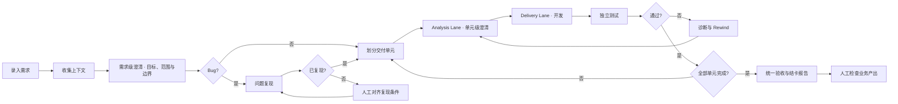

# LoopWork

LoopWork 是一个面向 **L4 Development** 的 AI 软件开发 Workflow Infra。它将工作重心从“人通过 Chat 持续推动 Agent”转为“确定性的 Harness 持续驱动多个专业 Agent”，使需求能够跨会话完成分析、开发、验证、恢复和结卡。

详细设计见 [L4 LOOP 工作手册](./docs/l4-loop-handbook.md)。

## 核心原则

- **最小交付单元**：将长任务拆成决策明确、可以独立验证的业务切片，缩短无验证距离。
- **确定性外环，自主内环**：Harness 管理状态、权限、调度和恢复；Agent 处理分析、实现、验证和诊断。
- **人负责业务，系统负责工程**：人只提供目标、回答不可推导的业务歧义，并检查最终业务产出。
- **Claim、Evidence、Result 分离**：Agent 提交声明和证据，独立 Agent 做专业判断，Harness 只持久化结果并执行明确路由。
- **状态持久化**：规格、决策、Memory、执行结果和验证证据保存在对话之外，使任务可以继续、重试或 rewind。
- **职责独立**：Analyst、Dev、Test 和 Review Agent 分别处理规格、实现、验证和结卡。

## Development Loop

需求录入后，LoopWork 自动接管流程；除需求澄清、必要运行信息和最终验收外，不需要人逐步批准。



需求梳理 Agent 只在目标、范围、路由或交付边界无法推导时请求需求级澄清；回答完成后交回同一 Agent，再进入交付拆分。每个交付单元随后形成版本化 Slice Spec：Analyst 必须列出完整关键决策树，覆盖产品决策以及架构、公开接口、数据迁移、关键依赖、安全、性能和运维等重大技术决策。每个决策要么有上下文证据，要么作为问题与用户对齐，不能用默认值代替确认。Dev Agent 只处理当前单元；Test Agent 将验证计划作为线索，依据仓库和环境事实独立选择验证方法并从用户入口进行黑盒验证；Review Agent 汇总最终范围、证据、风险和遗留项。

交付拆分后，同一任务进入双 Lane：Analysis Lane 串行分析后续单元，Delivery Lane 串行执行 `Dev(N) → Test(N)`，二者独立推进。Analysis 全局最多并发 4 个；当前共享工作区仍保持全局 1 个 Dev 和 1 个浏览器型 Agent。任一 Lane 完成后立即重新调度，不等待其他 Lane 或任务结束。

## 人机边界

LoopWork 只在以下情况请求人介入：

1. 存在无法从代码、文档和已有事实推导的业务歧义。
2. 当前 Agent 缺少不可替代的非敏感运行信息。
3. Bug 在合理尝试后仍无法复现，需要对齐预期、入口、数据或环境。
4. 事件超出权限、风险或执行环境边界。
5. 所有交付单元完成后，需要检查最终业务产出。

人的回答会成为新的事实，而不是对 Plan 或代码的 Approval。普通实现失败和测试失败由系统自动诊断、重试或 rewind。

生产环境采用 Human Gate：Agent 可以只读分析线上日志、Trace、告警和指标，但所有线上结果必须通知人，生产发布、修复和回滚由人确认。

## Workflow Infra

不同项目的 Prompt 和业务知识不同，但底层 Workflow 基本相同。LoopWork 统一提供：

- Agent 调度和节点间上下文交接。
- execution 级 Context Snapshot、精简 Working Pack 和按需只读上下文检索。
- Workflow 状态机、任务队列和代码槽。
- 版本化 Prompt、Memory、项目知识和 Slice Spec。
- 结构化 Agent Result、Test Evidence 和 Trace。
- execution attempt、Receipt、中断恢复、重试和 rewind。
- Feedback Agent 的评论分流、处理验证和确定性状态路由。
- 每个需求一个持久化 Chat 会话；Agent 重新读取交付文档、活动和代码，也可在安全窗口直接完成不改变需求语义的 UI / wording 小改动，验证后只提交自己的代码，始终不修改 Loop 状态。
- 权限边界、人工介入和可插拔执行器。
- 受限的 Prompt 演化和 LoopWork 自维护闭环。

项目只需要注入自己的 Agent Profile、领域知识、AC、工具、权限和验证规则；后续可以进一步通过 Skill 和 Workflow Profile 复用这些配置。统一的是“如何可靠运行一个 Loop”，而不是“每个项目应该做什么”。

## 当前范围

| Profile | 状态 |
| --- | --- |
| L4 Development | 已运行主要闭环：需求规格 → 交付单元 → 开发 → 测试 → 结卡 |
| Human-gated L4 Delivery | 设计阶段：Agent 监测线上环境，生产操作由人确认 |
| L4 End-to-End | 设计阶段：客户需求 → BA → 工程交付 → 业务结果 |

当前实现采用 Next.js、SQLite 和本地 Runner。它支持 Cursor、Codex 和 Claude CLI，但尚未证明大规模并发能力；Worktree 提供 Git 隔离，不等同于 OS 级安全沙箱。

## 快速开始

要求 Node.js 环境，并预先安装至少一种可用的 Agent CLI：Cursor、Codex 或 Claude。

```bash
npm install
npm run db:migrate
npm run dev
```

打开 `http://localhost:3000`，在项目设置中选择目标仓库和 Agent 执行器，然后在运行页面启动 Loop。

常用命令：

```bash
npm test
npm run build
npm run loopctl -- status
npm run loopctl -- paths
```

## 技术文档

- [L4 LOOP 工作手册](./docs/l4-loop-handbook.md)：WHY、设计原则、Development / Delivery / End-to-End 与统一 Infra。
- [V1 技术方案](./docs/v1-technical-solution.md)：架构、持久化、执行协议和验收标准。
- [DDD 边界与模型](./docs/v1-ddd-boundaries.md)：统一语言、限界上下文和领域不变量。

## 目录

```text
app/                 Next.js 页面与 Server Actions
src/domain/          领域模型与协议
src/application/     Workflow 用例与状态推进
src/infrastructure/  数据库、Agent、验证与运行适配器
scripts/loop/         Runner、Maintenance Runner 与 loopctl
migrations/          项目数据库迁移
docs/                工作手册与技术文档
```
