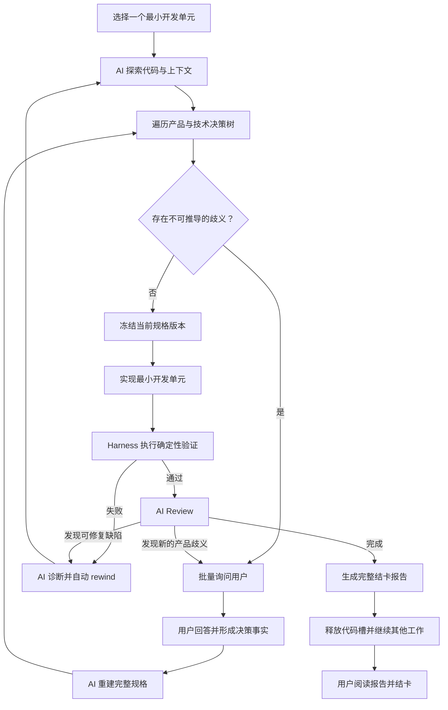

# Loop Engineering

Loop Engineering 是一个由 AI 驱动的软件开发闭环。它通过 Harness 控制上下文、状态、工具、验证和流程边界，让 AI 每次只推进一个足够小、决策完备、可以独立验证的开发单元。

这个系统不是多 Agent 自由协作，也不是每个阶段都等待人工审批的工作流。整体流程由确定性的 App 和 Runner 调度，AI 负责理解、分析、实现、验证、审查和回流；人只在两个固定节点参与：

1. 开发前，回答 AI 无法从代码、文档和已有决策中推导出的产品歧义。
2. 开发后，阅读 AI 生成的完整结卡报告，确认已经知晓交付结果，然后关闭任务。

人的回答不是 Approval，阅读结卡报告也不是对实现质量的审批。开发是否可以继续，由歧义是否归零和机器可检查的完成契约决定；实现是否完成，由验证证据和 AI Review 决定。

## 核心理念

### AI 负责推进，人负责消除歧义

AI 应先探索代码库、读取既有文档和历史决策，并系统性遍历当前开发单元的决策树。只有同时满足以下条件时，才允许向人提问：

- 存在两个或更多合理但行为不同的选择。
- 选择会改变用户可观察行为、数据语义或交付范围。
- 无法从代码、测试、既有约定或安全默认值中推导答案。
- AI 已完成必要的代码和上下文探索。

文件位置、已有组件、测试命令、实现模式和其他可以通过仓库探索得到的事实，不应被转交给人。需要澄清时，AI 应一次性返回当前开发单元的完整问题集，并为每个问题提供备选项、影响、依赖关系和推荐答案。

人的回答只会成为新的决策事实。回答完成后，AI 必须重新分析并更新完整规格；系统不能把“问题已回答”自动解释成“用户批准方案”。

### 每次只推进一个最小开发单元

Loop 不以“尽可能多写代码”为目标，而是持续缩小单次工作的决策范围。一个可以进入开发的单元，应当是一个“决策完备的最小开发切片”，至少包含：

- Goal：用户可观察的目标。
- Scope：本次包含和明确不包含的内容。
- Behavior：输入、状态、输出和异常行为。
- Decision Ledger：已经确定的产品与技术决策。
- Open Ambiguities：仍然无法推导的歧义。
- Acceptance Oracles：系统如何客观验证完成。
- Dependencies：前置单元、接口和环境依赖。
- Change Budget：允许影响的模块和能力范围。

只有在 `Open Ambiguities = 0`、验收标准可执行、依赖已满足且范围边界清晰时，开发 Agent 才能开始实现。

### Agent 提出结论，Harness 判断是否完成

Agent 返回的是分析、实现声明和验证建议，不是不可质疑的事实。Harness 负责：

- 注入当前开发单元的完整、受控上下文。
- 校验结构化 Agent Result。
- 执行确定性测试、构建、静态检查和其他验收步骤。
- 保存命令、退出码、日志、截图、Commit 等验证证据。
- 根据证据自动推进、重试、rewind 或请求澄清。
- 限制单次运行的时间、尝试次数、工具和工作区权限。

开发失败不需要人来裁决。能够由 AI 和验证环境定位的问题，应自动回到分析、实现或测试阶段；只有重新暴露出不可推导的产品歧义时，才再次询问人。

## 完整 Loop



## 角色边界

| 角色 | 核心责任 | 是否需要人参与 |
|---|---|---|
| Backlog Agent | 理解输入、分类任务并收集基础上下文 | 仅发现真实产品歧义时 |
| Story Splitter | 拆分决策范围足够小的开发单元 | 否 |
| Analyst Agent | 探索代码、遍历决策树、生成决策完备规格 | 有不可推导歧义时批量提问 |
| Repro Agent | 复现问题、保存证据并收敛根因范围 | 仅缺少不可替代的业务信息时 |
| Dev Agent | 只实现当前开发单元并提供实现声明 | 否 |
| Test / Verifier | 用环境证据验证验收条件 | 否；失败时自动回流 |
| Review Agent | 汇总完整交付、妥协、风险和遗留项 | 不审批；生成报告后等待阅读 |
| Human | 回答产品歧义；阅读最终报告并结卡 | 只在这两个固定节点参与 |

## Review 与结卡

Review Agent 不是审批者，也不负责询问人“是否允许交付”。它是整个 AI 开发过程的最终汇总者，生成一份不可变、可追溯的结卡报告，至少包括：

- 原始目标和最终实现范围。
- 每个开发单元的关键决策及用户澄清结果。
- 实际代码变更、Commit 和验证证据。
- 验收标准覆盖情况。
- 规格与实现之间的偏差。
- 已知风险、最终妥协和有意保留的限制。
- 遗留问题以及建议创建的后续任务。

报告生成后，开发流程已经完成，代码槽应立即释放，Loop 可以继续处理其他任务。当前任务进入 `ready_to_close`，等待人阅读报告。人的操作是 `acknowledge and close`，只记录“已阅读哪个报告版本”，不产生 `approve/reject` 决策。

如果报告生成后任务内容再次发生变化，旧的阅读记录失效，Review Agent 必须生成新版本报告，并等待人重新阅读。

## 系统边界

Loop Engineering 采用本地模块化单体：Next.js 页面、领域用例、SQLite、版本化 SQL migrations 和可插拔 Agent 执行器运行在同一应用仓库中。

- Web App 和 Runner 是唯一流程调度者。
- Agent 每次只处理一个明确的 delegation，不调度其他流程 Agent。
- Agent 不直接写业务数据库，也不直接推进 Task 状态。
- SQLite 保存 Task、开发单元、问题、决策事实、文档、结果、证据和运行记录。
- 目标 repo 只保存产品代码，不生成 Loop 业务工作文件。
- 单个 Agent 可以使用辅助 subagent 收集当前 delegation 的上下文，但不能处理其他 Task 或开发单元。

## 启动

```bash
npm install
npm run db:migrate
npm run dev
```

打开 `http://localhost:3000`。若该端口被占用，Next.js 会显示实际可用端口。

macOS、Linux 和 Windows 使用同一套启动方式。后台 Runner 由当前 Node.js 直接启动，不依赖平台特定的 `npx` / `npx.cmd`；Windows 停止运行时会终止完整 Runner 进程树。Cursor、Codex 或 Claude CLI 仍需预先安装并能在当前用户的 `PATH` 中执行。

## 常用命令

```bash
npm run db:migrate  # 执行 migrations/*.sql
npm run build       # 类型与生产构建校验
npm run loopctl -- status
```

当前工作区根目录由项目设置页维护在应用级 `data/loopwork.db`，切换后立即生效。每个项目的业务数据库位于 `data/<repo-root-short-hash>/loop-ui.db`，目标 repo 不再生成 `.project` 工作目录。

查看当前 repo 对应的数据目录：

```bash
python scripts/loop/loopctl.py paths
```

## 持续运行 Loop

UI 运行面板可以点击“开始运行”，创建一次本地 Loop 运行并逐个执行 Agent。应用负责决定下一步应由哪个 Agent 处理；没有可执行步骤时等待 5 分钟，有执行结果时等待 1 分钟，然后继续下一轮。项目设置中可以选择 Cursor、Codex 或 Claude，默认使用 Cursor：

```bash
cursor agent --print --output-format stream-json --force --workspace <workspace-root>
codex exec --json -C <workspace-root> <prompt>
claude --print --output-format stream-json <prompt>
```

选择 Codex 时，可为当前项目从 GPT-5.6 Sol、Terra 和 Luna 三档模型中选择，并单独配置思考强度。Runner 使用 `--model` 和 `--config model_reasoning_effort=...` 传递显式覆盖。开发实现 Agent 启动前若已有未提交改动，Runner 会先创建独立 checkpoint commit，再将当前交付单元的实现提交为另一个 commit；敏感文件仍会阻止自动提交。

执行器的 stdout、stderr 和 tool 事件会被标准化后写入 SQLite `run_logs`，并通过 SSE 在 `/runs` 页面实时展示。

Loop 生命周期与推进流程只由 Web App 和内部 Runner 管理。每次只执行一个 Agent，Runner 注入完整需求上下文并解析最终结构化 JSON；Application 自动保存文档、问题、回答、结果和运行证据，再计算下一步。Agent 不调用 `loopctl`，也不负责判断整体流程。

## V1 已实现范围

上面的章节定义 Loop Engineering 的目标产品语义。当前 V1 已经具备数据库驱动的状态机、问题回答、Agent 执行和结果回流，但部分历史字段及最终 Review 流程仍沿用确认/阻塞语义；后续实现将收敛为“歧义澄清 + 自动验证 + 阅读结卡”，不应把现有兼容结构理解为长期的 Approval 设计。

- 需求创建、列表、详情和状态流转。
- 数据库优先的需求上下文，不生成旧 `.project` 工作文档。
- 交付单元新增与进度展示。
- 问题、回答、现有流程记录和业务文档全部写入 SQLite。
- blocked / block-release，保留 resume status 和 resume pending 规则。
- rewind、cancel 和单代码槽保护。
- 推进流程计算，包含浏览器资源限制和代码槽限制。
- Cursor、Codex、Claude 可插拔执行器、结构化 Agent Result、本地单 Runner 和数据库流式运行日志。
- 多 repo 数据隔离：按 repo 根目录短 hash 选择 `data/<hash>/loop-ui.db`。
- Umzug 管理的 SQL migration，行为接近 Flyway 的顺序迁移。

## 目录

```text
app/                 Next.js 页面与 Server Actions
src/application/     需求、问题回答、状态流转等用例
src/infrastructure/  SQLite、Agent Executor Adapter 与 runner 进程管理
migrations/          顺序 SQL migrations（Umzug 管理）
app-migrations/      应用级设置数据库 migrations
scripts/             migration 与 loopctl 命令
data/                应用本地运行数据（按 repo 根路径短 hash 分目录，gitignore）
reference/           旧 cursor-loop 和原型材料
```
