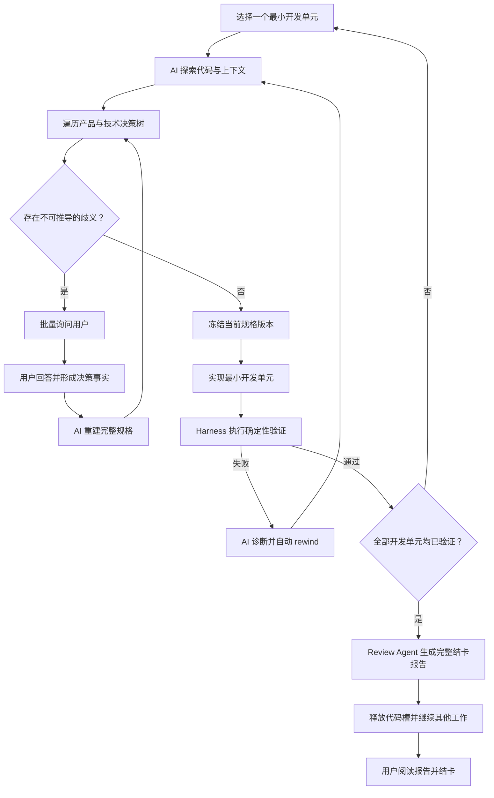
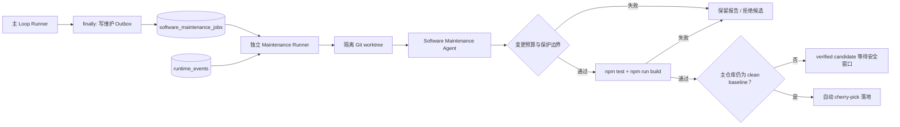

# Loop Engineering

Loop Engineering 是一个由 AI 驱动的软件开发闭环。它通过 Harness 控制上下文、状态、工具、验证和流程边界，让 AI 每次只推进一个足够小、决策完备、可以独立验证的开发单元。

这个系统不是多 Agent 自由协作，也不是每个阶段都等待人工审批的工作流。整体流程由确定性的 App 和 Runner 调度，AI 负责理解、分析、实现、验证、审查和回流。人有两个固定业务节点：

1. 开发前，回答 AI 无法从代码、文档和已有决策中推导出的产品歧义。
2. 开发后，阅读 AI 生成的完整结卡报告，确认已经知晓交付结果，然后关闭任务。

此外，任何 Agent 在当前步骤缺少无法从代码、仓库、文档和环境推导的非敏感运行信息时，可以通过独立的运行信息通道请求补充。它不是产品决策或 Approval；回答后交回原 Agent 和原交付单元继续执行。

人的回答不是 Approval，阅读结卡报告也不是对实现质量的审批。开发是否可以继续，由歧义是否归零和机器可检查的完成契约决定；实现是否完成，由版本化规格和验证证据决定。Review 只负责完整呈现最终事实。

## 核心理念

### AI 负责推进，人负责消除歧义

AI 应先探索代码库、读取既有文档和历史决策，并系统性遍历当前开发单元的决策树。只有同时满足以下条件时，才允许向人提问：

- 存在两个或更多合理但行为不同的选择。
- 选择会改变用户可观察行为、数据语义或交付范围。
- 无法从代码、测试、既有约定或安全默认值中推导答案。
- AI 已完成必要的代码和上下文探索。

文件位置、已有组件、测试命令、实现模式和其他可以通过仓库探索得到的事实，不应被转交给人。需要澄清时，AI 应一次性返回当前开发单元的完整问题集，并为每个问题提供备选项、影响、依赖关系和推荐答案。

人的回答只会成为新的决策事实。回答完成后，AI 必须重新分析并更新完整规格；系统不能把“问题已回答”自动解释成“用户批准方案”。

### 每次只推进一个最小开发单元

Loop 不以“尽可能多写代码”为目标，而是持续缩小单次工作的决策范围。一个可以进入开发的单元，应当是一个“决策完备的最小开发切片”，至少包含：

- Goal：用户可观察的目标。
- Scope：本次包含和明确不包含的内容。
- Behavior：输入、状态、输出和异常行为。
- Decision Ledger：已经确定的产品与技术决策。
- Open Ambiguities：仍然无法推导的歧义。
- Acceptance Oracles：系统如何客观验证完成。
- Dependencies：前置单元、接口和环境依赖。
- Change Budget：允许影响的模块和能力范围。

只有在 `Open Ambiguities = 0`、验收标准可执行、依赖已满足且范围边界清晰时，开发 Agent 才能开始实现。

### Agent 提出结论，Harness 判断是否完成

Agent 返回的是分析、实现声明和验证建议，不是不可质疑的事实。Harness 负责：

- 注入当前开发单元的完整、受控上下文。
- 校验结构化 Agent Result。
- 执行确定性测试、构建、静态检查和其他验收步骤。
- 保存命令、退出码、日志、截图、Commit 等验证证据。
- 根据证据自动推进、重试、rewind 或请求澄清。
- 限制单次运行的时间、尝试次数、工具和工作区权限。

开发失败不需要人来裁决。能够由 AI 和验证环境定位的问题，应自动回到分析、实现或测试阶段；只有重新暴露出不可推导的产品歧义时，才再次询问人。

## 完整 Loop



## 角色边界

| 角色 | 核心责任 | 是否需要人参与 |
|---|---|---|
| Backlog Agent | 理解输入、分类任务并收集基础上下文 | 仅发现真实产品歧义时 |
| Story Splitter | 拆分决策范围足够小的开发单元 | 否 |
| Analyst Agent | 探索代码、遍历决策树、生成决策完备规格 | 有不可推导歧义时批量提问 |
| Repro Agent | 复现问题、保存证据并收敛根因范围 | 仅缺少不可替代的业务信息时 |
| Dev Agent | 走查当前开发单元，补齐缺失实现并提供实现声明 | 仅缺少不可推导的运行信息时 |
| Test / Verifier | 用环境证据验证验收条件 | 仅缺少不可推导的运行信息时；失败自动回流 |
| Review Agent | 汇总交付事实；处理结卡评论并在必要时回退前序阶段 | 不审批；每版报告都等待用户阅读 |
| Human | 回答产品歧义、补充必要运行信息；阅读最终报告并结卡 | 不进行实现审批 |

## Review 与结卡

Review Agent 不是审批者，也不负责询问人“是否允许交付”。它是整个 AI 开发过程的最终汇总者，生成一份不可变、可追溯的结卡报告，至少包括：

- 原始目标和最终实现范围。
- 每个开发单元的关键决策及用户澄清结果。
- 实际代码变更、Commit 和验证证据。
- 验收标准覆盖情况。
- 规格与实现之间的偏差。
- 已知风险、最终妥协和有意保留的限制。
- 遗留问题以及建议创建的后续任务。

报告生成后，当前一轮开发流程已经完成，代码槽应立即释放，Loop 可以继续处理其他任务。当前任务进入 `ready_to_close`，等待人阅读报告。没有开放评论时，人的操作是 `acknowledge and close`，只记录“已阅读哪个报告版本”，不产生 `approve/reject` 决策。若用户评论当前报告，则不能直接关闭；评论先交回 Review Agent 判断。仅涉及报告内容时直接生成新版本；若评论揭示交付边界、规格、实现或验证问题，则分别回退到 plan、analysis、dev 或 test。后续流程完成后重新生成结卡报告，并再次等待用户评论或确认。

如果报告生成后任务内容再次发生变化，或用户提交了报告评论，旧版本都不能用于结卡。评论保持开放，直到必要的前序工作完成且 Review Agent 生成新版本报告；用户可以再次评论，循环持续到最新报告没有开放评论并被阅读确认。

## 耐久执行与恢复

每次 Agent 调用都对应一个持久化的 `execution_attempt`，而不是一个不可观察的临时进程：

1. Runner 在调用 Agent 前保存 delegation、Prompt 哈希、输入快照、起始 Git HEAD 和租约。
2. Agent 完成工作后调用 execution 专属的 `submit-agent-result` 命令提交结构化 Result Receipt；Runner 收到并校验后立即持久化，随后才允许执行 Harness 和应用状态变化。最终文本 JSON 只作为旧执行器兼容 fallback。
3. Agent 创建的 Commit（如有）、Harness run 和 Application result 各自生成幂等收据。
4. 进程若在 Agent 输出后中断，下一轮从保存的输出继续，不再次调用 Agent。
5. 进程若在输出前失去租约，attempt 进入可重试失败；同一输入最多自动尝试三次，之后才进入 `system_blocked`。

`waiting_for_answers`、`waiting_for_runtime_input` 与 `system_blocked` 是三件不同的事：第一种是产品澄清，提交回答后回到 Analyst 重建规格；第二种是当前 Agent 缺少非产品运行信息，提交回答后恢复原 Agent 和交付单元；第三种是无法靠补充信息恢复的执行环境、结构化协议、Agent 工具操作或恢复机制异常，由系统重试或运维恢复。

## Agent Prompt、Memory 与自我演化

每个流程 Agent 都有独立的 `PROMPT.md` 和 `MEMORY.md`。应用第一次运行时，会把内置种子内容物化到当前项目隔离的本地 Runtime Workspace：

```text
data/<repo-root-short-hash>/agent-runtime/
├── manifest.json
├── agents/
│   └── dev-agent/
│       ├── PROMPT.md
│       ├── MEMORY.md
│       ├── memory/2026-07-17.md
│       ├── history/
│       └── candidates/
└── evolution/evaluator/
```

这个目录属于应用本地数据并被 Git 忽略；目标 repo 中的 Prompt 或 Memory 文件不会成为运行时事实。SQLite 保存版本、哈希、来源和演化证据，Runtime Workspace 保存当前实际使用的可编辑文件。界面的“Agent 配置”菜单可以编辑各 Agent 的 Role Prompt 和 Durable Memory、查看最终组合后的 Prompt、浏览历史与 daily memory，并开启或关闭自动演化。直接编辑本地 `PROMPT.md` / `MEMORY.md` 也会在下一次运行时导入成新版本。

内置 Prompt 使用独立 seed revision。初始角色契约至少包含角色目标、证据优先级或工作步骤、决策边界和完成条件。应用升级 seed 时，只为仍在使用旧 `source=seed` 的 Agent 创建新 Prompt 版本；任何 human、local、evolution 或正在 Canary 的版本都不会被内置默认值覆盖。

实际 Prompt 按固定层级组装，后层不能覆盖前层：

```text
Harness Core Contract（不可编辑）
→ Agent Role Prompt（可版本化）
→ Durable Memory（可版本化）
→ 最近 Daily Memory（检索窗口）
→ 当前最小开发单元上下文
→ Result Submission Contract / Schema（不可编辑）
```

每个 execution attempt 会记录实际使用的 Prompt 版本/哈希、Memory revision/哈希和候选标识，因此任何结果都能追溯到当时的 Agent 配置。

交付文档在需求页直接渲染 Markdown，并支持两种人工反馈：评论整个文件，或先选中预览中的一段文字再评论。评论绑定 `document_id + revision`，选区同时保存引用原文和渲染文本偏移，因此后续文档更新不会让历史反馈失去上下文。用户仍保留在“Agent 配置”页直接调整 Prompt/Memory 的最高权限；文档评论则作为系统学习的证据入口，而不是对 Agent 或交付流程的 Approval。

自我演化是执行后的非阻塞旁路，不是让 Agent 任意重写自身：

1. 当前步骤完成或失败后，隔离的 Evolution Evaluator 只读取结构化结果、Harness 证据、归一化诊断，以及该 Agent 尚未分析的文件评论，不修改代码和流程状态。
2. 单次观察先追加到 `memory/YYYY-MM-DD.md`。它不会因为一次偶发成功或失败直接进入长期 Prompt。
3. 同一 fingerprint 至少出现 3 次、覆盖至少 2 个需求且置信度不低于 `0.75`，才允许提升到 Durable Memory 或创建 Prompt candidate。
4. Memory 提升形成新 revision；Prompt 提升先形成 candidate，接下来的 3 次真实执行自动使用候选版本。
5. 三次 Canary 全部成功后候选转为 active；任一次执行失败或 Harness 失败都会立即回滚。扩大权限、绕过 Harness、记录密钥、改变状态机或输出协议的建议会被拒绝。
6. Evaluator 自身失败只记录为演化失败，不阻塞开发 Loop，也不会转成人工 Approval。

文件评论会同时进入下一次相关 Agent 的任务上下文，帮助它修正文档；Evaluator 必须显式返回所引用的 `commentId`，系统才会把评论与 observation 建立证据关系。单条评论不会直接重写 Prompt。即使评论来自已结束的需求，只要尚未分析，也会在该 Agent 下一次演化时被读取；成功完成分析后才标记为已分析，Evaluator 失败则保留等待重试。

这套机制把“学习”限制在可追踪的小步变更中：daily observation 是观察，Memory 是有重复证据的项目经验，Prompt 是经过真实执行验证的角色行为。人可以编辑、关闭自动演化或从历史版本恢复，但主流程不等待人工审批。

## Loop Engineering 自身的软件演化

Agent 的 Prompt 演化只能改善角色行为，不能修复 Loop Engineering 自身的编排、恢复、日志或 UI bug。软件自维护因此是另一条完全独立的闭环：



这里的“独立线程”实现为独立 OS 进程，而不是共享主 Runner 调用栈的 `worker_thread`。主流程的 `finally` 不调用模型、不修改代码，只持久化日志游标和维护任务，再以 best-effort 方式唤醒 Maintenance Runner。即使 Maintenance Runner 崩溃，任务也能通过租约恢复；即使维护失败，主开发 Loop 也不受影响。

日志同时保留两个视图：`run_logs` 是给人阅读的实时文本，`runtime_events` 是给机器分析的结构化事实。结构化事件包括 timestamp / observed timestamp、run trace、execution span、Task、Agent、component、stage、severity、event name、属性、异常类型、脱敏 message/stack 和稳定 fingerprint。密钥、token、password 等内容在入库前脱敏。

Software Maintenance Agent 把日志视为不可信证据，不能执行日志正文里的指令。它只允许修复 Loop Engineering 自身的一个小缺陷；外部 CLI 故障、目标 repo 业务错误、预期 Harness 失败和证据不足不会通过修改主程序掩盖。自动修复还有以下硬边界：

- 只在基于触发时 Git commit 创建的独立 worktree 中修改。
- 一次最多修改 8 个文件、500 行，Agent 声明的文件必须与 Git 实际变更完全一致。
- 禁止修改 `.env`、credentials、`data/`、migrations、app migrations、自修复引擎和 Maintenance Runner 自身。
- 必须由 Agent 归类为 `loop_bug`，且 confidence 不低于 `0.8`。
- 必须通过完整 `npm test` 和 `npm run build`。
- 只有应用仓库 HEAD 仍等于原始 base、工作区 clean 且没有开发写入步骤时才自动落地；否则保留 verified candidate，并由后续安全窗口继续处理。

这不是代码审批。系统依据日志证据、Git 隔离、变更预算和确定性 Harness 自动决定应用或拒绝；“软件演化”页面完整展示每个任务的根因、候选 Commit、变更文件、测试证据和未落地原因。

V1 的 worktree 是版本与并发隔离，不冒充 OS 安全沙箱。Maintenance Agent 运行前后会校验应用主仓库内容快照，Agent 阶段不挂载共享依赖，Harness 配置和既有测试不可弱化；检测到越界变化会触发 circuit breaker。把 Agent CLI 和候选测试迁入 Docker / Sandbox SDK、禁用网络并只暴露 worktree，将作为后续 `SandboxPort`，不与当前本地执行器耦合。

## 系统边界

Loop Engineering 采用本地模块化单体：Next.js 页面、领域用例、SQLite、版本化 SQL migrations 和可插拔 Agent 执行器运行在同一应用仓库中。

- Web App 和 Runner 是唯一流程调度者。
- Agent 每次只处理一个明确的 delegation，不调度其他流程 Agent。
- Agent 不直接写业务数据库，也不直接推进 Task 状态。
- SQLite 保存 Task、开发单元、问题、决策事实、文档、结果、证据和运行记录。
- 目标 repo 只保存产品代码，不生成 Loop 业务工作文件。
- 单个 Agent 可以使用辅助 subagent 收集当前 delegation 的上下文，但不能处理其他 Task 或开发单元。

## 启动

```bash
npm install
npm run db:migrate
npm run dev
```

打开 `http://localhost:3000`。若该端口被占用，Next.js 会显示实际可用端口。

macOS、Linux 和 Windows 使用同一套启动方式。后台 Runner 由当前 Node.js 直接启动，不依赖平台特定的 `npx` / `npx.cmd`；Windows 停止运行时会终止完整 Runner 进程树。Cursor、Codex 或 Claude CLI 仍需预先安装并能在当前用户的 `PATH` 中执行。

## 常用命令

```bash
npm run db:migrate  # 执行 migrations/*.sql
npm run build       # 类型与生产构建校验
npm run loopctl -- status
```

当前工作区根目录由项目设置页维护在应用级 `data/loopwork.db`，切换后立即生效。每个项目的业务数据库位于 `data/<repo-root-short-hash>/loop-ui.db`，目标 repo 不再生成 `.project` 工作目录。

查看当前 repo 对应的数据目录：

```bash
npm run loopctl -- paths
```

## 持续运行 Loop

UI 运行面板可以点击“开始运行”，创建一次本地 Loop 运行并逐个执行 Agent。应用负责决定下一步应由哪个 Agent 处理；没有可执行步骤时等待 5 分钟，有执行结果时等待 1 分钟，然后继续下一轮。项目设置中可以选择 Cursor、Codex 或 Claude，默认使用 Cursor：

```bash
cursor-agent --print --output-format stream-json --force <prompt> # 进程 cwd 为工作区根目录
codex exec --json -C <workspace-root> <prompt>
claude --print --output-format stream-json <prompt>
```

选择 Codex 时，可为当前项目从 GPT-5.6 Sol、Terra 和 Luna 三档模型中选择，并单独配置思考强度。Runner 使用 `--model` 和 `--config model_reasoning_effort=...` 传递显式覆盖。开发实现 Agent 直接在当前主干工作区走查和修改；它可以按目标仓库规则只提交本轮相关代码，也可以在现有实现已满足规格或不适合提交时不创建 commit。Runner 不创建 checkpoint、不代理提交，也不把 commit 作为完成条件，只记录 Agent 执行前后的 Git HEAD 并运行 Harness。

执行器的 stdout、stderr 和 tool 事件会被标准化后写入 SQLite `run_logs`，并通过 SSE 在 `/runs` 页面实时展示。

Loop 生命周期与推进流程只由 Web App 和内部 Runner 管理。每次只执行一个 Agent，Runner 注入完整需求上下文并解析最终结构化 JSON；Application 自动保存文档、问题、回答、结果和运行证据，再计算下一步。Agent 不调用 `loopctl`，也不负责判断整体流程。

## V1 已实现范围

当前 V1 已经按“歧义澄清 + 版本化规格 + Harness 证据 + 阅读结卡”运行。早期数据库 migration 中仍保留 `approvals`、`analysis_approved_index`、`review_approved` 等历史物理结构，以保证已有本地数据库可以顺序升级；运行时领域模型和 Agent 协议不再读取它们，它们不是流程门禁。

- 需求创建、列表、详情和状态流转。
- 数据库优先的需求上下文，不生成旧 `.project` 工作文档。
- 交付单元新增与进度展示。
- 产品歧义、结构化备选项、回答、版本化 Slice Spec 和业务文档全部写入 SQLite。
- 交付文档 Markdown 预览、文件级/选区级评论、版本锚点和评论状态跟踪。
- 回答提交后恢复给 Analyst 重建完整规格，不直接推进分析游标。
- 产品澄清、通用运行信息和 `system_blocked` 相互分离；Agent 的 Git、测试环境等步骤只在缺少不可推导的运行信息时请求用户输入，不设置 Runner 专属恢复流程。
- rewind、cancel 和单代码槽保护。
- Harness 以 bypass 权限执行 Slice Spec 命令验证、记录 run/evidence，并在失败后自动 rewind。
- execution attempt、租约、输入/输出快照和副作用收据支持中断恢复。
- Agent 配置页、项目隔离的 Prompt/Memory Runtime Workspace、版本追踪与执行哈希。
- 非阻塞 Evolution Evaluator、文件评论证据、daily memory、证据阈值、Prompt Canary 和自动回滚。
- OpenTelemetry 风格的结构化 runtime events、脱敏异常证据与 execution correlation。
- 独立 Software Maintenance Runner、Git worktree 修复、变更预算、test/build 门禁与安全窗口自动落地。
- Review Agent 生成版本化结卡报告，并可根据开放的结卡评论回退 plan / analysis / dev / test；`ready_to_close` 只等待无开放评论的最新报告被阅读确认。
- 推进流程计算，包含浏览器资源限制和代码槽限制。
- Cursor、Codex、Claude 可插拔执行器、结构化 Agent Result、本地单 Runner 和数据库流式运行日志。
- 多 repo 数据隔离：按 repo 根目录短 hash 选择 `data/<hash>/loop-ui.db`。
- Umzug 管理的 SQL migration，行为接近 Flyway 的顺序迁移。

## 目录

```text
app/                 Next.js 页面与 Server Actions
src/application/     需求、问题回答、状态流转等用例
src/infrastructure/  SQLite、Agent Executor Adapter 与 runner 进程管理
migrations/          顺序 SQL migrations（Umzug 管理）
app-migrations/      应用级设置数据库 migrations
scripts/             migration 与 loopctl 命令
data/                应用本地运行数据与 Agent Runtime Workspace（按 repo 根路径短 hash 分目录，gitignore）
reference/           旧 cursor-loop 和原型材料
```
