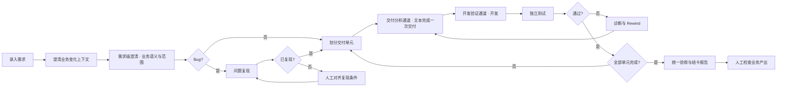

# LoopWork

LoopWork 是一个面向 **L4 Development** 的 AI 软件开发 Workflow Infra。它将工作重心从“人通过 Chat 持续推动 Agent”转为“确定性的 Harness 持续驱动多个专业 Agent”，使需求能够跨会话完成分析、开发、验证、恢复和结卡。

详细设计见 [L4 LOOP 工作手册](./docs/l4-loop-handbook.md)。

## 核心原则

- **最小交付单元**：将长任务拆成决策明确、可以独立验证的业务切片，缩短无验证距离。
- **确定性外环，自主内环**：Harness 管理状态、权限、调度和恢复；Agent 处理分析、实现、验证和诊断。
- **人负责业务，系统负责工程**：人只提供目标、回答不可推导的业务歧义，并检查最终业务产出。
- **Claim、Evidence、Result 分离**：Agent 提交声明和证据，独立 Agent 做专业判断，Harness 只持久化结果并执行明确路由。
- **状态持久化**：规格、决策、Memory、执行结果和验证证据保存在对话之外，使任务可以继续、重试或 rewind。
- **职责独立**：交付分析 Agent、Dev、Test 和 Review Agent 分别处理规格、实现、验证和结卡。

## Development Loop

需求录入后，LoopWork 自动接管流程；除需求澄清、必要运行信息和最终验收外，不需要人逐步批准。


```mermaid
flowchart LR
    input["录入需求"] --> context["澄清业务变化上下文"]
    context --> intakeClarify["需求级澄清 · 业务语义与范围"]
    intakeClarify --> bug{"Bug?"}
    bug -->|"否"| split["划分交付单元"]
    bug -->|"是"| repro["问题复现"]
    repro --> reproduced{"已复现?"}
    reproduced -->|"否"| reproAlign["人工对齐复现条件"]
    reproAlign --> repro
    reproduced -->|"是"| split
    split --> deliveryAnalysis["交付分析通道 · 文本完成一次交付"]
    deliveryAnalysis --> dev["开发验证通道 · 开发"]
    dev --> test["独立测试"]
    test --> passed{"通过?"}
    passed -->|"否"| rewind["诊断与 Rewind"]
    rewind --> deliveryAnalysis
    passed -->|"是"| completed{"全部单元完成?"}
    completed -->|"否"| split
    completed -->|"是"| review["统一验收与结卡报告"]
    review --> human["人工检查业务产出"]
```

需求梳理 Agent 负责把原始输入转化为业务变化上下文：基于项目可用证据区分当前实际行为、当前应有业务语义和目标行为，明确三者之间的变化，并自主识别对业务结果有实质意义的影响。代码只是当前实现的一种证据，不等同于完整业务事实。Agent 只在业务目标、规则、参与者、范围、分类或验收结果无法推导时请求需求级澄清；识别影响不代表自动扩大范围。交付规划 Agent 冻结已经完成的业务变化上下文，把变化、保持约束、技术后果和需求级验收语义显式映射到有序的业务闭环；交付单元的参与者、触发条件、可观察结果、单元验收和自然依赖会作为正式契约传给交付分析 Agent，而不是只保留标题。

交付分析 Agent 把 Do It Twice 作为思考方法：在真实开发前基于冻结承诺和项目证据完整思考一次交付，主动发现需求文字之外的实际影响，并关闭会阻塞实现或验证的关键业务与核心技术决策。它不把推演过程做成表单，只持久化分析摘要、实际影响及处理方式、关键决策和冻结交付契约；已解决的技术决策无需虚构候选项，只有超出权限且会产生实质不同后果的最少决策才交给用户。Dev Agent 与 Test Agent 分别从同一份冻结契约出发：Dev 负责实现并提交验收证据关系和关键检查选择，Git、Commit、变更文件及 Runner 命令结果由 Application 自动取证；Test 不读取 Dev 的自述、自检、开发记录或 Commit message，而是先独立冻结测试计划，再逐项执行面向业务预期的黑盒验证。每项交付单元验收语义必须由真实前端覆盖完整用户闭环；API 场景可以补充边界、错误反馈和数据语义，也可以形成失败证据，但不能替代前端闭环。Review Agent 最后汇总实现与独立验证事实。

交付拆分后，同一需求进入双通道：交付分析通道串行分析后续单元，开发验证通道串行执行 `Dev(N) → Test(N)`，二者独立推进。这里的箭头只表示 Test 必须在 Dev 形成稳定仓库状态后执行，不表示 Dev Result 是 Test 输入；两者在认知上相互隔离，只共享交付分析冻结的契约。交付分析全局最多并发 4 个；当前共享工作区仍保持全局 1 个 Dev 和 1 个浏览器型 Agent。任一通道完成后立即重新调度，不等待其他通道或需求结束。

结卡前后的文档评论采用前向反馈流程：Feedback Agent 先把冻结批次按共同验收目标分组；直接回复和历史说明就地闭环，Bug 先复现；所有需要工程实施的 Bug、行为修订、范围新增和技术调整都先由交付规划 Agent 形成一个或多个完整的追加交付单元。旧交付单元、旧交付规格和旧文档始终作为历史事实保留，不因评论回退或改写；新增单元重新经过交付分析、开发、验证和 Feedback 独立验证，最后由 Review 生成反映最终状态的结卡报告。

## 人机边界

LoopWork 只在以下情况请求人介入：

1. 存在无法从代码、文档和已有事实推导的业务歧义。
2. 当前 Agent 缺少不可替代的非敏感运行信息。
3. Bug 在合理尝试后仍无法复现，需要对齐预期、入口、数据或环境。
4. 事件超出权限、风险或执行环境边界。
5. 所有交付单元完成后，需要检查最终业务产出。

人的回答会成为新的事实，而不是对 Plan 或代码的 Approval。普通实现失败和测试失败由系统自动诊断、重试或 rewind。

生产环境采用 Human Gate：Agent 可以只读分析线上日志、Trace、告警和指标，但所有线上结果必须通知人，生产发布、修复和回滚由人确认。

## Workflow Infra

不同项目的 Prompt 和业务知识不同，但底层 Workflow 基本相同。LoopWork 统一提供：

- Agent 调度、角色化上下文投影与认知隔离。
- execution 级 Context Snapshot、精简 Working Pack 和按需只读上下文检索。
- Workflow 状态机、任务队列和代码槽。
- 版本化 Prompt、Memory、项目知识和交付规格。
- 结构化 Agent Result、Test Evidence 和 Trace。
- execution attempt、Receipt、中断恢复、重试和 rewind。
- Feedback Agent 的批次分组、前向追加工作和独立处理验证。
- 每个需求一个持久化 Chat 会话；Agent 重新读取交付文档、活动和代码，也可在安全窗口直接完成不改变需求语义的 UI / wording 小改动，验证后只提交自己的代码，始终不修改 Loop 状态。
- 权限边界、人工介入和可插拔执行器。
- 受限的 Prompt 演化和 LoopWork 自维护闭环。

项目只需要注入自己的 Agent Profile、领域知识、AC、工具、权限和验证规则；后续可以进一步通过 Skill 和 Workflow Profile 复用这些配置。统一的是“如何可靠运行一个 Loop”，而不是“每个项目应该做什么”。

## 当前范围

| Profile | 状态 |
| --- | --- |
| L4 Development | 已运行主要闭环：需求规格 → 交付单元 → 开发 → 测试 → 结卡 |
| Human-gated L4 Delivery | 设计阶段：Agent 监测线上环境，生产操作由人确认 |
| L4 End-to-End | 设计阶段：客户需求 → BA → 工程交付 → 业务结果 |

当前实现采用 Next.js、SQLite 和本地 Runner。它支持 Cursor、Codex 和 Claude CLI，但尚未证明大规模并发能力；Worktree 提供 Git 隔离，不等同于 OS 级安全沙箱。

## 快速开始

要求 Node.js 环境，并预先安装至少一种可用的 Agent CLI：Cursor、Codex 或 Claude。

```bash
npm install
npm run db:migrate
npm run dev
```

打开 `http://localhost:3000`，在项目设置中选择目标仓库和 Agent 执行器，然后在运行页面启动 Loop。

常用命令：

```bash
npm test
npm run build
npm run loopctl -- status
npm run loopctl -- paths
```

## 技术文档

- [L4 LOOP 工作手册](./docs/l4-loop-handbook.md)：WHY、设计原则、Development / Delivery / End-to-End 与统一 Infra。
- [V1 技术方案](./docs/v1-technical-solution.md)：架构、持久化、执行协议和验收标准。
- [DDD 边界与模型](./docs/v1-ddd-boundaries.md)：统一语言、限界上下文和领域不变量。

## 目录

```text
app/                 Next.js 页面与 Server Actions
src/domain/          领域模型与协议
src/application/     Workflow 用例与状态推进
src/infrastructure/  数据库、Agent、验证与运行适配器
scripts/loop/         Runner、Maintenance Runner 与 loopctl
migrations/          项目数据库迁移
docs/                工作手册与技术文档
```
