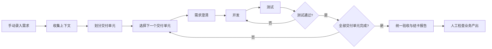
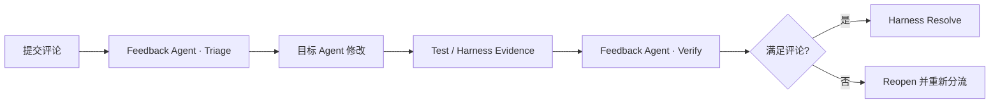
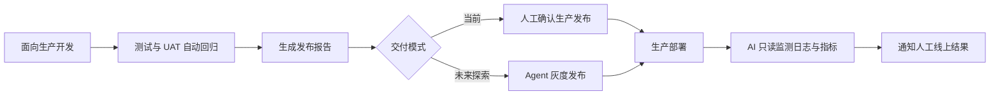

# L4 LOOP 工作手册

## 1. Introduction

大模型已经让 AI 从代码补全工具发展为能够理解仓库、修改代码、执行测试和完成工程任务的 Coding Agent。然而，生成代码只是软件交付的一部分。需求歧义、长任务漂移、验证可信度、执行恢复、权限控制、部署观测和业务结果判断，仍然限制着软件开发自动化程度。本文采用 AI4SE 的成熟度评估模型来评估软件开发自动化程度 [1]。

对于 L4 而言，AI4SE 系统应当包括：

1. AI 能完成从需求到部署的端到端闭环。
2. 系统能够无人值守地修复故障，并由多个 Agent 交叉验证。
3. 人工检查最终业务产出。

L4 评估的不是单个模型，而是由模型、Agent Harness、工程基础设施、验证体系和组织流程共同组成的软件交付系统。其核心原则不是延长单个 Agent 的连续工作时间，而是缩短每次执行的无验证距离：系统将工作拆成足够小、决策完备、可以独立验证的单元，在每次推进后保存状态和证据，并自动继续、重试、rewind、修复或停止。

根据生命周期覆盖范围，本文进一步区分三个 L4 Profile：

- **L4 Development**：从需求规格到代码合并。
- **L4 Delivery**：从需求规格到部署、环境观测和自动修复或回滚。
- **L4 End-to-End**：从客户需求、BA 分析到工程交付、业务观测和下一轮迭代。

我们已经通过 LoopWork 实现并实际运行 L4 Development 的主要闭环。当前系统使用确定性的外层流程调度多个专业 Agent，每次只推进一个最小开发单元，并提供问题澄清、结构化结果、自动测试、rewind、Git 状态记录、运行日志和可观测追踪。L4 Delivery 和 L4 End-to-End 尚未实现，是本文进一步提出的演进方向。

本文首先回顾 Coding Agent、Agent Harness、长任务执行、自动验证、多 Agent 系统和自动化成熟度模型等相关工作；随后定义 L4 的判定标准、运行边界和人机责任；接着介绍 L4 的设计原则及 Loop of Loops 架构，并以 LoopWork 说明 L4 Development 的参考实现；最后提出向 L4 Delivery 和 L4 End-to-End 演进的设计。

本文的主要贡献包括：

1. 提出基于 AI 驱动的 L4 LOOP 软件开发框架。
2. 提出以最小开发单元和短验证距离支撑长期无人值守的设计原则。
3. 给出已实际运行的 L4 Development 参考实现。
4. 提出从 L4 Development 演进至 L4 Delivery 和 L4 End-to-End 的总体架构。

## 2. 相关工作：为什么这样设计

### 2.1 长任务的问题不是运行时间，而是状态丢失

长任务的主要问题不是模型能否继续生成，而是能否跨上下文保持目标、状态和证据。Anthropic 的长任务实践强调增量工作、进度文件、Git checkpoint 和跨会话交接 [2]。

METR 提出了 Task-Completion Time Horizon，用于衡量 AI Agent 能够以一定成功概率完成的人类等价任务长度 [3]。该指标并不是衡量 Agent 可以连续运行多久，而是衡量：一个由人类专家通常需要一定时间完成的任务，Agent 能否独立完成。

相关研究表明，随着任务时间跨度增加，Agent 完成任务的成功概率会逐渐下降。即使当前先进的 Coding Agent 已经具备小时级的软件工程任务能力，对于跨越更长周期、包含更多隐含决策的软件交付任务，单个 Agent 的可靠自治能力仍然存在明显限制。例如对于 Claude Opus 4.6，其 50% 成功率阈值对应约 12 小时量级的人类专家任务；该结果取决于任务分布和评估方法，不代表 Agent 可以连续稳定运行相同时间 [3]。

因此，L4 LOOP 不把希望寄托在一次超长调用上，而是用 Harness 将长目标转换成范围可控的执行单元。

### 2.2 Harness 控制流程，Agent 处理局部问题

Anthropic 在《Building Effective Agents》中区分了 Workflow 和 Agent：Workflow 是预定义流程，可控、可预测；Agent 更适合动态规划和自主决策 [4]。

已有 Agent 系统研究表明，复杂任务通常需要在 Agent 自主能力和确定性 Workflow 之间取得平衡。对于目标明确、流程可预测的问题，应优先采用 Workflow 控制流程，而仅在需要动态决策的位置引入 Agent。

本文继承这一思想：

- Harness 负责状态管理、流程推进、权限控制和验证。
- Agent 负责局部认知任务。

### 2.3 人应该判断业务，而不是替系统检查每一步

Human-in-the-loop（HITL）长期被用于提高 AI 系统可靠性，其核心思想是在 AI 能力不足或风险较高的位置引入人工判断。然而，Agent 系统逐渐具备更强的任务执行能力，例如 SWE-bench 已经证明 AI 的局部自治是可行的 [5]。传统的逐步审批模式可能因此成为系统扩展的限制因素。

已有 Human-AI Interaction 研究指出，人工参与的价值主要集中于 AI 无法可靠判断的高层目标、不确定情况和高影响决策，而不是替代 AI 完成所有过程判断。

因此，本文提出一种面向 L4 软件开发的人机责任重新分配：

- Harness 负责流程控制、状态管理、工程验证和异常恢复。
- Agent 负责受约束范围内的分析和执行。
- 人负责提供业务目标、解决不可推导的业务歧义，并检查最终业务结果。

### 2.4 多 Agent 的价值是职责分离

复杂软件工程任务通常涉及需求分析、设计、实现、测试和维护等多个阶段。不同阶段具有不同的目标、知识需求和评价标准，因此单一 Agent 难以覆盖完整的软件工程过程。

LLM-based Multi-Agent 系统通过多个具有不同职责和专业能力的 Agent 协同工作，为复杂软件工程任务提供了一种新的解决路径。相关综述研究指出，其核心优势来自 Agent 的专业化分工、协作机制以及对复杂任务的分解能力 [6]。

Multi-Agent 系统的价值并非来自简单增加 Agent 数量，而来自不同 Agent 在职责和能力上的差异。例如，一个 Agent 可以负责代码生成，另一个 Agent 负责测试或文档生成，通过专业化角色降低单一 Agent 同时处理多个目标时产生的能力冲突。

在软件工程代码生成任务中，常见角色包括 Orchestrator、Programmer、Reviewer、Tester 和 Information Retriever。Orchestrator 负责高层目标规划、任务拆解、任务分配和执行协调，其他 Agent 负责具体的软件工程活动。这类架构说明，复杂软件工程自动化不仅依赖模型本身的代码生成能力，还需要一个负责任务组织和协作控制的外部协调层。

### 2.5 自动测试是必要条件，但不是全部

SWE-bench 使用 Fail-to-Pass 和 Pass-to-Pass 测试判断补丁是否解决问题，说明可执行测试是 Coding Agent 自治的重要基础 [5]。但后续研究也发现，测试不足可能让错误补丁被判定为成功 [7]。

因此，L4 LOOP 将三类信息分开：

- **Claim**：Agent 声称完成了什么。
- **Evidence**：测试、命令、退出码、Diff、Commit、日志和运行指标说明了什么。
- **Result**：Harness 根据规则和证据做出的最终判定。

“Agent 说通过”不能等同于“系统验证通过”。验证越接近外部可观察行为和业务目标，结论越可信。

### 2.6 相关工作如何支撑 L4 LOOP

| 已知问题或研究结论 | L4 LOOP 的设计选择 |
| --- | --- |
| Agent 的成功率随任务跨度和隐含决策增加而下降 | 拆分最小开发单元，缩短无验证距离 |
| 模型上下文不能可靠保存长期状态 | 状态、规格和证据由 Harness 持久化 |
| Workflow 可预测，Agent 适合动态决策 | 确定性外环与自主内环 |
| 逐步人工审批限制自动化扩展 | 人只处理业务目标、真实歧义和最终结果 |
| 多 Agent 可以专业分工，也会产生共同错误 | 职责独立的 Agent 加外部工程 Oracle |
| 单一测试可能产生错误成功结论 | 分离 Claim、Evidence 和 Result，组合多个验证来源 |

## 3. L4 Development

### 3.1 L4 定义和范围

L4 本身的定义参考 AI4SE 的成熟度评估模型。本文按照生命周期覆盖范围进一步区分三个 Profile：

| Profile | 起点 | 终点 |
| --- | --- | --- |
| L4 Development | 已对齐的需求规格 | 代码合并与结卡报告 |
| L4 Delivery | 已对齐的需求规格 | 部署、观测、修复或回滚 |
| L4 End-to-End | 客户原始需求 | 业务结果与后续迭代 |

### 3.2 L4 设计原则

| L4 LOOP 的设计选择 | L4 LOOP 的具体实现 |
| --- | --- |
| 确定性外环与自主内环 | 外层基于传统开发框架实现 Workflow：需求对齐 → 开发 → 测试 → 验收；内层 Agent 主动收集上下文，完成对应节点工作 |
| 人只处理业务目标、真实歧义和最终结果 | Loop 持续驱动 Agent，除非 Agent 明确需要人确定，否则持续推动到任务完成 |
| 拆分最小开发单元，缩短无验证距离 | 划分最小交付单元，在每个单元上确定决策树、开发计划和 AC |
| 状态、规格和证据由 Harness 持久化 | 外层 Workflow 提供基础工具，支持内层 Agent 提交状态、结果和文档 |
| 分离 Claim、Evidence 和 Result | 使用单独的测试 Agent，独立于实现 Agent 进行验证 |

以下逐项介绍这些设计，并以 L4 Development 的参考实现 LoopWork 为例。

### 3.3 持续驱动 Agent 的 Workflow 与自主决策的 Agent

参考 Loop Engineering，工作重心应该从“由人通过 Chat 推动 Agent 干活”转为“设计一个持续驱动 Agent 的系统” [8]。该系统应当包括以下功能：

- Loop 能够自主发现和分配工作。
- 通过职责独立的 Agent 分配实现和验证，并将进度、证据和下一步动作持久化，以便持续运行。
- Loop 在必要时自主请求人介入，并根据反馈自动推动下一步动作。

以 LoopWork 实现的 L4 Development 为例，整体流程如下：

1. 当人手动添加需求后，Loop 接管该需求并自动开始整个流程，无需人逐步确认。
2. 每个状态分配一个独立 Agent 处理，外层 Workflow 负责上下文交接。
3. 在 Happy Path 中，人只需要参与需求澄清和统一验收；每个 Agent 节点也可以申请人介入，以补充上下文或解除阻塞。

### 3.4 划分最小交付单元，在每个交付单元上确定决策树

Agent 的成功率随任务跨度和隐含决策增加而下降，因此系统应拆分每一次交付的范围，减少不确定性。

最小交付单元取决于项目本身的结构和 AI 友好程度，例如：

- 项目越小，AI 越容易获取完整上下文。
- DDD 做得越好，AI 越容易从业务代码推断上下文。
- 业务文档和知识库整理得越好，AI 越容易获得完整上下文。

因此，最小交付单元随项目本身变化。团队可以在 L3 阶段不断尝试，总结当前项目中 Agent 能够可信交付的单元大小。

#### 决策树对齐

在最小交付单元下，再与 Agent 对齐业务及技术决策树，限制 Agent 自我发挥的空间。

这里不能在拆分交付单元前进行对齐。拆分前的范围尚未确定，因此需要先完成拆分，再进行业务和技术对齐。

#### 抽查开发计划和 AC

通常，在对齐决策树后，Agent 已经可以自行实现整个功能。系统仍然要求其在开发前写好计划，便于团队随时审查。团队可以偶尔抽查开发计划，判断 Prompt 是否需要更新，而不是逐任务审批。

### 3.5 单独的测试 Agent

“Agent 说通过”不能等同于“系统验证通过”。验证越接近外部可观察行为和业务目标，结论越可信。

因此，我们建议使用单独的测试 Agent，并要求它不依赖代码实现和 Dev Agent 的完成声明，只根据最小交付单元的需求澄清生成测试计划，再通过前端或其他用户入口模拟 QA 进行测试。

LoopWork 在 Web 项目中进行试验时，Test Agent 会根据需求规格说明书和澄清范围自动生成测试计划，并通过浏览器工具从前端验证整个流程。

### 3.6 状态、规格和证据持久化

持续运行不能依赖对话历史。模型会遗忘，对话会截断，进程也可能退出；因此任务事实必须保存在 Harness 管理的持久化存储中。

LoopWork 主要保存以下信息：

- 原始需求、交付单元和当前流程状态。
- 版本化 Slice Spec、决策事实和待澄清问题。
- 每次 Agent 的输入、Prompt 版本和结构化 Result。
- Harness 命令、退出码和验证 Evidence。
- 执行前后的 Git HEAD、Agent 创建的 Commit 和工作区状态。
- 运行日志、结构化事件和 Trace 关联信息。
- Review 报告、用户评论和结卡版本。

这些数据共同回答三个问题：系统已经做了什么；哪些结论已经被验证；下一步应该由谁处理什么工作。

外层 Workflow 还需要为 Agent 提供受控工具，使 Agent 可以提交结构化结果、请求澄清或运行信息，但不能直接修改业务数据库或任意推进流程状态。

### 3.7 失败、重试与恢复

长期无人值守不意味着系统不会失败，而是失败后不需要人重新理解整个过程。

LoopWork 中，每次 Agent 调用都对应一个持久化的 `execution_attempt`。系统在调用前保存输入、Prompt 版本、起始 Git HEAD 和租约；Agent Result、Harness Run 和状态应用分别保存 Receipt。

系统根据失败位置选择不同的恢复方式：

- Agent 尚未返回结果就中断：在预算内重新执行当前 attempt。
- Agent Result 已经保存但应用前中断：直接从已保存 Result 继续，不重复调用模型。
- Harness 验证失败：自动回到 Dev 或 Analysis，修复当前单元。
- 发现业务歧义：进入 `waiting_for_answers`，回答后回到 Analyst 重建规格。
- 缺少测试地址、账号配置或测试数据等运行信息：进入 `waiting_for_runtime_input`，补充后恢复原 Agent。
- 执行环境、工具协议或恢复机制异常：进入 `system_blocked`，保留完整诊断信息。

当前主流程记录执行前后的 Git HEAD，并允许 Dev Agent 按仓库规范创建本轮 Commit；Runner 不强制创建 checkpoint，也不代理提交。Git 状态、结构化 Result、数据库 Receipt 和 Trace 共同构成恢复边界。

### 3.8 统一验收与结卡

每个交付单元完成测试后，系统仍需要对整个需求进行统一验收。单元分别通过，并不能自动证明它们组合后仍然满足原始业务目标。

Review Agent 根据原始需求、所有 resolved Slice Spec、用户澄清、实际 Commit、Harness Evidence 和 Test Agent 结果生成结卡报告。报告至少包括：

- 原始目标和最终用户可观察结果。
- 实际交付范围以及明确未包含的内容。
- 各交付单元的关键决策和技术取舍。
- AC 与验证证据的对应关系。
- 规格与实现之间的偏差。
- 已知限制、残余风险和建议后续事项。

Review 不是审批门禁。报告生成后任务进入 `ready_to_close`，人的责任是检查最终业务产出并阅读报告，而不是重新完成一次代码 Review。

如果人的评论只涉及报告表述，Review Agent 直接生成新版本；如果评论揭示规格、实现或验证问题，系统自动 rewind 到对应阶段，完成修复和验证后重新生成报告。只有无开放问题的最新报告可以用于结卡。

### 3.9 文档评论与反馈闭环

评论不会中断正在运行的 Agent。Harness 在下一次派发前按任务检查反馈队列；有待处理评论的任务优先派发一个 Feedback Agent，没有评论的任务继续原流程。不同任务相互隔离，因此多个任务同时有评论时会并发运行各自的 Feedback Agent。

Feedback Agent 有两个模式：Triage 判断评论影响、目标阶段和完成标准；Verify 在目标 Agent 完成修改、Test/Harness 产生证据后，检查原评论是否真正得到满足。目标 Agent 负责修改，Feedback Agent 负责语义判断，最终只有 Harness 可以将反馈标记为 `resolved`。

只有已经处理并验证为 `resolved` 的重复反馈才能进入 Memory 或 Prompt 演化。这样当前任务修复和长期能力学习相互关联，但不会把未经验证的评论直接写入长期规则。

## 4. L4 Delivery

### 4.1 为什么代码合并还不是交付完成

代码合并只能证明变更已经进入代码库，不能证明它能够正确构建、部署并在目标环境稳定运行。配置差异、数据迁移、外部依赖、容量、网络和运行时行为，都可能使通过开发测试的代码在环境中失败。

L4 Delivery 将终点从“代码合并”扩展为“目标版本已经部署，并在观察窗口内达到稳定状态”。其基本过程包括：

1. **面向生产开发**：开发时构建合适的日志和监测体系，以便上线后由 AI 直接观测。
2. **测试环境和 UAT 环境回归**：在测试环境和 UAT 环境自动回归所有 AC。
3. **生产环境只读监测**：上线后，AI 读取生产环境日志，并监测相关内容是否按预期运行。

由于生产环境涉及合规要求，当前流程本质上仍由人推动后续交付。未来更激进的情况下，可以探索由 Agent 进行灰度发布和持续交付：

### 4.2 Delivery Loop 需要新增的能力

#### Release Spec

每次发布需要一个决策完备的 Release Spec，至少声明目标环境、Artifact、配置差异、依赖、数据迁移、风险等级、验证步骤、Canary 策略、成功指标、观察窗口和回滚条件。部署 Agent 不应在执行时临场猜测这些内容。

#### Environment Adapter

Agent 不应直接获得任意环境操作权限。Harness 应通过统一 Adapter 暴露构建、部署、查询状态、切换流量和回滚等受控动作。每个动作都要校验环境、权限和幂等键，并保存外部系统返回的 Receipt。

#### Runtime Oracle

环境验证不能只依赖部署平台返回的 `success`。系统需要组合以下证据：

- Artifact、配置和环境版本一致性。
- 实例健康状态和依赖可用性。
- Smoke Test、端到端测试和关键路径合成监控。
- Canary 与基线的错误率、延迟和资源差异。
- 日志、Trace、告警和业务保护指标。

## 5. L4 End-to-End

### 5.1 将起点前移到客户需求

L4 End-to-End 把起点从已对齐的需求规格前移到客户原始需求，把终点从环境稳定后移到业务结果。

BA 不再直接承接客户原始需求，而是由 L4 LOOP 先承接客户需求，完成一轮基础上下文收集和方案分析，再与关键干系人交互确认。

### 5.2 BA Loop

BA Loop 不只是把客户原话整理成文档，而是将原始需求转成可验证的业务方案。它需要：

1. 保存客户原话、背景、利益相关方和期望结果。
2. 分析现有业务流程、规则、例外和产品能力。
3. 识别冲突和缺失事实，只对关键业务歧义向人提问。
4. 形成 Solution Spec，包括业务流程、范围、规则、业务 AC 和指标。
5. 将 Solution Spec 交给后续 Loop，拆成工程交付单元。

### 5.3 全链路可追溯

L4 End-to-End 需要让任意工程结果都能够回到原始业务目标：

`客户原话 → 业务决策 → Solution Spec → Slice Spec → Commit → Release → 运行指标 → 业务结果`

如果开发阶段发现业务规则冲突，应回到 BA 或 Alignment 形成新版本；如果生产技术稳定但业务指标没有改善，应回到 BA 检查业务假设，而不是让 Dev Agent 继续修改代码碰运气。

### 5.4 人工检查业务产出

业务观测结束后，人检查的是结果和价值，而不是重新审批过程：目标是否真正达到，保护指标是否恶化，是否产生不可接受的副作用，以及是否需要开始下一轮迭代。

即使实现 L4 End-to-End，系统仍然不是 L5。客户和业务负责人继续决定战略目标和价值方向；系统只在这些目标及运行边界内自主完成交付闭环。

## 6. L4 基础设施

随着系统从“人通过 Chat 推动 Agent”变成“Workflow 持续驱动 Agent”，L4 越来越像一个面向 Software Engineering 的 Agent 应用。虽然不同项目的 Prompt、业务知识和技术栈不同，但整体流程通常相似：

`发现工作 → 收集上下文 → 拆分交付单元 → 需求澄清 → 开发 → 测试 → 验收`

因此，可以建设统一的 L4 Workflow Infra，复用各项目都需要的基础能力：

- Agent 调度和节点间上下文交接。
- 状态、规格、决策、Memory 和 Evidence 持久化。
- 结构化 Result、Harness 验证和 Trace。
- 中断恢复、重试、rewind 和人工介入。
- 模型、工具、网络和环境权限控制。

统一 Infra 不负责定义具体业务，而是将稳定能力与项目差异分开：

| 统一 Infra | 项目自定义 |
| --- | --- |
| Workflow、状态机和恢复机制 | 启用哪些阶段以及阶段顺序 |
| Agent Runtime 和结果协议 | Prompt、Skill 和模型 |
| Memory、Evidence 和 Trace | 领域知识、AC 和项目经验 |
| 权限、人工 Gate 和 Adapter 接口 | 仓库、工具、环境和风险策略 |

长期 Memory 不能只是保存全部对话。它应分别保存当前任务状态、用户决策、项目知识和验证证据，并带有来源、作用域和版本，只向当前 Agent 提供需要的内容。

LoopWork 已经具备这套 Infra 的早期形态，包括确定性编排、Agent Profile、版本化 Slice Spec、execution attempt、Harness Evidence、rewind、日志、Trace 和 Memory。下一步可以将固定流程抽象为可配置的 Workflow Profile，并通过 Agent、Skill、Policy 和 Adapter 支持不同项目及 L4 Profile。

统一 Infra 的目标不是创建一个适用于所有项目的超级 Agent，而是统一“如何可靠运行一个 Loop”，让项目只需要注入自己的业务知识、Prompt 和验证规则，从而使 L4 能力能够跨项目复用和持续沉淀。

## References

1. Garousi, V., Keleş, A. B., Değirmenci, S., Jafarov, Z., Mövsümova, A., & Namazov, A. [Assessing Individual and Organizational Competency in AI-assisted Software Engineering: The AI4SE-MM Maturity Model](https://doi.org/10.2139/ssrn.5249786). 2025.
2. Anthropic. [Effective Harnesses for Long-Running Agents](https://www.anthropic.com/engineering/effective-harnesses-for-long-running-agents). 2025.
3. METR. [Task-Completion Time Horizons of Frontier AI Models](https://metr.org/time-horizons/). 2026.
4. Anthropic. [Building Effective Agents](https://www.anthropic.com/engineering/building-effective-agents). 2024.
5. Jimenez, C. E., et al. [SWE-bench: Can Language Models Resolve Real-World GitHub Issues?](https://www.swebench.com/original.html). ICLR, 2024.
6. He, J., Treude, C., & Lo, D. [LLM-Based Multi-Agent Systems for Software Engineering: Literature Review, Vision and the Road Ahead](https://doi.org/10.1145/3712003). ACM TOSEM, 2025.
7. Wang, Y., Pradel, M., & Liu, Z. [Are “Solved Issues” in SWE-bench Really Solved Correctly?](https://arxiv.org/abs/2503.15223). 2025.
8. Osmani, A. [Loop Engineering](https://www.oreilly.com/radar/loop-engineering/). O’Reilly Radar, 2026.
