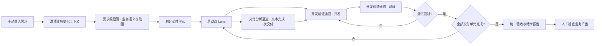
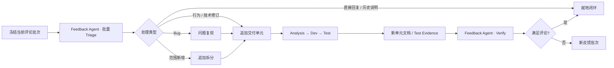
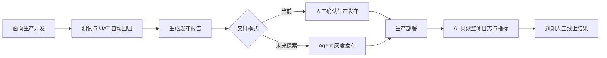

# L4 LOOP 工作手册

## 1. Introduction

大模型已经让 AI 从代码补全工具发展为能够理解仓库、修改代码、执行测试和完成工程任务的 Coding Agent。然而，生成代码只是软件交付的一部分。需求歧义、长任务漂移、验证可信度、执行恢复、权限控制、部署观测和业务结果判断，仍然限制着软件开发自动化程度。本文采用 AI4SE 的成熟度评估模型来评估软件开发自动化程度 [1]。

对于 L4 而言，AI4SE 系统应当包括：

1. AI 能完成从需求到部署的端到端闭环。
2. 系统能够无人值守地修复故障，并由多个 Agent 交叉验证。
3. 人工检查最终业务产出。

L4 评估的不是单个模型，而是由模型、Agent Harness、工程基础设施、验证体系和组织流程共同组成的软件交付系统。其核心原则不是延长单个 Agent 的连续工作时间，而是缩短每次执行的无验证距离：系统将工作拆成足够小、决策完备、可以独立验证的单元，在每次推进后保存状态和证据，并自动继续、重试、rewind、修复或停止。

根据生命周期覆盖范围，本文进一步区分三个 L4 Profile：

- **L4 Development**：从需求规格到代码合并。
- **L4 Delivery**：从需求规格到部署、环境观测和自动修复或回滚。
- **L4 End-to-End**：从客户需求、BA 分析到工程交付、业务观测和下一轮迭代。

我们已经通过 LoopWork 实现并实际运行 L4 Development 的主要闭环。当前系统使用确定性的外层流程调度多个专业 Agent，每次只推进一个最小开发单元，并提供问题澄清、结构化结果、自动测试、rewind、Git 状态记录、运行日志和可观测追踪。L4 Delivery 和 L4 End-to-End 尚未实现，是本文进一步提出的演进方向。

本文首先回顾 Coding Agent、Agent Harness、长任务执行、自动验证、多 Agent 系统和自动化成熟度模型等相关工作；随后定义 L4 的判定标准、运行边界和人机责任；接着介绍 L4 的设计原则及 Loop of Loops 架构，并以 LoopWork 说明 L4 Development 的参考实现；最后提出向 L4 Delivery 和 L4 End-to-End 演进的设计。

本文的主要贡献包括：

1. 提出基于 AI 驱动的 L4 LOOP 软件开发框架。
2. 提出以最小开发单元和短验证距离支撑长期无人值守的设计原则。
3. 给出已实际运行的 L4 Development 参考实现。
4. 提出从 L4 Development 演进至 L4 Delivery 和 L4 End-to-End 的总体架构。

## 2. 相关工作：为什么这样设计

### 2.1 长任务的问题不是运行时间，而是状态丢失

长任务的主要问题不是模型能否继续生成，而是能否跨上下文保持目标、状态和证据。Anthropic 的长任务实践强调增量工作、进度文件、Git checkpoint 和跨会话交接 [2]。

METR 提出了 Task-Completion Time Horizon，用于衡量 AI Agent 能够以一定成功概率完成的人类等价任务长度 [3]。该指标并不是衡量 Agent 可以连续运行多久，而是衡量：一个由人类专家通常需要一定时间完成的任务，Agent 能否独立完成。

相关研究表明，随着任务时间跨度增加，Agent 完成任务的成功概率会逐渐下降。即使当前先进的 Coding Agent 已经具备小时级的软件工程任务能力，对于跨越更长周期、包含更多隐含决策的软件交付任务，单个 Agent 的可靠自治能力仍然存在明显限制。例如对于 Claude Opus 4.6，其 50% 成功率阈值对应约 12 小时量级的人类专家任务；该结果取决于任务分布和评估方法，不代表 Agent 可以连续稳定运行相同时间 [3]。

因此，L4 LOOP 不把希望寄托在一次超长调用上，而是用 Harness 将长目标转换成范围可控的执行单元。

### 2.2 Harness 控制流程，Agent 处理局部问题

Anthropic 在《Building Effective Agents》中区分了 Workflow 和 Agent：Workflow 是预定义流程，可控、可预测；Agent 更适合动态规划和自主决策 [4]。

已有 Agent 系统研究表明，复杂任务通常需要在 Agent 自主能力和确定性 Workflow 之间取得平衡。对于目标明确、流程可预测的问题，应优先采用 Workflow 控制流程，而仅在需要动态决策的位置引入 Agent。

本文继承这一思想：

- Harness 负责状态管理、流程推进、权限控制和结果持久化。
- Agent 负责分析、实现、验证和其他局部认知任务。

### 2.3 人应该判断业务，而不是替系统检查每一步

Human-in-the-loop（HITL）长期被用于提高 AI 系统可靠性，其核心思想是在 AI 能力不足或风险较高的位置引入人工判断。然而，Agent 系统逐渐具备更强的任务执行能力，例如 SWE-bench 已经证明 AI 的局部自治是可行的 [5]。传统的逐步审批模式可能因此成为系统扩展的限制因素。

已有 Human-AI Interaction 研究指出，人工参与的价值主要集中于 AI 无法可靠判断的高层目标、不确定情况和高影响决策，而不是替代 AI 完成所有过程判断。

因此，本文提出一种面向 L4 软件开发的人机责任重新分配：

- Harness 负责流程控制、状态管理和异常恢复。
- Agent 负责受约束范围内的分析和执行。
- 人负责提供业务目标、解决不可推导的业务歧义，并检查最终业务结果。

### 2.4 多 Agent 的价值是职责分离

复杂软件工程任务通常涉及需求分析、设计、实现、测试和维护等多个阶段。不同阶段具有不同的目标、知识需求和评价标准，因此单一 Agent 难以覆盖完整的软件工程过程。

LLM-based Multi-Agent 系统通过多个具有不同职责和专业能力的 Agent 协同工作，为复杂软件工程任务提供了一种新的解决路径。相关综述研究指出，其核心优势来自 Agent 的专业化分工、协作机制以及对复杂任务的分解能力 [6]。

Multi-Agent 系统的价值并非来自简单增加 Agent 数量，而来自不同 Agent 在职责和能力上的差异。例如，一个 Agent 可以负责代码生成，另一个 Agent 负责测试或文档生成，通过专业化角色降低单一 Agent 同时处理多个目标时产生的能力冲突。

在软件工程代码生成任务中，常见角色包括 Orchestrator、Programmer、Reviewer、Tester 和 Information Retriever。Orchestrator 负责高层目标规划、任务拆解、任务分配和执行协调，其他 Agent 负责具体的软件工程活动。这类架构说明，复杂软件工程自动化不仅依赖模型本身的代码生成能力，还需要一个负责任务组织和协作控制的外部协调层。

### 2.5 自动测试是必要条件，但不是全部

SWE-bench 使用 Fail-to-Pass 和 Pass-to-Pass 测试判断补丁是否解决问题，说明可执行测试是 Coding Agent 自治的重要基础 [5]。但后续研究也发现，测试不足可能让错误补丁被判定为成功 [7]。

因此，L4 LOOP 将三类信息分开：

- **Claim**：Agent 声称完成了什么。
- **Evidence**：测试、命令、退出码、Diff、Commit、日志和运行指标说明了什么。
- **Result**：职责独立的 Agent 根据事实和证据做出的专业判定；Harness 只保存结果并执行明确路由。

“Agent 说通过”不能等同于“系统验证通过”。验证越接近外部可观察行为和业务目标，结论越可信。

### 2.6 相关工作如何支撑 L4 LOOP

| 已知问题或研究结论 | L4 LOOP 的设计选择 |
| --- | --- |
| Agent 的成功率随任务跨度和隐含决策增加而下降 | 拆分最小开发单元，缩短无验证距离 |
| 模型上下文不能可靠保存长期状态 | 状态、规格和证据由 Harness 持久化 |
| Workflow 可预测，Agent 适合动态决策 | 确定性外环与自主内环 |
| 逐步人工审批限制自动化扩展 | 人只处理业务目标、真实歧义和最终结果 |
| 多 Agent 可以专业分工，也会产生共同错误 | 实现与验证职责独立，并保留可追溯证据 |
| 单一测试可能产生错误成功结论 | 分离 Claim、Evidence 和 Result，组合多个验证来源 |

## 3. L4 Development

### 3.1 L4 定义和范围

L4 本身的定义参考 AI4SE 的成熟度评估模型。本文按照生命周期覆盖范围进一步区分三个 Profile：

| Profile | 起点 | 终点 |
| --- | --- | --- |
| L4 Development | 已对齐的需求规格 | 代码合并与结卡报告 |
| L4 Delivery | 已对齐的需求规格 | 部署、观测、修复或回滚 |
| L4 End-to-End | 客户原始需求 | 业务结果与后续迭代 |

### 3.2 L4 设计原则

| L4 LOOP 的设计选择 | L4 LOOP 的具体实现 |
| --- | --- |
| 确定性外环与自主内环 | 外层基于传统开发框架实现 Workflow：需求对齐 → 开发 → 测试 → 验收；内层 Agent 主动收集上下文，完成对应节点工作 |
| 人只处理业务目标、真实歧义和最终结果 | Loop 持续驱动 Agent，除非 Agent 明确需要人确定，否则持续推动到任务完成 |
| 拆分最小开发单元，缩短无验证距离 | 划分最小交付单元，在每个单元上确定决策树、开发计划和 AC |
| 状态、规格和证据由 Harness 持久化 | 外层 Workflow 提供基础工具，支持内层 Agent 提交状态、结果和文档 |
| 分离 Claim、Evidence 和 Result | 使用单独的测试 Agent，独立于实现 Agent 进行验证 |

以下逐项介绍这些设计，并以 L4 Development 的参考实现 LoopWork 为例。

### 3.3 持续驱动 Agent 的 Workflow 与自主决策的 Agent

参考 Loop Engineering，工作重心应该从“由人通过 Chat 推动 Agent 干活”转为“设计一个持续驱动 Agent 的系统” [8]。该系统应当包括以下功能：

- Loop 能够自主发现和分配工作。
- 通过职责独立的 Agent 分配实现和验证，并将进度、证据和下一步动作持久化，以便持续运行。
- Loop 在必要时自主请求人介入，并根据反馈自动推动下一步动作。

以 LoopWork 实现的 L4 Development 为例，整体流程如下：

```mermaid
flowchart LR
    input["手动录入需求"] --> context["澄清业务变化上下文"]
    context --> intakeClarify["需求级澄清 · 业务语义与范围"]
    intakeClarify --> split["划分交付单元"]
    split --> lanes["启动双 Lane"]
    lanes --> clarify["交付分析通道 · 文本完成一次交付"]
    lanes --> dev["开发验证通道 · 开发"]
    clarify --> dev
    dev --> test["开发验证通道 · 测试"]
    test --> passed{"测试通过?"}
    passed -->|"否"| dev
    passed -->|"是"| completed{"全部交付单元完成?"}
    completed -->|"否"| lanes
    completed -->|"是"| review["统一验收与结卡报告"]
    review --> human["人工检查业务产出"]
```

1. 当人手动添加需求后，Loop 接管该需求并自动开始整个流程，无需人逐步确认。
2. 每个状态分配一个独立 Agent 处理，外层 Workflow 只投影当前角色所需的权威上下文，并隔离相邻 Agent 的非权威叙事。
3. 在 Happy Path 中，人只需要回答无法推导的需求级产品歧义，以及超出工程自主权且会产生实质不同交付后果的交付级关键决策，并参与统一验收；需求级回答交回需求梳理 Agent，交付级回答交回对应交付分析 Agent。

需求梳理 Agent 是原始输入与 L4 Development 正式起点“已对齐需求规格”之间的桥梁。它依据当前项目能够提供的证据，区分当前实际业务状态、当前应有的业务语义和本次目标状态，明确三者之间的变化，并分析对业务结果有实质意义的影响。代码只能证明当前实现的一部分，不天然代表完整业务事实或正确业务规则；不同项目可以通过领域知识、文档、运行观察、工具和 Skill 提供自己的证据能力。

基础角色只规定认识论、业务边界和完成标准，不预设固定行业检查清单。Agent 自主选择与当前项目匹配的调查路径；发现关联影响不代表自动将其纳入范围，必须区分需要同步改变、必须保持不变、需要业务决策和留给后续技术分析的影响。草稿中的稳定 key 表示稳定语义身份，错误结论必须显式排除或取代并保留修订历史。需求梳理 Agent 不拆分交付单元，也不设计实现方案。

交付拆分后，交付分析通道可以连续分析后续交付单元，开发验证通道在后方串行执行 `Dev(N) → Test(N)`。两条通道的状态、阻塞和恢复相互独立，但 Dev 永远不能超过已经收敛的交付分析进度。任一通道完成后立即重新调度；进入 Review 前，两条通道必须全部汇合且没有开放反馈。

### 3.4 划分最小交付单元，在每个交付单元上确定决策树

Agent 的成功率随任务跨度和隐含决策增加而下降，因此系统应拆分每一次交付的范围，减少不确定性。

最小交付单元取决于项目本身的结构和 AI 友好程度，例如：

- 项目越小，AI 越容易获取完整上下文。
- DDD 做得越好，AI 越容易从业务代码推断上下文。
- 业务文档和知识库整理得越好，AI 越容易获得完整上下文。

因此，最小交付单元随项目本身变化。团队可以在 L3 阶段不断尝试，总结当前项目中 Agent 能够可信交付的单元大小。

交付规划不是把需求改写成一组标题。它冻结需求梳理阶段已经收敛的业务变化上下文，将必须同步改变的影响、必须保持的约束、交给后续分析的技术后果和需求级验收语义，显式映射到有序交付单元。每个单元保留稳定身份、业务参与者、触发条件、可观察结果、独立验收语义和自然依赖，并作为交付分析 Agent 的正式输入契约。

Application 只校验来源引用存在、冻结输入均有承接、依赖无环且与顺序一致等结构事实，不判断某种拆分在业务上是否更优。Agent 根据当前项目自主判断边界；无法证明两个结果可以独立成立时采用较大的完整闭环，不为了缩小上下文制造不可验收的半成品，也不通过阶段回退重新打开已经收敛的需求语义。

#### Do It Twice：先在思考中完成一次交付

交付单元冻结后，交付分析 Agent 不直接跳到文件计划，而是根据项目实际在调查和推理中完整走过业务触发、系统响应、状态变化、失败与边界以及用户可观察结果。Do It Twice 是思考方法，不是要求逐项持久化的文档模板。代码、测试、配置、数据模型和运行观察用于证明当前项目事实，但不自动覆盖上游业务承诺。

思考过程中应显式发现需求文字未覆盖的实际影响，以及会改变业务结果、公共契约、数据语义、兼容策略、重大工程后果或独立验证结果的关键决策。每个真实影响最终处理为改变、保持、排除或待决策。决策权留给最接近事实且有权承担后果的一方：上游已经承诺的直接继承，用户答复形成稳定事实，项目证据能够确定的由证据关闭，核心工程取舍可以由交付分析 Agent 在权限内自主关闭；文件位置、局部命名和容易回退的等价实现留给 Dev Agent。只有无法由现有证据确定、超出工程自主权且会产生实质不同交付后果的最少决策才询问用户。

交付分析的结果不是逐文件开发计划，也不是完整推演档案，而是一份轻量、版本化的冻结交付契约：分析摘要、实际影响及处理方式、关键业务和技术决策、实现方向、保护约束与验证关注点。它是 Dev 与 Test 的共同上游事实，而不是二者之间的交接；它消除执行期间的阻塞性不确定性，同时保留不改变交付语义的实现与验证自主空间。

### 3.5 单独的测试 Agent

“Agent 说通过”不能等同于“系统验证通过”。验证越接近外部可观察行为和业务目标，结论越可信。

因此，我们建议使用单独的测试 Agent。Test 以交付分析冻结的业务承诺、实际影响、保护约束和验证关注点建立 Oracle，以当前仓库和真实环境作为验证对象；它不读取或依赖 Dev Agent 的完成声明、自检、开发记录、变更说明、Commit message 或恢复声明，而是先独立生成并冻结测试计划，再逐项执行。每项交付单元验收语义必须从真实前端覆盖完整用户业务闭环；API 黑盒场景可补充边界、错误反馈、数据语义和跨入口一致性，只要它服务于业务预期，而不是把接口实现细节当作交付目标。

开发验证通道仍按 `Dev(N) → Test(N)` 串行执行，因为 Test 必须面对 Dev 完成后的稳定仓库状态。这个顺序是时间和状态依赖，不是信息交接：Dev 与 Test 的专业判断彼此隔离，二者只共享 Analyst 冻结的交付契约。

LoopWork 在 Web 项目中进行试验时，Test Agent 会根据冻结交付契约先形成前端与必要 API 场景，再通过浏览器从前端验证完整业务流程，并按计划逐项记录通过、失败或阻塞。API 反例可以直接支持失败结论；但没有前端业务闭环证据不能判定交付通过。前端能力存在而测试地址、浏览器、账号、设备或数据等资源不可获得时，Test 可以报告环境阻塞。

### 3.6 状态、规格和证据持久化

持续运行不能依赖对话历史。模型会遗忘，对话会截断，进程也可能退出；因此任务事实必须保存在 Harness 管理的持久化存储中。

LoopWork 主要保存以下信息：

- 原始需求、交付单元和当前流程状态。
- 版本化交付规格、决策事实和待确认问题。
- 每次 Agent 实际收到的完整 Prompt snapshot、execution input hash、Base Prompt version、Overlay revision、组合 Role Prompt hash、Memory revision/hash 和结构化 Result。
- Test Agent 的命令、观察、失败分类和验证 Evidence。
- 执行前后的 Git HEAD、Agent 创建的 Commit 和工作区状态。
- 运行日志、结构化事件和 Trace 关联信息。
- Review 报告、用户评论和结卡版本。

这些数据共同回答三个问题：系统已经做了什么；哪些结论已经被验证；下一步应该由谁处理什么工作。

Agent 配置历史与 execution 审计是两个不同边界。当前全套修正版统一作为新的 V1 Base；配置域中每个 Agent 只有一条随应用升级的 Base Prompt、一条可选项目 Overlay，自动演化期间至多增加一个临时 Overlay candidate。旧 Prompt/Overlay 历史不保留，也不提供 UI 恢复入口。candidate 三次 Canary 全部成功后覆盖当前 Overlay 并被删除，任一次失败则直接丢弃，当前 Overlay 保持不变。Base 升级不会覆盖 Overlay，Memory 继续保留 revision 历史。与此同时，已经发生的每次 execution 必须保留当时完整的 Prompt snapshot、execution input hash、Base version、Overlay revision 和组合 Role Prompt hash；该快照只用于审计，不能恢复为当前配置。

外层 Workflow 还需要为 Agent 提供受控工具，使 Agent 可以提交结构化结果、请求澄清或运行信息，但不能直接修改业务数据库或任意推进流程状态。

### 3.7 失败、重试与恢复

长期无人值守不意味着系统不会失败，而是失败后不需要人重新理解整个过程。

LoopWork 中，每次 Agent 调用都对应一个持久化的 `execution_attempt`。系统在调用前保存实际发送给模型的完整 Prompt snapshot、execution input hash、Base version、Overlay revision、组合 Role Prompt hash、Memory revision/hash、上下文输入和起始 Git HEAD；Agent Result 和状态应用分别保存 Receipt。配置域后续更新 Base/Overlay 或丢弃 candidate 不会改写这份审计。Execution 不使用超时租约，Loop Run 通过 Runner 进程存活和短周期心跳识别主动停止、崩溃与突然关机。

系统根据失败位置选择不同的恢复方式：

- Agent 尚未返回结果就中断：在预算内重新执行当前 attempt。
- Agent Result 已经保存但应用前中断：直接从已保存 Result 继续，不重复调用模型。
- Test Agent 判断为实现问题或规格问题：分别回到 Dev 或 Analysis；环境问题和无法判断保持阻塞，不默认回退。
- 发现交付级关键决策：进入 `waiting_for_answers`，回答后回到交付分析 Agent 在原 key 上继续收敛规格。
- 缺少测试地址、账号配置或测试数据等运行信息：进入 `waiting_for_runtime_input`，补充后恢复原 Agent。
- 执行环境、工具协议或恢复机制异常：进入 `system_blocked`，保留完整诊断信息。

应用启动新一轮前会收尾已经失去 Runner 的旧 Run：`planned/running` 且没有持久化结果的 attempt 转为 `retryable_failed`；存在待消费结果或处于 `output_received/verifying/applying` 的 attempt 保持原检查点，由新的 `agent-runner` 优先恢复。主动停止使用同一套收尾规则，因此不会留下长期占用 Lane 的运行记录。

当前主流程记录执行前后的 Git HEAD，并允许 Dev Agent 按仓库规范创建本轮 Commit；Runner 不强制创建 checkpoint，也不代理提交。Git 状态、结构化 Result、数据库 Receipt 和 Trace 共同构成恢复边界。

### 3.8 统一验收与结卡

每个交付单元完成测试后，系统仍需要对整个需求进行统一验收。单元分别通过，并不能自动证明它们组合后仍然满足原始业务目标。

Review Agent 根据原始需求、所有已收敛交付规格、用户澄清、实际 Commit、Test Evidence 和执行事实生成结卡报告。报告至少包括：

- 原始目标和最终用户可观察结果。
- 实际交付范围以及明确未包含的内容。
- 各交付单元的关键决策和技术取舍。
- AC 与验证证据的对应关系。
- 规格与实现之间的偏差。
- 已知限制、残余风险和建议后续事项。

Review 不是审批门禁。报告生成后任务进入 `ready_to_close`，人的责任是检查最终业务产出并阅读报告，而不是重新完成一次代码 Review。

如果人的评论只涉及报告表述，Review Agent 生成新版本；如果评论揭示规格、实现或验证问题，系统在既有交付之后追加修订交付单元，完整完成分析、实现和验证后重新生成报告。只有无开放问题且没有活动反馈批次的最新报告可以用于结卡。

### 3.9 文档评论与反馈闭环

评论不会中断正在运行的 Agent。Harness 在下一次派发前按任务冻结当前待分流评论，优先派发一个 Feedback Agent 批量处理；执行期间新增的评论进入下一批。不同任务相互隔离，因此多个任务同时有评论时会并发运行各自的 Feedback Agent。

Feedback Agent 有两个模式：Triage 把批次评论按共同验收目标分成工作组；Verify 在追加工作产生新文档或 Test Evidence 后，逐条检查评论是否真正得到满足。直接回复、历史说明和长期建议不创建交付单元；Bug 先复现，行为修订和技术调整各追加一个单元，范围新增先由交付规划 Agent 拆分，报告修订生成新版本。Application 不接受评论驱动的阶段跳转或回退。旧文档、旧交付规格和旧交付单元保持不变，新工程工作只追加到末尾并按正常 Loop 前进。任何未验证评论或活动反馈批次都会阻止结卡，验证未通过的评论进入一个新批次。

```mermaid
flowchart LR
    comment["冻结当前评论批次"] --> triage["Feedback Agent · 批量 Triage"]
    triage --> kind{"处理类型"}
    kind -->|"直接回复 / 历史说明"| resolved["就地闭环"]
    kind -->|"Bug"| repro["问题复现"]
    kind -->|"范围新增"| split["追加拆分"]
    kind -->|"行为 / 技术修订"| append["追加交付单元"]
    repro --> append
    split --> append
    append --> target["Analysis → Dev → Test"]
    target --> evidence["新单元文档 / Test Evidence"]
    evidence --> verify["Feedback Agent · Verify"]
    verify --> result{"满足评论?"}
    result -->|"是"| resolved
    result -->|"否"| reopen["新反馈批次"]
```

只有已经处理并验证为 `resolved` 的重复反馈才能进入 Memory revision 或 Overlay candidate。Overlay candidate 仍必须独立通过 Canary，成功后覆盖当前 Overlay，失败则丢弃；它不会形成可恢复的 Prompt 历史。这样当前任务修复和长期能力学习相互关联，但不会把未经验证的评论直接写入长期规则。

## 4. L4 Delivery

### 4.1 为什么代码合并还不是交付完成

代码合并只能证明变更已经进入代码库，不能证明它能够正确构建、部署并在目标环境稳定运行。配置差异、数据迁移、外部依赖、容量、网络和运行时行为，都可能使通过开发测试的代码在环境中失败。

L4 Delivery 将终点从“代码合并”扩展为“目标版本已经部署，并在观察窗口内达到稳定状态”。其基本过程包括：

1. **面向生产开发**：开发时构建合适的日志和监测体系，以便上线后由 AI 直接观测。
2. **测试环境和 UAT 环境回归**：在测试环境和 UAT 环境自动回归所有 AC。
3. **生产环境只读监测**：上线后，AI 读取生产环境日志，并监测相关内容是否按预期运行。

由于生产环境涉及合规要求，当前流程本质上仍由人推动后续交付。未来更激进的情况下，可以探索由 Agent 进行灰度发布和持续交付：

```mermaid
flowchart LR
    dev["面向生产开发"] --> test["测试与 UAT 自动回归"]
    test --> ready["生成发布报告"]
    ready --> mode{"交付模式"}
    mode -->|"当前"| human["人工确认生产发布"]
    mode -->|"未来探索"| canary["Agent 灰度发布"]
    human --> prod["生产部署"]
    canary --> prod
    prod --> monitor["AI 只读监测日志与指标"]
    monitor --> notify["通知人工线上结果"]
```

### 4.2 Delivery Loop 需要新增的能力

#### Release Spec

每次发布需要一个决策完备的 Release Spec，至少声明目标环境、Artifact、配置差异、依赖、数据迁移、风险等级、验证步骤、Canary 策略、成功指标、观察窗口和回滚条件。部署 Agent 不应在执行时临场猜测这些内容。

#### Environment Adapter

Agent 不应直接获得任意环境操作权限。Harness 应通过统一 Adapter 暴露构建、部署、查询状态、切换流量和回滚等受控动作。每个动作都要校验环境、权限和幂等键，并保存外部系统返回的 Receipt。

#### Runtime Oracle

环境验证不能只依赖部署平台返回的 `success`。系统需要组合以下证据：

- Artifact、配置和环境版本一致性。
- 实例健康状态和依赖可用性。
- Smoke Test、端到端测试和关键路径合成监控。
- Canary 与基线的错误率、延迟和资源差异。
- 日志、Trace、告警和业务保护指标。

## 5. L4 End-to-End

### 5.1 将起点前移到客户需求

L4 End-to-End 把起点从已对齐的需求规格前移到客户原始需求，把终点从环境稳定后移到业务结果。

BA 不再直接承接客户原始需求，而是由 L4 LOOP 先承接客户需求，完成一轮基础上下文收集和交付分析，再与关键干系人交互确认。

### 5.2 BA Loop

BA Loop 不只是把客户原话整理成文档，而是将原始需求转成可验证的业务方案。它需要：

1. 保存客户原话、背景、利益相关方和期望结果。
2. 分析现有业务流程、规则、例外和产品能力。
3. 识别冲突和缺失事实，只对关键业务歧义向人提问。
4. 形成 Solution Spec，包括业务流程、范围、规则、业务 AC 和指标。
5. 将 Solution Spec 交给后续 Loop，拆成工程交付单元。

### 5.3 全链路可追溯

L4 End-to-End 需要让任意工程结果都能够回到原始业务目标：

`客户原话 → 业务决策 → Solution Spec → 交付规格 → Commit → Release → 运行指标 → 业务结果`

如果开发阶段发现业务规则冲突，应回到 BA 或 Alignment 形成新版本；如果生产技术稳定但业务指标没有改善，应回到 BA 检查业务假设，而不是让 Dev Agent 继续修改代码碰运气。

### 5.4 人工检查业务产出

业务观测结束后，人检查的是结果和价值，而不是重新审批过程：目标是否真正达到，保护指标是否恶化，是否产生不可接受的副作用，以及是否需要开始下一轮迭代。

即使实现 L4 End-to-End，系统仍然不是 L5。客户和业务负责人继续决定战略目标和价值方向；系统只在这些目标及运行边界内自主完成交付闭环。

## 6. L4 基础设施

随着系统从“人通过 Chat 推动 Agent”变成“Workflow 持续驱动 Agent”，L4 越来越像一个面向 Software Engineering 的 Agent 应用。虽然不同项目的 Prompt、业务知识和技术栈不同，但整体流程通常相似：

`发现工作 → 收集上下文 → 需求级澄清 → 拆分交付单元 → 单元级澄清 → 开发 → 测试 → 验收`

因此，可以建设统一的 L4 Workflow Infra，复用各项目都需要的基础能力：

- Agent 调度、角色化上下文投影与认知隔离。
- 状态、规格、决策、Memory 和 Evidence 持久化。
- 结构化 Result、Test Evidence 和 Trace。
- 中断恢复、重试、rewind 和人工介入。
- 模型、工具、网络和环境权限控制。

统一 Infra 不负责定义具体业务，而是将稳定能力与项目差异分开：

| 统一 Infra | 项目自定义 |
| --- | --- |
| Workflow、状态机和恢复机制 | 启用哪些阶段以及阶段顺序 |
| Agent Runtime 和结果协议 | Prompt、Skill 和模型 |
| Memory、Evidence 和 Trace | 领域知识、AC 和项目经验 |
| 权限、人工 Gate 和 Adapter 接口 | 仓库、工具、环境和风险策略 |

长期 Memory 不能只是保存全部对话。它应分别保存当前任务状态、用户决策、项目知识和验证证据，并带有来源、作用域和 revision 历史，只向当前 Agent 提供需要的内容。Prompt 不复用这套历史模型：当前修正版从 V1 Base 开始，配置域只保留一条随应用升级的 Base Prompt、一条可选项目 Overlay 和至多一个临时 Overlay candidate。

LoopWork 已经具备这套 Infra 的早期形态，包括确定性编排、Agent Profile、版本化交付规格、execution attempt、Test Evidence、Recovery Item、rewind、日志、Trace 和 Memory。下一步可以将固定流程抽象为可配置的 Workflow Profile，并通过 Agent、Skill、Policy 和 Adapter 支持不同项目及 L4 Profile。

统一 Infra 的目标不是创建一个适用于所有项目的超级 Agent，而是统一“如何可靠运行一个 Loop”，让项目只需要注入自己的业务知识、Prompt 和验证规则，从而使 L4 能力能够跨项目复用和持续沉淀。

## References

1. Garousi, V., Keleş, A. B., Değirmenci, S., Jafarov, Z., Mövsümova, A., & Namazov, A. [Assessing Individual and Organizational Competency in AI-assisted Software Engineering: The AI4SE-MM Maturity Model](https://doi.org/10.2139/ssrn.5249786). 2025.
2. Anthropic. [Effective Harnesses for Long-Running Agents](https://www.anthropic.com/engineering/effective-harnesses-for-long-running-agents). 2025.
3. METR. [Task-Completion Time Horizons of Frontier AI Models](https://metr.org/time-horizons/). 2026.
4. Anthropic. [Building Effective Agents](https://www.anthropic.com/engineering/building-effective-agents). 2024.
5. Jimenez, C. E., et al. [SWE-bench: Can Language Models Resolve Real-World GitHub Issues?](https://www.swebench.com/original.html). ICLR, 2024.
6. He, J., Treude, C., & Lo, D. [LLM-Based Multi-Agent Systems for Software Engineering: Literature Review, Vision and the Road Ahead](https://doi.org/10.1145/3712003). ACM TOSEM, 2025.
7. Wang, Y., Pradel, M., & Liu, Z. [Are “Solved Issues” in SWE-bench Really Solved Correctly?](https://arxiv.org/abs/2503.15223). 2025.
8. Osmani, A. [Loop Engineering](https://www.oreilly.com/radar/loop-engineering/). O’Reilly Radar, 2026.
