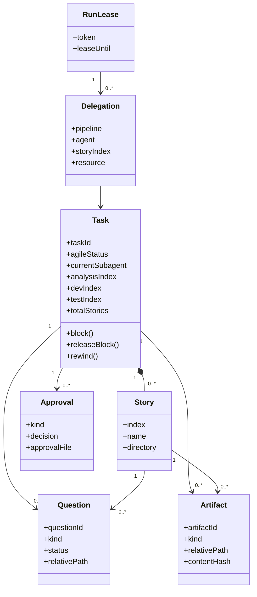

# Loop Engineering UI：V1 DDD 边界与模型

## 1. 统一语言

V1 的产品术语必须沿用现有系统，不采用 prototype 的新术语替代已有概念。

| 术语 | 含义 |
|---|---|
| Task | `tasks` 表中的工作项，Feature、Bug、Tech 等均以 Task 进入 loop。 |
| Story | Task 经 `story-splitter-agent` 拆出的可推进单元。 |
| Agent | `source-agent`、`backlog-agent`、`story-splitter-agent`、`analyst-agent`、`repro-agent`、`dev-agent`、`test-agent`、`review-agent`。 |
| Pipeline | CLI 根据 Task 状态和游标给出的下一步委派。 |
| Analysis / Dev / Test Index | Story 分别完成分析、开发、测试的顺序游标。 |
| Blocked | Task 等待人工或外部信息的状态，不是 Agent 失败的同义词。 |
| Question | 写入 `90_questions.md`、`90_analysis_questions.md`、`91_test_questions.md` 的待确认问题。 |
| Approval | analyst 的 `Analysis Decision` 与 review 的 `Review Decision` 所构成的人工门禁。 |
| Artifact | 工作目录中的 Markdown、附件、截图、测试证据和 review 文件。 |
| Run Lease | 防止两个 `/loop` 重叠委派的短期租约。 |
| Code Slot | 无 worktree 时仅允许一个 Task 占用开发/评审相关代码工作区的限制。 |

## 2. Bounded Context

### 2.1 Task Management

负责 Task 生命周期、Story 游标、状态迁移、回退和归档。

- Aggregate Root：`Task`
- 内部实体：`Story`
- 值对象：`TaskStatus`、`ItemType`、`Priority`、`PipelineProgress`
- 关键命令：`TaskIngest`、`TaskContextInit`、`TaskUpdate`、`TaskRewind`、`TaskCancel`

`Task` 是 V1 的唯一流程 aggregate root。Story 作为其内部实体存在，因为当前状态机必须在同一一致性边界内维护 Task 状态与三个 Story 游标。

### 2.2 Loop Orchestration

负责读取 Task 当前状态并生成委派计划；不直接修改 Task。

- 模型：`RunLease`、`Delegation`
- 关键命令：`RunBegin`、`PipelineAll`、`RunEnd`
- 依赖：Task Management 的只读状态与 Resource Management 的可用性

V1 不将 `/loop` 改造成后台服务。该 context 只是让 UI 能正确展示现有 run lease、下一步和委派原因。

### 2.3 Question and Approval

负责人工确认点，但不重新定义 Task 工作流。

- 模型：`Question`、`Approval`
- 关键命令：`AddQuestion`、`AnswerQuestion`、`BlockRelease`
- 依赖：Task Management

`Question` 的正文仍在本地 Markdown；数据库存其稳定 ID、所属 Task/Story、类型、状态、文件位置和解析出的答复。`Approval` 只表达既有两个协议：analysis 的 `pending/continue/confirmed` 与 review 的 `pending/changes_requested/approved`。

### 2.4 Artifact Management

负责本地文件的索引、版本和解析，不拥有 Task 状态。

- 模型：`Artifact`、`ArtifactRevision`
- 值对象：`ArtifactKind`、`RelativePath`、`ContentHash`
- 关键命令：`ScanArtifacts`、`SyncArtifact`、`WriteArtifact`

每个 Artifact 只允许以项目根目录下的相对路径标识。UI 读取、预览和写入文件都经该 context，以避免路径穿越和不同页面各自解析 Markdown。

### 2.5 Resource Management

负责展示和校验现有资源约束。

- 模型：`CodeSlot`、`BrowserReservation`
- 关键规则：一个 Code Slot；每轮最多一个 Browser 委派。

V1 不增加新的资源调度器。这个 context 的职责是把当前 `loopctl` 已有约束从隐式 CLI 错误变成可解释的 UI 信息。

### 2.6 Project Configuration

负责当前项目根目录及其可安全展示的配置。

- Aggregate Root：`Project`
- 模型：`ProjectPath`、`AgentProfileReference`、`LoopMode`

V1 不在 UI 保存账号密码、API key 或 Cursor 全局 agent 的机密配置。

## 3. 领域关系



## 4. Task 不变量

这些规则已经由 `loopctl` 强制，V1 的领域层和 API 必须保持一致。

1. `0 <= test_index <= dev_index <= analysis_index <= total_stories`。
2. `ready for dev` 必须存在至少一个 Story。
3. `in review` 时所有 Story 必须已完成 analysis、dev 和 test。
4. `blocked` 必须有 `current_subagent` 和 `blocked_reason`。
5. Story analysis 推进前，必须存在对应的人工 `confirmed` approval。
6. Task 进入 `done` 前，必须存在 review 的 `approved` approval，且归档目录和 `06_review.md` 存在。
7. 逆向流程只能通过 `task-rewind`；不允许由 UI 直接减少任何游标。
8. 从 `blocked` 恢复只能通过 `block-release`；恢复后的第一次委派必须交回原 `current_subagent`。
9. 已占用 Code Slot 的 Task，以及从开发/评审状态 blocked 的 Task，继续占用代码槽。
10. 每轮 `pipeline-all` 最多出现一个 `resource=browser` 的 Delegation。

## 5. 状态与命令责任

| 命令 | 负责 context | 允许 actor / 来源 | 结果 |
|---|---|---|---|
| `task-ingest` / `task-add` | Task Management | source-agent / human | 创建 backlog Task。 |
| `task-context-init` | Task Management + Artifact Management | backlog-agent / human | 创建工作目录和初始文件。 |
| `task-update` | Task Management | 当前 CLI 角色权限 | 正向推进或记录 blocked。 |
| `task-rewind` | Task Management | analyst/dev/test/review/human | 统一逆向游标与责任 agent。 |
| `question-add` | Question and Approval | 当前责任 agent | 写文件并创建 Question 投影。 |
| `block-release` | Question and Approval + Task Management | human | 读取 approval，恢复 Task 并设置 resume pending。 |
| `run-begin` / `run-end` | Loop Orchestration | `/loop` | 管理 Run Lease。 |
| `pipeline-all` | Loop Orchestration | `/loop` | 只计算 Delegation，不改变 Task。 |

## 6. SQLite 表的职责

| 表 | 职责 | V1 来源 |
|---|---|---|
| `tasks` | Task 当前事实与流程游标 | 保留现有表，必要时迁移扩展。 |
| `meta` | schema version、inbox MD5、run lease | 保留现有表。 |
| `stories` | Story 的结构化索引 | 从 `03_story_list.md` 同步。 |
| `artifacts` | Artifact 当前索引 | 从本地目录扫描。 |
| `artifact_revisions` | 文档 hash、快照元数据、同步时间 | 每次同步或 UI 写入产生。 |
| `questions` | Question 可查询投影 | 解析 90/91 question 文件。 |
| `approvals` | analysis/review 决策记录 | 解析 approval file。 |
| `task_events` | 面向 UI 的审计时间线 | 由成功 command 追加；不是 Event Sourcing。 |
| `sync_state` | 文件扫描 hash、解析错误与同步状态 | Artifact Management 使用。 |

数据库中的 `stories`、`artifacts`、`questions`、`approvals` 不是绕过文件协议的新工作流，而是让 UI 可以查询、筛选、关联和呈现的本地投影。

## 7. 领域事件（审计用途）

V1 仅追加审计事件，不以事件回放重建系统状态。

```text
TaskIngested
TaskContextInitialized
TaskClassified
StoriesSplit
TaskBlocked
QuestionAdded
BlockReleased
StoryAnalysisApproved
StoryDeveloped
StoryTested
TaskEnteredReview
ReviewApproved
ReviewChangesRequested
TaskRewound
TaskArchived
ArtifactSynced
```

事件应包含：发生时间、actor、Task ID、可选 Story index、command 名、变更摘要和证据路径；不得复制附件或完整敏感内容。

## 8. 架构守则

- UI 不直接访问 SQLite 或本地文件。
- Fastify route 不写状态机判断；判断放在 application/domain 层。
- domain 不 import Fastify、SQLite driver、React 或 `fs`。
- infrastructure 只实现端口：SQLite repository、文件系统、`loopctl` adapter。
- 每一个 UI 操作都映射到已有 CLI command 或一个只读查询，不能发明绕过既有规则的快捷入口。
- 在 API 与 CLI 共存期间，以同一套领域测试验证两者行为一致。
