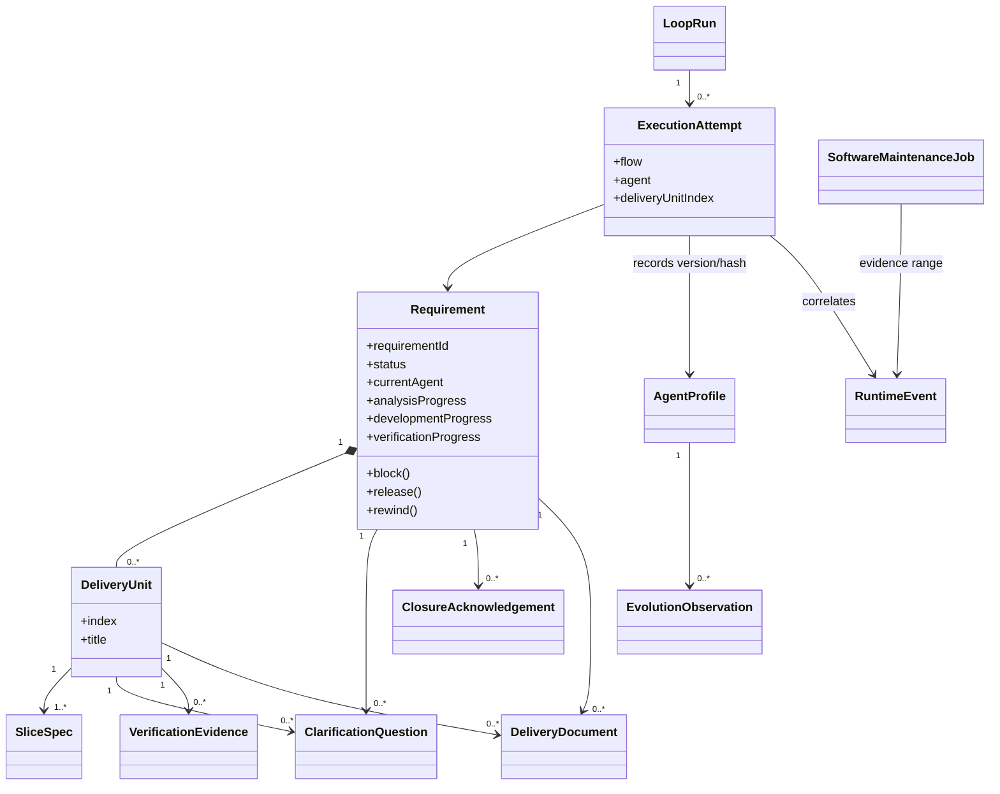

# Loop Engineering UI：V1 DDD 边界与模型

## 1. 统一语言

| 产品术语 | 含义 |
|---|---|
| 需求（Requirement） | 用户输入的完整目标，可能包含多个可独立交付的业务流程，是系统的流程聚合根。 |
| 交付单元（Delivery Unit） | 从需求中拆出的最小可独立交付、验证的业务闭环，粒度应适合一个开发实现 Agent 在一次上下文中完成。 |
| Agent 执行尝试 | 应用为一个明确推进步骤持久化输入、输出和副作用收据后启动一次 Agent CLI。 |
| 推进流程 | 应用根据需求状态和进度计算出的下一组 Agent 执行步骤。 |
| 需求级产品歧义 | 需求梳理 Agent 无法从事实推导，且会改变目标、范围、路由或交付单元边界的信息。 |
| 单元级设计歧义 | Analyst 无法从代码、用户答复或明确项目文档推导的产品决策或重大技术决策。重大技术决策包括架构边界、公开接口、持久化与迁移、跨模块依赖、安全与隐私、性能目标、部署运维行为以及代价高且难回退的选择。 |
| 决策事实 | 用户对设计歧义的回答；它是新规格的输入，不是 Approval。 |
| Slice Spec | 当前交付单元的版本化最小契约；只有歧义归零的 resolved 版本可以进入开发。 |
| 验证证据 | Test Agent 针对当前规格和实际环境保存的可追溯结果；失败时形成跨阶段 Recovery Item。 |
| 结卡确认 | 用户已阅读指定版本结卡报告的事实，不包含 approve/reject。 |
| 交付文档 | 需求梳理、方案分析、问题复现、验证结果和整体验收等正文。 |
| Loop 运行 | 应用持续计算下一步、执行 Agent、保存结果并再次计算的本地循环。 |
| 等待回答 | 需求在原 Agile 状态等待设计决策，`run_state=waiting_for_answers`。 |
| 运行信息请求 | 当前 Agent 为继续执行所需、无法从现有上下文推导的非敏感信息；不是设计决策或 Approval。 |
| 等待运行信息 | 需求在原 Agile 状态等待运行信息，`run_state=waiting_for_runtime_input`；回答后恢复原 Agent 和交付单元。 |
| 系统阻塞 | 自动恢复耗尽或执行环境异常，`run_state=system_blocked`；不伪装成人工决策。 |
| 代码槽 | 本地单工作区中开发实现写代码时的串行保护。 |
| Agent Profile | 某个流程 Agent 当前生效的 Prompt、Memory、版本与演化策略。 |
| 演化观察 | 从真实 execution 证据提取的可复用候选经验；它不是事实，必须经累计和验证后才能提升。 |
| 运行事件 | 与 run / execution 关联、已脱敏的机器可分析日志事实。 |
| 软件维护任务 | 主 Runner 在 finally 写入的 durable outbox；独立维护进程据此诊断 Loop Engineering 自身。 |
| 修复候选 | 在隔离 worktree 中通过变更预算和 Harness 的软件 patch；它不是产品 Approval。 |

标准推进过程：

```text
录入需求 → 需求梳理 → 交付拆分 → 单元推进（规格 → 开发 → 独立 Test）→ 结卡报告 → 阅读结卡 → 完成
```

交付单元必须以可验收的业务结果命名和拆分。不得把“数据库层”“接口层”“页面层”“测试层”分别作为交付单元；这些属于同一个业务闭环内部的实现工作。

## 2. 限界上下文

### 2.1 需求管理（Requirement Management）

负责需求生命周期、交付单元进度、状态迁移、回退和取消。

- Aggregate Root：`Requirement`
- 内部实体：`DeliveryUnit`
- 值对象：`RequirementStatus`、`RequirementType`、`Priority`、`DeliveryProgress`
- 关键命令：`CreateRequirement`、`InitializeRequirementContext`、`AddDeliveryUnit`、`AdvanceRequirement`、`RewindRequirement`、`CancelRequirement`

需求是 V1 唯一的流程聚合根。交付单元属于需求的一致性边界，因为方案分析、开发实现和验证进度必须与需求状态在一个事务中保持一致。

### 2.2 Loop 编排（Loop Orchestration）

负责读取需求当前事实、按任务计算下一步并并发执行不同任务的 Agent；Agent 不负责决定整体流程。

- 模型：`LoopRun`、`TaskLane`、`ExecutionAttempt`、`ExecutionReceipt`
- 关键用例：开始运行、计算推进步骤、执行单个 Agent、应用结构化结果、结束运行
- 依赖：需求管理的只读状态、资源管理的可用性、Agent Executor Port

每次 Agent 执行只处理一个明确目标。当前 Agent 可使用辅助 subagent 收集局部上下文，但辅助 subagent 不参与整体调度，也不能推进其他交付单元。

Application 必须在调用 CLI 前持久化输入快照，在收到结构化输出后先持久化输出，再执行状态推进。`agent-runner` 是恢复、结果消费、新派发和空队列等待的唯一调度入口。Loop Run 通过进程存活和短周期心跳识别异常退出，不给 execution 设置租约：恢复时优先继续已有输出；只有所属 Runner 已确认退出且 execution 尚无持久化输出时，才允许创建下一个 attempt。同一输入最多自动尝试三次。

执行日志不由 Agent 主动上报。Agent Executor Adapter 直接解析 Cursor、Codex、Claude 的流式输出、工具调用、stderr 和退出码；Application 在命令成功后追加领域审计事件。

Loop 的等待策略属于编排规则：本轮有 Agent 执行时，1 分钟后继续；没有可执行步骤时，5 分钟后由 Dispatch Waiter 唤醒同一个 `agent-runner`。等待器不计算派发，也不产生额外 Agent 调用。

### 2.3 澄清与规格管理（Clarification and Specification）

负责需求决策、单元设计决策和版本化最小开发契约。

- 模型：`ClarificationQuestion`、`DecisionFact`、`SliceSpec`
- 关键命令：保存待回答规格、批量创建歧义、回答歧义、提交回答、保存 resolved 规格
- 依赖：需求管理

需求梳理 Agent 和 Analyst 可以在各自边界内创建设计歧义。需求梳理 Agent 只询问影响目标、范围、plan/repro 路由或交付拆分的需求级产品问题；全部回答后只恢复给同一个需求梳理 Agent，完成新版需求上下文后才允许交付拆分。Analyst 必须在 `decisionTree` 中枚举当前单元的产品决策和重大技术决策：有明确上下文证据的写入 `resolved_from_context`，其余写入 `needs_user_input` 并形成用户问题。Application 只校验决策引用有效、待确认规格不能冒充 resolved，以及仍有未决歧义时不能推进；不再比较 `decisionTree`、`decisions`、`ambiguities` 和 `questions` 中重复文案是否完全一致。命名、局部代码组织、既有组件用法和容易回退的等价实现等细节不属于该决策树。全部回答后只恢复给对应 Analysis Lane，`analysis_progress` 不前进，直到 Analyst 生成无未决分支且验收 Oracle 完整的新规格版本。

### 2.4 验证与结卡（Verification and Closure）

- 模型：`TestResult`、`RecoveryItem`、`ClosureReport`、`ClosureAcknowledgement`
- 关键命令：保存 Test 证据、记录失败恢复事项、生成结卡报告、确认已阅读当前报告

Test Agent 独立读取 resolved Slice Spec、实际仓库和运行环境，将 verification plan 当作线索而不是可直接执行的真相，自行选择验证方法并保存证据。实现失败明确回退 Dev，规格失败明确回退 Analysis；环境问题和无法判断不会默认解释为实现失败，而是保持 Test 阶段阻塞并等待恢复。Feedback Agent 批量把当前评论整理为向前工作组；Application 对工程类工作只追加新交付单元，不改写历史文档、旧 Slice Spec 或既有游标。新单元仍完整经过 Analysis、Dev、Test，随后由 Feedback Agent 独立验证。Review Agent 汇总原始需求、历史交付与后续修订的最终事实。存在未验证反馈或活动反馈批次时不能结卡。

### 2.5 文档管理（Document Management）

负责交付文档的结构化保存和读取，不拥有需求状态。

- 模型：`DeliveryDocument`
- 值对象：`DocumentKind`、`DocumentFormat`
- 关键命令：保存文档、查询文档

Application 从 Agent 的结构化结果写入文档，UI 直接读取数据库正文。目标代码库不生成 `.project`、Inbox 或流程 Markdown。

### 2.6 资源管理（Resource Management）

负责解释并校验本地运行约束。

- 模型：`CodeSlot`、`BrowserReservation`
- 关键规则：同一时间一个代码槽、一个浏览器独占步骤和最多四个 Analysis Agent

代码槽繁忙不是设计澄清。需要写代码的步骤进入内部等待队列，释放后自动继续。开发实现 Agent 直接使用当前主干工作区，可以只提交本轮相关代码，也可以不提交；V1 接受已有改动与 Agent 修改同文件时难以完全区分归属的风险，不由 Runner 创建 checkpoint 或代理提交。

### 2.7 Agent 配置与演化（Agent Configuration and Evolution）

负责按项目隔离各流程 Agent 的实际 Role Prompt、Durable Memory、daily observation、文件评论证据、版本历史和 Prompt Canary。

- 模型：`AgentProfile`、`PromptVersion`、`MemoryRevision`、`ArtifactCommentEvidence`、`RuntimeInputEvidence`、`EvolutionObservation`、`EvolutionRun`
- 关键命令：保存 Prompt、保存 Memory、切换自动演化、提升 Memory、创建 Prompt candidate、记录 Canary、回滚 candidate
- 依赖：Loop 编排提供 execution evidence；不依赖需求状态迁移

内置 Prompt 只负责首次 seed。SQLite 保存版本与证据，本地 Runtime Workspace 物化当前实际文件；目标代码库不拥有这套配置。文件评论和已用于成功恢复的运行信息回答都可成为演化证据；Evaluator 只能提炼跨任务可复用的仓库约定或操作方法，不能记忆具体用户数据、具体卡号、地址、账号或凭据，只有明确的仓库级模板和通用占位符可以保留。Evolution Evaluator 只能提出结构化观察，不能写流程状态、修改 Core Contract 或自行决定提升。Prompt candidate 必须由匹配 candidate ID 的真实 execution attempt 验证，任何失败立即回滚；整个演化链路不能阻塞主 Loop。

### 2.8 软件自维护（Autonomous Software Maintenance）

负责把 Loop Engineering 自身的异常转化为可恢复的结构化维护任务，并在不阻塞主 Loop 的前提下生成、验证和安全落地最小修复。

- 模型：`RuntimeEvent`、`SoftwareMaintenanceJob`、`RepairCandidate`、`RepairHarness`
- 关键命令：记录事件、finally 入队、claim 维护任务、创建 worktree、验证变更预算、执行 Harness、自动落地或拒绝
- 依赖：Loop 编排提供 correlation；Agent Executor 执行诊断；Git 与 Harness 提供独立事实

Maintenance Agent 的结论不是事实。Git status 决定实际变更，test/build 决定候选有效性，clean baseline 决定能否落地。维护上下文不能改变 Requirement、Delivery Unit 或代码槽状态；维护失败只记录在自身聚合中。自修复引擎和 migration 是 V1 的保护边界，防止递归改坏恢复机制。

### 2.9 项目配置（Project Configuration）

用户只配置工作区根目录、Agent 执行器及其可选模型参数：Codex 模型/思考强度或 Claude 模型。工作区短 hash、应用数据目录和 SQLite 路径对普通用户不可见。

当前工作区根目录存入应用级 `data/loopwork.db`；每个工作区的需求、文档、确认事项、Loop 运行和执行器设置存入独立项目数据库。切换工作区前必须确认当前项目没有活跃 Loop 运行。

## 3. 领域关系



## 4. 需求不变量

1. `0 <= verification_progress <= development_progress <= analysis_progress <= total_delivery_units`。
2. 等待单元推进时必须至少存在一个交付单元。
3. 进入整体验收前，所有交付单元必须完成方案分析、开发实现和验证。
4. `waiting_for_answers` 必须关联 Analyst 问题和待回答规格，且不能改变 Agile 状态。
5. `waiting_for_runtime_input` 必须关联当前 Agent 的待回答运行信息；提交后第一次执行必须交回同一 Agent 和交付单元。
6. 方案分析进度只能指向 `ambiguities=[]` 的 resolved Slice Spec。
7. 进入 `ready_to_close` 必须存在当前 Review 报告版本，且 Review Agent 已释放。
8. 需求完成前必须存在当前报告版本的阅读记录，且当前报告不能有开放评论。
9. 逆向流程只能通过统一回退命令，不能直接减少进度值。
10. 提交设计澄清回答后，第一次执行必须交回问题来源 Agent：需求级交回需求梳理 Agent，单元级交回 Analyst。
11. 代码槽繁忙时自动排队，不能生成人工问题；等待运行信息的 Dev 继续占用代码槽。
12. 同一任务最多同时运行一个 Analysis Agent 和一个 Delivery Agent；Delivery 严格执行 `Dev(N) → Test(N)`，且 `dev_index <= analysis_index`。
13. 全局最多派发四个 Analysis Agent、一个 Dev Agent 和一个需要独占浏览器的 Agent；同优先级 Analysis 按 Lane 等待时间调度。
14. 同一个 execution attempt 的 Agent Commit（如有）、验证和 Agent Result 必须幂等记录。
15. execution attempt 必须记录实际使用的 Prompt/Memory 版本和哈希。
16. Prompt 自动提升必须满足证据阈值并通过三次真实 Canary；任一次失败立即回滚。
17. 主 Runner 的 finally 只能持久化维护任务，不能同步修改代码或等待 Maintenance Agent。
18. runtime event 在持久化前必须脱敏，并保留 run/execution correlation、severity 和稳定异常 fingerprint。
19. 软件修复候选只能在独立 worktree 生成；变更预算、保护路径、test/build 和 clean baseline 缺一不可。

## 5. Agent 与流程的责任边界

| 决策 | 负责方 |
|---|---|
| 当前应执行哪个 Agent | 应用推进流程 |
| 当前处理哪个交付单元 | 应用推进流程 |
| 是否满足状态和进度不变量 | Application / Domain |
| 需求如何拆成业务闭环 | 交付规划 Agent |
| 单元方案与实现细节 | 方案分析 / 开发实现 Agent |
| 验收与黑盒验证是否通过 | 验证 Agent；Application 只保存结论并执行明确路由 |
| 最终事实如何呈现 | Review Agent |
| 是否已阅读结卡报告 | 用户的 Closure Acknowledgement |
| 文档评论如何处理 | Feedback Agent 冻结并分组评论；直接回复类就地闭环，工程类追加新交付单元，报告类生成新版本；旧交付不回退，Review 最终汇总 |
| 工具调用、subagent 使用 | 当前 Agent |
| 文档、确认事项和结果入库 | Application |
| 运行信息请求、回答与原阶段恢复 | 当前 Agent 提出；Application 持久化和恢复；用户仅补充事实 |
| Git 提交（可选） | 开发实现 Agent；Runner 只记录执行前后 HEAD，不代理提交或要求必须存在 Commit |
| Prompt / Memory 版本与自动演化 | Agent Configuration；Harness 约束提升与回滚 |
| Loop Engineering 自身缺陷诊断 | Software Maintenance Agent 提议；Git/Harness 决定候选与落地 |

Agent 通过 Runner 为当前 execution 注入的 `submit-agent-result --input <result.json>` 命令提交结构化 Result Receipt，不调用流程命令、不写运行日志、不直接操作 SQLite，也不自行推进状态。普通最终回复不再承担控制面协议；未调用结果命令时，Runner 仅为旧执行器兼容而尝试解析最终文本 JSON。

## 6. SQLite 持久化映射

为避免一次高风险数据迁移，V1 暂时保留已有物理表名和列名。它们是基础设施兼容细节，不得出现在产品界面或 Agent Prompt 中。

| 产品模型 | 当前物理实现 |
|---|---|
| Requirement | `tasks`，主键当前仍为 `task_id`；新 ID 使用 `REQ-<UUID>`，创建时不按标题、URL 或外部 ID 去重。 |
| Delivery Unit | `stories`，序号列当前仍为 `story_index`。 |
| Clarification Question / Decision Fact | `questions`。 |
| Slice Spec | `story_specs`。 |
| Test Result / Recovery Evidence | `documents` / `recovery_items`；`verification_runs` / `verification_evidence` 仅保留旧数据库兼容。 |
| Closure Acknowledgement | `closure_acknowledgements`。 |
| Delivery Document | `documents`。 |
| Loop Run / logs | `loop_meta` / `run_logs`。 |
| Agent Result | `agent_results`。 |
| Execution Attempt / Receipt | `execution_attempts` / `execution_receipts`。 |
| Agent Profile / Prompt / Memory | `agent_profiles` / `agent_prompt_versions` / `agent_memory_versions`。 |
| Evolution Observation / Run | `agent_observations` / `agent_observation_occurrences` / `agent_evolution_runs`。 |
| Runtime Event | `runtime_events`。 |
| Software Maintenance Job / Candidate | `software_maintenance_jobs` 与本地 Git worktree/branch。 |
| Project Configuration | 项目级 `project_settings` 与应用级 `app_settings`。 |
| Audit Event | `task_events`，仅用于时间线，不做 Event Sourcing。 |

早期 migration 中的 `approvals`、`analysis_approved_index`、`review_approved` 只为顺序升级保留，运行时领域模型不读取它们。`TaskCreated`、`StoryAdded`、`story-splitter-agent` 等稳定标识暂时保留在内部协议中；对用户分别显示为“创建需求”“新增交付单元”“交付规划 Agent”。

## 7. 架构守则

- UI 不直接访问 SQLite；所有写操作进入 Application command。
- Server Action 不承载状态机判断；判断放在 application/domain 层。
- domain 不依赖 Next、SQLite driver、React 或文件系统。
- infrastructure 只负责数据库、迁移、执行器适配、Runner、Git 和路径解析。
- Agent 不直接读写数据库或旧工作文档；Runner 注入高信号 Working Pack，并通过 execution-bound 的只读 `agent-context` 接口提供冻结快照中的按需资料，Application 解释结果和执行状态迁移。
- 每个 UI 操作必须映射到明确用例，不能绕过状态、确认和资源约束。
- 产品统一语言与物理存储命名通过映射层隔离；新增界面和 Prompt 必须使用产品术语。
