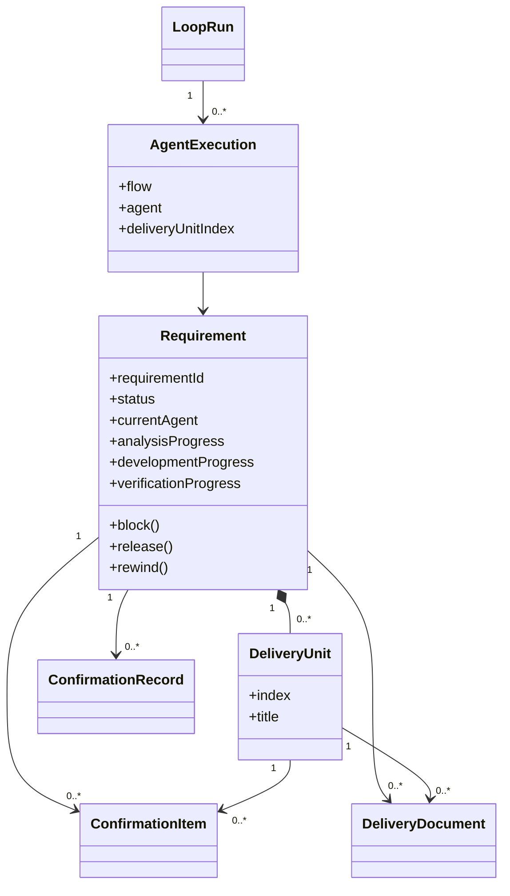

# Loop Engineering UI：V1 DDD 边界与模型

## 1. 统一语言

| 产品术语 | 含义 |
|---|---|
| 需求（Requirement） | 用户输入的完整目标，可能包含多个可独立交付的业务流程，是系统的流程聚合根。 |
| 交付单元（Delivery Unit） | 从需求中拆出的最小可独立交付、验证的业务闭环，粒度应适合一个开发实现 Agent 在一次上下文中完成。 |
| Agent 执行 | 应用为一个明确推进步骤启动一次 Agent CLI。 |
| 推进流程 | 应用根据需求状态和进度计算出的下一组 Agent 执行步骤。 |
| 确认事项 | Agent 无法从代码和已有上下文确定、必须由用户决策的信息。 |
| 确认记录 | 对确认事项或整体验收给出的结构化结论。 |
| 交付文档 | 需求梳理、方案分析、问题复现、验证结果和整体验收等正文。 |
| Loop 运行 | 应用持续计算下一步、执行 Agent、保存结果并再次计算的本地循环。 |
| 待确认 | 需求等待用户或外部信息，不等同于 Agent 执行失败。 |
| 代码槽 | 本地单工作区中开发实现和整体验收写代码时的串行保护。 |

标准推进过程：

```text
录入需求 → 需求梳理 → 交付拆分 → 单元推进（方案分析 → 开发实现 → 验证）→ 整体验收 → 完成
```

交付单元必须以可验收的业务结果命名和拆分。不得把“数据库层”“接口层”“页面层”“测试层”分别作为交付单元；这些属于同一个业务闭环内部的实现工作。

## 2. 限界上下文

### 2.1 需求管理（Requirement Management）

负责需求生命周期、交付单元进度、状态迁移、回退和取消。

- Aggregate Root：`Requirement`
- 内部实体：`DeliveryUnit`
- 值对象：`RequirementStatus`、`RequirementType`、`Priority`、`DeliveryProgress`
- 关键命令：`CreateRequirement`、`InitializeRequirementContext`、`AddDeliveryUnit`、`AdvanceRequirement`、`RewindRequirement`、`CancelRequirement`

需求是 V1 唯一的流程聚合根。交付单元属于需求的一致性边界，因为方案分析、开发实现和验证进度必须与需求状态在一个事务中保持一致。

### 2.2 Loop 编排（Loop Orchestration）

负责读取需求当前事实、计算下一步并逐个执行 Agent；Agent 不负责决定整体流程。

- 模型：`LoopRun`、`AgentExecution`
- 关键用例：开始运行、计算推进步骤、执行单个 Agent、应用结构化结果、结束运行
- 依赖：需求管理的只读状态、资源管理的可用性、Agent Executor Port

每次 Agent 执行只处理一个明确目标。当前 Agent 可使用辅助 subagent 收集局部上下文，但辅助 subagent 不参与整体调度，也不能推进其他交付单元。

执行日志不由 Agent 主动上报。Agent Executor Adapter 直接解析 Cursor、Codex、Claude 的流式输出、工具调用、stderr 和退出码；Application 在命令成功后追加领域审计事件。

Loop 的等待策略属于编排规则：本轮有 Agent 执行时，1 分钟后继续；没有可执行步骤时，5 分钟后重试。等待不产生额外 Agent 调用。

### 2.3 确认管理（Confirmation Management）

负责用户决策点，但不自行改变需求流程。

- 模型：`ConfirmationItem`、`ConfirmationRecord`
- 关键命令：创建确认事项、回答确认事项、解除待确认
- 依赖：需求管理

确认事项的正文、建议和用户答复以 SQLite 为唯一事实来源。Agent 通过最终结构化 JSON 返回确认事项，不写旧的问题 Markdown。方案分析产生的确认事项全部回答后，流程恢复给原 Agent 更新方案；整体验收的确认记录是需求完成的人工门禁。

### 2.4 文档管理（Document Management）

负责交付文档的结构化保存和读取，不拥有需求状态。

- 模型：`DeliveryDocument`
- 值对象：`DocumentKind`、`DocumentFormat`
- 关键命令：保存文档、查询文档

Application 从 Agent 的结构化结果写入文档，UI 直接读取数据库正文。目标代码库不生成 `.project`、Inbox 或流程 Markdown。

### 2.5 资源管理（Resource Management）

负责解释并校验本地运行约束。

- 模型：`CodeSlot`、`BrowserReservation`
- 关键规则：同一时间一个代码槽；每轮最多一个浏览器独占步骤

代码槽繁忙不是待确认事项。需要写代码的步骤进入内部等待队列，释放后自动继续。开发实现 Agent 开始前若存在普通未提交改动，Runner 先创建 checkpoint commit，再执行并单独提交本交付单元；敏感文件仍会阻止自动提交。

### 2.6 项目配置（Project Configuration）

用户只配置工作区根目录和 Agent 执行器。工作区短 hash、应用数据目录和 SQLite 路径对普通用户不可见。

当前工作区根目录存入应用级 `data/loopwork.db`；每个工作区的需求、文档、确认事项、Loop 运行和执行器设置存入独立项目数据库。切换工作区前必须确认当前项目没有活跃 Loop 运行。

## 3. 领域关系



## 4. 需求不变量

1. `0 <= verification_progress <= development_progress <= analysis_progress <= total_delivery_units`。
2. 等待单元推进时必须至少存在一个交付单元。
3. 进入整体验收前，所有交付单元必须完成方案分析、开发实现和验证。
4. 待确认状态必须记录当前责任 Agent 和原因。
5. 方案分析恢复推进前，相关确认事项必须全部回答。
6. 需求完成前必须存在整体验收的通过记录。
7. 逆向流程只能通过统一回退命令，不能直接减少进度值。
8. 从待确认恢复后，第一次执行必须交回原责任 Agent。
9. 代码槽繁忙时自动排队，不能生成要求用户处理的确认事项。
10. 每轮最多派发一个需要独占浏览器的 Agent 执行。

## 5. Agent 与流程的责任边界

| 决策 | 负责方 |
|---|---|
| 当前应执行哪个 Agent | 应用推进流程 |
| 当前处理哪个交付单元 | 应用推进流程 |
| 是否满足状态和进度不变量 | Application / Domain |
| 需求如何拆成业务闭环 | 交付规划 Agent |
| 单元方案与实现细节 | 方案分析 / 开发实现 Agent |
| 测试是否通过 | 验证 Agent |
| 整体需求是否可交付 | 整体验收 Agent + 用户确认记录 |
| 工具调用、subagent 使用 | 当前 Agent |
| 文档、确认事项和结果入库 | Application |
| Git checkpoint 与交付提交 | Runner |

Agent 最终只返回结构化结果，不调用流程命令、不写运行日志、不直接操作 SQLite，也不自行推进状态。

## 6. SQLite 持久化映射

为避免一次高风险数据迁移，V1 暂时保留已有物理表名和列名。它们是基础设施兼容细节，不得出现在产品界面或 Agent Prompt 中。

| 产品模型 | 当前物理实现 |
|---|---|
| Requirement | `tasks`，主键当前仍为 `task_id`；新 ID 使用 `REQ-` 前缀。 |
| Delivery Unit | `stories`，序号列当前仍为 `story_index`。 |
| Confirmation Item | `questions`。 |
| Confirmation Record | `approvals`。 |
| Delivery Document | `documents`。 |
| Loop Run / logs | `loop_meta` / `run_logs`。 |
| Agent Result | `agent_results`。 |
| Project Configuration | 项目级 `project_settings` 与应用级 `app_settings`。 |
| Audit Event | `task_events`，仅用于时间线，不做 Event Sourcing。 |

同理，`TaskCreated`、`StoryAdded`、`story-splitter-agent` 等稳定标识暂时可保留在内部协议中；对用户分别显示为“创建需求”“新增交付单元”“交付规划 Agent”。

## 7. 架构守则

- UI 不直接访问 SQLite；所有写操作进入 Application command。
- Server Action 不承载状态机判断；判断放在 application/domain 层。
- domain 不依赖 Next、SQLite driver、React 或文件系统。
- infrastructure 只负责数据库、迁移、执行器适配、Runner、Git 和路径解析。
- Agent 不读写旧工作文档或数据库；Runner 注入上下文，Application 解释结果。
- 每个 UI 操作必须映射到明确用例，不能绕过状态、确认和资源约束。
- 产品统一语言与物理存储命名通过映射层隔离；新增界面和 Prompt 必须使用产品术语。
