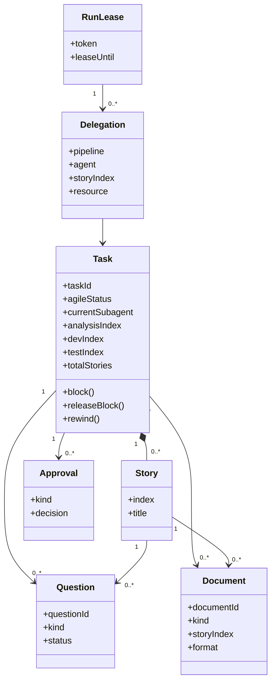

# Loop Engineering UI：V1 DDD 边界与模型

## 1. 统一语言

V1 的产品术语沿用现有系统，不采用 prototype 的新术语替代已有概念。

| 术语 | 含义 |
|---|---|
| Task | `tasks` 表中的工作项，Feature、Bug、Tech 等均以 Task 进入 loop。 |
| Story | Task 经 `story-splitter-agent` 拆出的可推进单元。 |
| Agent | `backlog-agent`、`story-splitter-agent`、`analyst-agent`、`repro-agent`、`dev-agent`、`test-agent`、`review-agent`。 |
| Pipeline | 根据 Task 状态和游标计算出的下一步委派。 |
| Analysis / Dev / Test Index | Story 分别完成分析、开发、测试的顺序游标。 |
| Blocked | Task 等待人工或外部信息的状态，不是 Agent 失败的同义词。 |
| Question | Agent 通过 JSON 创建、存入 `questions` 表的待确认问题。 |
| Approval | analysis 与 review 的人工门禁记录。 |
| Document | Agent 写入 `documents` 表的业务正文，例如 context、analysis、repro、test result、review。 |
| Run Lease | 防止两个 loop 重叠派发的短期租约。 |
| Code Slot | 无 worktree 时仅允许一个 Task 占用开发/评审相关代码工作区的限制。 |

## 2. Bounded Context

### 2.1 Task Management

负责 Task 生命周期、Story 游标、状态迁移、回退和终止。

- Aggregate Root：`Task`
- 内部实体：`Story`
- 值对象：`TaskStatus`、`ItemType`、`Priority`、`PipelineProgress`
- 关键命令：`CreateTask`、`TaskContextInit`、`AddStory`、`TaskUpdate`、`TaskRewind`、`TaskCancel`

`Task` 是 V1 的唯一流程 aggregate root。Story 作为其内部实体存在，因为当前状态机必须在同一一致性边界内维护 Task 状态与三个 Story 游标。

### 2.2 Loop Orchestration

负责读取 Task 当前状态并生成委派计划；不直接修改 Task。

- 模型：`RunLease`、`Delegation`
- 关键命令：`RunBegin`、`PipelineAll`、`RunEnd`、`RunLog`
- 依赖：Task Management 的只读状态与 Resource Management 的可用性

V1 的持续 loop 由 App runner 驱动。若本轮有委派，runner 通过 Agent Executor Port 按 delegation 逐个启动项目所选 CLI；每次执行只处理一个明确 pipeline agent。当前 agent 可以在本 delegation 内使用辅助 subagent 做上下文收集，但辅助 subagent 不参与 pipeline 调度。若没有委派，等待后继续重试。

### 2.3 Question and Approval

负责人工确认点，但不重新定义 Task 工作流。

- 模型：`Question`、`Approval`
- 关键命令：`AddQuestion`、`AnswerQuestion`、`BlockRelease`
- 依赖：Task Management

`Question` 的正文、推荐答案、用户答复都以 SQLite 为事实来源。Agent 不写 question 文档。`Approval` 表达 analysis 的 `pending/confirmed` 与 review 的 `pending/approved`。

### 2.4 Document Management

负责业务文档的结构化保存和读取，不拥有 Task 状态。

- 模型：`Document`
- 值对象：`DocumentKind`、`DocumentFormat`
- 关键命令：`UpsertDocument`、`ListDocuments`、`GetDocument`

Document 是替代旧工作目录 Markdown 的事实来源。Agent 必须通过 `document-upsert` 写入；UI 直接从 `documents` 表展示正文。

### 2.5 Resource Management

负责展示和校验现有资源约束。

- 模型：`CodeSlot`、`BrowserReservation`
- 关键规则：一个 Code Slot；每轮最多一个 Browser 委派。

V1 不增加新的资源调度器。这个 context 的职责是把当前约束从隐式 CLI 错误变成可解释的 UI 信息。

### 2.6 Project Configuration

负责当前 workspace root。

- Aggregate Root：`Project`
- 模型：`WorkspaceRoot`

用户只需要设置工作区根目录。repo hash、数据库路径、app data 目录和运行模式对普通用户隐藏。

## 3. 领域关系



## 4. Task 不变量

这些规则来自旧 loop 状态机，V1 的领域层和 Server Action 必须保持一致。

1. `0 <= test_index <= dev_index <= analysis_index <= total_stories`。
2. `ready for dev` 必须存在至少一个 Story。
3. `in review` 时所有 Story 必须已完成 analysis、dev 和 test。
4. `blocked` 必须有 `current_subagent` 和 `blocked_reason`。
5. Story analysis 推进前，必须存在对应的人工 `confirmed` approval。
6. Task 进入 `done` 前，必须存在 review 的 `approved` approval。
7. 逆向流程只能通过 `task-rewind`；不允许由 UI 直接减少任何游标。
8. 从 `blocked` 恢复只能通过 `block-release`；恢复后的第一次委派必须交回原 `current_subagent`。
9. 已占用 Code Slot 的 Task，以及从开发/评审状态 blocked 的 Task，继续占用代码槽。
10. 每轮 `pipeline-all` 最多出现一个 `resource=browser` 的 Delegation。

## 5. 状态与命令责任

| 命令 | 负责 context | 允许 actor / 来源 | 结果 |
|---|---|---|---|
| `CreateTask` | Task Management | human | 创建 backlog Task。 |
| `TaskContextInit` | Task Management | backlog-agent / human | 初始化数据库上下文，不创建工作目录。 |
| `AddStory` | Task Management | human / story-splitter-agent | 创建 Story 结构化记录。 |
| `UpsertDocument` | Document Management | 当前责任 agent / human | 保存业务正文到 `documents` 表。 |
| `TaskUpdate` | Task Management | 当前角色权限 | 正向推进或记录 blocked。 |
| `TaskRewind` | Task Management | analyst/dev/test/review/human | 统一逆向游标与责任 agent。 |
| `AddQuestion` | Question and Approval | 当前责任 agent / human | 校验 JSON 并创建 Question 记录。 |
| `BlockRelease` | Question and Approval + Task Management | human | 确认全部问题已回答，恢复 Task 并设置 resume pending。 |
| `RunBegin` / `RunEnd` | Loop Orchestration | UI / runner | 管理 Run Lease。 |
| `PipelineAll` | Loop Orchestration | UI / runner | 只计算 Delegation，不改变 Task。 |
| `RunDelegation` | Loop Orchestration | runner | 通过所选 Agent Executor 为单条 Delegation 启动一次 CLI。 |

## 6. SQLite 表的职责

| 表 | 职责 | V1 来源 |
|---|---|---|
| `tasks` | Task 当前事实与流程游标 | command 写入。 |
| `loop_meta` | run lease 和本地元数据 | runner / UI 写入。 |
| `stories` | Story 的结构化索引 | `story-add`。 |
| `documents` | 业务文档正文 | `document-upsert`。 |
| `questions` | Question 事实来源 | `question-add` 和 UI 回答。 |
| `approvals` | analysis/review 决策记录 | `question-add` / `block-release`。 |
| `run_logs` | 持续 loop 的运行日志 | runner / agent 追加，运行面板增量读取。 |
| `project_settings` | 当前项目的 Agent 执行器等设置 | UI command 写入。 |
| `task_events` | 面向 UI 的审计时间线 | 成功 command 追加；不是 Event Sourcing。 |

旧迁移中的兼容列可以保留为空值，但不参与 V1 运行语义。

## 7. 领域事件（审计用途）

V1 仅追加审计事件，不以事件回放重建系统状态。

```text
TaskCreated
ContextInitialized
StoryAdded
TaskUpdated
QuestionAdded
QuestionAnswered
BlockReleased
DocumentUpserted
TaskRewound
TaskCancelled
```

事件应包含：发生时间、actor、Task ID、可选 Story index、command 名和变更摘要；不得复制附件或完整敏感内容。

## 8. 架构守则

- UI 不直接访问 SQLite。
- Server Action 不写状态机判断；判断放在 application/domain 层。
- domain 不 import Next、SQLite driver、React 或 `fs`。
- infrastructure 只负责 SQLite migration、连接、Agent Executor Adapter、runner 进程和路径解析。
- Agent 不读写旧工作文档；所有上下文通过 `loopctl` 命令进入 application 层。
- 每一个 UI 操作都映射到明确 application command 或只读查询，不能发明绕过既有规则的快捷入口。
