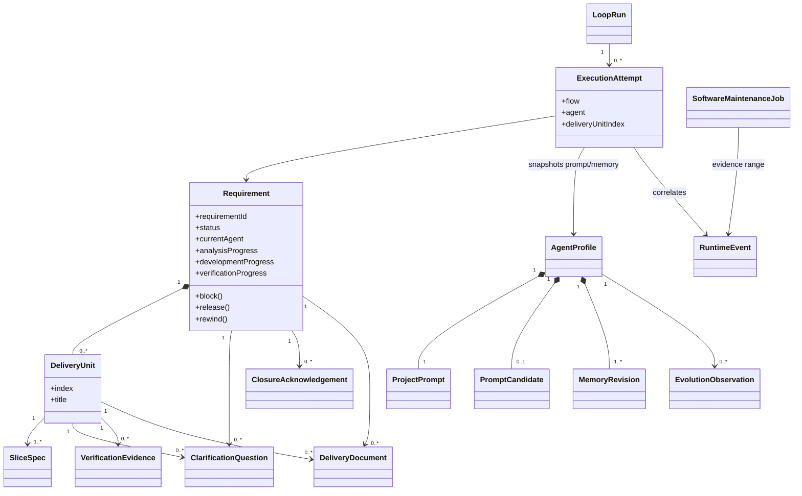

# Loop Engineering UI：V1 DDD 边界与模型

## 1. 统一语言

| 产品术语 | 含义 |
|---|---|
| 需求（Requirement） | 用户输入的完整目标，可能包含多个可独立交付的业务流程，是系统的流程聚合根。 |
| 交付单元（Delivery Unit） | 带稳定身份、参与者、触发条件、可观察结果、验收语义、来源覆盖和自然依赖的业务闭环；在保持闭环完整的前提下，粒度应适合当前项目可信的 Agent 交付能力。 |
| Agent 执行尝试 | 应用为一个明确推进步骤持久化输入、输出和副作用收据后启动一次 Agent CLI。 |
| 推进流程 | 应用根据需求状态和进度计算出的下一组 Agent 执行步骤。 |
| 需求级产品歧义 | 需求梳理 Agent 无法从项目证据推导，且会改变业务目标、规则、参与者、范围、分类或验收结果的信息。 |
| 业务变化上下文 | 对业务意图、当前实际状态、当前应有语义、目标状态、变化、影响处理、范围和验收语义的可追溯表达。 |
| 业务语义陈述 | 带稳定 key、视角、证据状态和来源的业务结论；视角分为 actual、expected 和 target。 |
| 业务影响 | 目标变化可能产生的实质业务后果；分别处理为改变、保持、待业务决策或后续技术分析，识别影响不等于纳入范围。 |
| 交付级关键决策 | 会产生不同业务结果、公共契约、数据语义、兼容策略、重大工程后果或验证结果的业务或核心技术选择。 |
| 决策事实 | 由上游承诺、用户答复、项目证据或角色自主权关闭的交付决策；用户回答不是 Approval。 |
| 交付分析 | 当前交付单元的版本化冻结交付契约，包含冻结承诺、分析摘要、实际影响、关键决策、实现方向、保护约束和验证关注点；只有已收敛版本可以进入开发。 |
| 验证证据 | Test Agent 针对当前规格和实际环境保存的可追溯结果；失败时形成跨阶段 Recovery Item。 |
| 结卡确认 | 用户已阅读指定版本结卡报告的事实，不包含 approve/reject。 |
| 交付文档 | 需求梳理、交付分析、问题复现、验证结果和整体验收等正文。 |
| Loop 运行 | 应用持续计算下一步、执行 Agent、保存结果并再次计算的本地循环。 |
| 等待回答 | 需求在原 Agile 状态等待设计决策，`run_state=waiting_for_answers`。 |
| 运行信息请求 | 当前 Agent 为继续执行所需、无法从现有上下文推导的非敏感信息；不是设计决策或 Approval。 |
| 等待运行信息 | 需求在原 Agile 状态等待运行信息，`run_state=waiting_for_runtime_input`；回答后恢复原 Agent 和交付单元。 |
| 系统阻塞 | 自动恢复耗尽或执行环境异常，`run_state=system_blocked`；不伪装成人工决策。解除后，支持 `resume` 的角色恢复原草稿，其他角色由调度器按原业务步骤和原作用域重新派发。 |
| 代码槽 | 本地单工作区中开发实现写代码时的串行保护。 |
| Agent Profile | 某个项目中一个流程 Agent 的完整 Current Prompt、至多一个临时 Prompt candidate、带 revision 历史的 Memory 与演化策略；系统模板只负责首次初始化。 |
| 演化观察 | 从真实 execution 证据提取的可复用候选经验；它不是事实，必须经累计和验证后才能提升。 |
| 运行事件 | 与 run / execution 关联、已脱敏的机器可分析日志事实。 |
| 软件维护任务 | 主 Runner 在 finally 写入的 durable outbox；独立维护进程据此诊断 Loop Engineering 自身。 |
| 修复候选 | 在隔离 worktree 中通过变更预算和 Harness 的软件 patch；它不是产品 Approval。 |

标准推进过程：

```text
录入需求 → 需求梳理 → 交付拆分 → 单元推进（规格 → 开发 → 独立 Test）→ 结卡报告 → 阅读结卡 → 完成
```

交付单元必须以可验收的业务结果命名和拆分。不得把“数据库层”“接口层”“页面层”“测试层”分别作为交付单元；这些属于同一个业务闭环内部的实现工作。

## 2. 限界上下文

### 2.1 需求管理（Requirement Management）

负责需求生命周期、交付单元进度、状态迁移、回退和取消。

- Aggregate Root：`Requirement`
- 内部实体：`DeliveryUnit`
- 值对象：`RequirementStatus`、`RequirementType`、`Priority`、`DeliveryProgress`
- 关键命令：`CreateRequirement`、`InitializeRequirementContext`、`AddDeliveryUnit`、`AdvanceRequirement`、`RewindRequirement`、`CancelRequirement`

需求是 V1 唯一的流程聚合根。交付单元属于需求的一致性边界，因为交付分析、开发实现和验证进度必须与需求状态在一个事务中保持一致。

### 2.2 Loop 编排（Loop Orchestration）

负责读取需求当前事实、按任务计算下一步并并发执行不同任务的 Agent；Agent 不负责决定整体流程。

- 模型：`LoopRun`、`TaskLane`、`ExecutionAttempt`、`ExecutionReceipt`
- 关键用例：开始运行、计算推进步骤、执行单个 Agent、应用结构化结果、结束运行
- 依赖：需求管理的只读状态、资源管理的可用性、Agent Executor Port

每次 Agent 执行只处理一个明确目标。当前 Agent 可使用辅助 subagent 收集局部上下文，但辅助 subagent 不参与整体调度，也不能推进其他交付单元。

Application 必须在调用 CLI 前持久化输入快照，在收到结构化输出后先持久化输出，再执行状态推进。`agent-runner` 是恢复、结果消费、新派发和空队列等待的唯一调度入口。Loop Run 通过进程存活和短周期心跳识别异常退出，不给 execution 设置租约：恢复时优先继续已有输出；只有所属 Runner 已确认退出且 execution 尚无持久化输出时，才允许创建下一个 attempt。同一输入最多自动尝试三次。

执行日志不由 Agent 主动上报。Agent Executor Adapter 直接解析 Cursor、Codex、Claude 的流式输出、工具调用、stderr 和退出码；Application 在命令成功后追加领域审计事件。

Loop 的等待策略属于编排规则：本轮有 Agent 执行时，1 分钟后继续；没有可执行步骤时，5 分钟后由 Dispatch Waiter 唤醒同一个 `agent-runner`。等待器不计算派发，也不产生额外 Agent 调用。

### 2.3 澄清与规格管理（Clarification and Specification）

负责需求决策、交付级关键决策和版本化交付契约。

- 模型：`ClarificationQuestion`、`DecisionFact`、`DeliverySpec`
- 关键命令：保存待回答规格、批量创建歧义、回答歧义、提交回答、保存 resolved 规格
- 依赖：需求管理

需求梳理 Agent 和交付分析 Agent 可以在各自边界内请求人工决策。需求梳理 Agent 基于项目自适应选择证据和调查路径，区分 AS-IS Actual、AS-IS Expected 与 TO-BE，并只询问会改变业务目标、规则、参与者、范围、分类或验收结果的需求级问题；全部回答后只恢复给同一个需求梳理 Agent，完成新版业务变化上下文后才允许交付拆分。代码只是当前实现的一种证据，Application 不要求固定行业调查清单，也不判断业务文案是否正确；它只校验稳定 key、来源、证据状态、影响处理、问题引用和终止条件。

交付分析 Agent 以冻结的交付单元承诺为输入，把 Do It Twice 作为内部调查和推理方法，主动识别需求文字之外的真实影响，并关闭影响正确实现和独立验证的关键业务与核心技术决策。它只持久化摘要、影响、决策和冻结交付契约，不保存完整推演过程。能够由上游、用户答复、项目证据或工程自主权确定的决策直接关闭；只有超出角色权限且会产生实质不同后果的决策使用 `needs_user_input`。Application 校验稳定 decision key、影响处理、决策权限、回答消费和终止条件。全部回答后只恢复给对应交付分析通道，直到原 key 被消费且所有影响获得最终处理方式。

### 2.4 验证与结卡（Verification and Closure）

- 模型：`TestResult`、`RecoveryItem`、`ClosureReport`、`ClosureAcknowledgement`
- 关键命令：保存 Test 证据、记录失败恢复事项、生成结卡报告、确认已阅读当前报告

Test Agent 只以已收敛的冻结交付契约为 Oracle，在当前仓库和运行环境上先规划、后执行黑盒验证。第一阶段形成带稳定身份的 `frontend` 或 `api` 场景并冻结计划；每项交付单元验收语义必须由真实前端业务闭环覆盖，API 场景可以补充业务证据或形成独立反例。第二阶段逐项记录通过、失败或阻塞；Application 信任 Agent 的专业观察，根据场景结果和失败分类确定性生成最终 Test Result，不额外要求 Harness 回执。Dev 的结果文档、自述、自检、开发记录、Commit message 和恢复声明不进入 Test 的可读上下文，也不能作为通过依据；Test 只继承自己的验证草稿和由自身失败形成的原始 Recovery 事实。实现失败明确回流 Dev，规格失败明确回流交付分析；前端或 API 所需运行资源缺失、环境问题和无法判断不会默认解释为实现失败，而是保持验证阶段阻塞并等待恢复。Feedback Agent 批量把当前评论整理为向前工作组；Application 对工程类工作只追加新交付单元，不改写历史文档、旧交付规格或既有游标。新单元仍完整经过交付分析、开发和验证，随后由 Feedback Agent 独立验证。Review Agent 汇总原始需求、历史交付与后续修订的最终事实。存在未验证反馈或活动反馈批次时不能结卡。

### 2.5 文档管理（Document Management）

负责交付文档的结构化保存和读取，不拥有需求状态。

- 模型：`DeliveryDocument`
- 值对象：`DocumentKind`、`DocumentFormat`
- 关键命令：保存文档、查询文档

Application 从 Agent 的结构化结果写入文档，UI 直接读取数据库正文。目标代码库不生成 `.project`、Inbox 或流程 Markdown。

### 2.6 资源管理（Resource Management）

负责解释并校验本地运行约束。

- 模型：`CodeSlot`、`BrowserReservation`
- 关键规则：同一时间一个代码槽、一个浏览器独占步骤和最多四个 Analysis Agent

代码槽繁忙不是设计澄清。需要写代码的步骤进入内部等待队列，释放后自动继续。开发实现 Agent 直接使用当前工作区：每次执行都以仓库当下状态重新检查功能完整性；本轮有代码改动时由 Agent 按仓库规范提交相关文件，走查确认现有实现已满足规格时不制造 Commit。Application 不比较 execution Commit 与当前 HEAD，不推断本轮文件归属，也不因换分支、改写历史、其他 Commit 或未提交变化阻塞开发完成。Runner 不创建 checkpoint，也不代理提交。

### 2.7 Agent 配置与演化（Agent Configuration and Evolution）

负责各项目中流程 Agent 的完整 Current Prompt、至多一个临时 Prompt Canary candidate、带 revision 历史的 Durable Memory、daily observation 和文件评论证据。

- 模型：`AgentProfile`、`ProjectPrompt`、`PromptCandidate`、`MemoryRevision`、`ArtifactCommentEvidence`、`RuntimeInputEvidence`、`EvolutionObservation`、`EvolutionRun`
- 关键命令：保存项目 Prompt、保存 Memory、切换自动演化、提升 Memory、创建 Prompt candidate、记录 Canary、接受或丢弃 candidate
- 依赖：Loop 编排提供 execution evidence；不依赖需求状态迁移

系统代码提供版本化 Prompt Template，但它不是运行时配置层。某个项目第一次初始化 Agent 时，把当时模板复制为项目数据库中的完整 Current Prompt；此后用户直接编辑这一份 Prompt，应用升级不会覆盖。新项目使用最新模板，旧项目新增此前不存在的 Agent 时只初始化该 Agent。Core Contract、实际工具能力和状态机权限不属于可编辑 Role Prompt，用户 Prompt 不能借此获得系统未授予的能力。自动演化基于当前 Prompt revision 产生完整 candidate；用户保存 Prompt 时立即丢弃 candidate。candidate 必须由匹配 candidate ID 的真实 execution attempt 验证：同一 candidate 同时最多一个 execution，Application 从持久化 execution 终态可重放地计算结果；三次 Canary 全部成功且原 Prompt revision 未变化时原子替换 Current Prompt，任一次失败或用户并发编辑时丢弃 candidate，当前 Prompt 不变。配置域不保存 Prompt 历史，UI 不提供恢复入口。本地 Runtime Workspace 只从数据库单向物化 Current Prompt，`PROMPT.md` 文件修改不得反向导入；目标代码库不拥有这套配置。Memory 提升继续生成并保留新的 revision；整个演化链路不能阻塞主 Loop。

Prompt 配置与 execution 审计严格分离。每个 `ExecutionAttempt` 永久保存当次实际发送给模型的完整 Prompt snapshot、execution input hash、项目 Prompt revision、初始模板 version、Prompt hash 以及 Memory revision/hash；Prompt 更新或 candidate 被丢弃都不能改写该快照，也不能把历史 execution 快照恢复为当前配置。

### 2.8 软件自维护（Autonomous Software Maintenance）

负责把 Loop Engineering 自身的异常转化为可恢复的结构化维护任务，并在不阻塞主 Loop 的前提下生成、验证和安全落地最小修复。

- 模型：`RuntimeEvent`、`SoftwareMaintenanceJob`、`RepairCandidate`、`RepairHarness`
- 关键命令：记录事件、finally 入队、claim 维护任务、创建 worktree、验证变更预算、执行 Harness、自动落地或拒绝
- 依赖：Loop 编排提供 correlation；Agent Executor 执行诊断；Git 与 Harness 提供独立事实

Maintenance Agent 的结论不是事实。Git status 决定实际变更，test/build 决定候选有效性，clean baseline 决定能否落地。维护上下文不能改变 Requirement、Delivery Unit 或代码槽状态；维护失败只记录在自身聚合中。自修复引擎和 migration 是 V1 的保护边界，防止递归改坏恢复机制。

### 2.9 项目配置（Project Configuration）

用户配置工作区根目录，并为每个流程 Agent 独立配置执行器及其可选模型参数：Codex 模型/思考强度或 Claude 模型。没有独立 Profile 的系统辅助 Agent 使用单独的项目级系统 Runtime。工作区短 hash、应用数据目录和 SQLite 路径对普通用户不可见。

当前工作区根目录存入应用级 `data/loopwork.db`；每个工作区的需求、文档、确认事项、Loop 运行、逐 Agent Runtime 和系统 Runtime 设置存入独立项目数据库。切换工作区前必须确认当前项目没有活跃 Loop 运行。

## 3. 领域关系


```mermaid
classDiagram
  class Requirement {
    +requirementId
    +status
    +currentAgent
    +analysisProgress
    +developmentProgress
    +verificationProgress
    +block()
    +release()
    +rewind()
  }
  class DeliveryUnit {
    +index
    +title
  }
  class SliceSpec
  class ClarificationQuestion
  class VerificationEvidence
  class ClosureAcknowledgement
  class DeliveryDocument
  class LoopRun
  class ExecutionAttempt {
    +flow
    +agent
    +deliveryUnitIndex
  }
  class AgentProfile
  class ProjectPrompt
  class PromptCandidate
  class MemoryRevision
  class EvolutionObservation
  class RuntimeEvent
  class SoftwareMaintenanceJob

  Requirement "1" *-- "0..*" DeliveryUnit
  Requirement "1" --> "0..*" ClarificationQuestion
  Requirement "1" --> "0..*" ClosureAcknowledgement
  Requirement "1" --> "0..*" DeliveryDocument
  DeliveryUnit "1" --> "1..*" SliceSpec
  DeliveryUnit "1" --> "0..*" ClarificationQuestion
  DeliveryUnit "1" --> "0..*" VerificationEvidence
  DeliveryUnit "1" --> "0..*" DeliveryDocument
  LoopRun "1" --> "0..*" ExecutionAttempt
  ExecutionAttempt --> Requirement
  AgentProfile "1" *-- "1" ProjectPrompt
  AgentProfile "1" *-- "0..1" PromptCandidate
  AgentProfile "1" *-- "1..*" MemoryRevision
  AgentProfile "1" --> "0..*" EvolutionObservation
  ExecutionAttempt --> AgentProfile : snapshots prompt/memory
  ExecutionAttempt --> RuntimeEvent : correlates
  SoftwareMaintenanceJob --> RuntimeEvent : evidence range
```

## 4. 需求不变量

1. `0 <= verification_progress <= development_progress <= analysis_progress <= total_delivery_units`。
2. 等待单元推进时必须至少存在一个交付单元。
3. 进入整体验收前，所有交付单元必须完成交付分析、开发实现和验证。
4. `waiting_for_answers` 必须关联交付分析 Agent 问题和待回答规格，且不能改变 Agile 状态。
5. `waiting_for_runtime_input` 必须关联当前 Agent 的待回答运行信息或 Test Agent 的验证协助；提交后第一次执行必须交回同一 Agent 和交付单元。验证协助可以补充环境，也可以提供人工执行的实际观察与证据，但最终判定仍由 Test Agent 依据原 Oracle 作出。
6. 交付分析进度只能指向实际影响均有处理方式、关键决策均已关闭且冻结交付契约完整的交付规格。
7. 进入 `ready_to_close` 必须存在当前 Review 报告版本，且 Review Agent 已释放。
8. 需求完成前必须存在当前报告版本的阅读记录，且当前报告不能有开放评论。
9. 逆向流程只能通过统一回退命令，不能直接减少进度值。
10. 提交关键决策回答后，第一次执行必须交回问题来源 Agent：需求级交回需求梳理 Agent，交付级交回交付分析 Agent。
11. 代码槽繁忙时自动排队，不能生成人工问题；等待运行信息的 Dev 继续占用代码槽。
12. 同一任务最多同时运行一个 Analysis Agent 和一个 Delivery Agent；Delivery 严格执行 `Dev(N) → Test(N)`，且 `dev_index <= analysis_index`。该顺序只约束仓库状态形成的先后，不授权 Test 读取 Dev 的结果叙事。Test 场景受阻属于可协作补齐的验证事实，不是系统阻塞；系统阻塞只用于 Runner、CLI、浏览器控制或 Application 自身异常。
13. 全局最多派发四个 Analysis Agent、一个 Dev Agent 和一个需要独占浏览器的 Agent；同优先级 Analysis 按 Lane 等待时间调度。
14. 同一个 execution attempt 的 Agent Commit（如有）、验证和 Agent Result 必须幂等记录。
15. execution attempt 必须记录实际发送给模型的完整 Prompt snapshot、execution input hash、项目 Prompt revision、初始模板 version、Prompt hash 和 Memory revision/hash；配置变化不得改写审计快照。
16. 每个项目的每个 Agent 必须且只能有一条完整 Current Prompt，并且至多有一个临时 Prompt candidate。系统模板只在首次初始化时复制，应用升级不得覆盖项目 Prompt。自动提升必须满足证据阈值并通过三次真实 Canary，全部成功且原 revision 未变化后替换 Current Prompt，任一次失败或用户编辑则丢弃 candidate。配置域不得保存 Prompt 历史或提供恢复能力。
17. 主 Runner 的 finally 只能持久化维护任务，不能同步修改代码或等待 Maintenance Agent。
18. runtime event 在持久化前必须脱敏，并保留 run/execution correlation、severity 和稳定异常 fingerprint。
19. 软件修复候选只能在独立 worktree 生成；变更预算、保护路径、test/build 和 clean baseline 缺一不可。

## 5. Agent 与流程的责任边界

| 决策 | 负责方 |
|---|---|
| 当前应执行哪个 Agent | 应用推进流程 |
| 当前处理哪个交付单元 | 应用推进流程 |
| 是否满足状态和进度不变量 | Application / Domain |
| 需求如何拆成业务闭环 | 交付规划 Agent |
| 单元方案与实现细节 | 交付分析 / 开发实现 Agent |
| 验收与黑盒验证是否通过 | 验证 Agent；Application 只保存结论并执行明确路由 |
| 最终事实如何呈现 | Review Agent |
| 是否已阅读结卡报告 | 用户的 Closure Acknowledgement |
| 文档评论如何处理 | Feedback Agent 冻结并分组评论；直接回复类就地闭环，工程类追加新交付单元，报告类生成新版本；旧交付不回退，Review 最终汇总 |
| 工具调用、subagent 使用 | 当前 Agent |
| 文档、确认事项和结果入库 | Application |
| 运行信息请求、回答与原阶段恢复 | 当前 Agent 提出；Application 持久化和恢复；用户仅补充事实 |
| Git 提交 | 开发实现 Agent；有代码改动时按仓库规范提交相关文件，无改动走查不制造 Commit；Runner 不以 Git 历史建立完成门禁 |
| 项目 Current Prompt、临时 candidate、Memory revisions 与自动演化 | Agent Configuration；Harness 约束 candidate 的验证、替换或丢弃 |
| Loop Engineering 自身缺陷诊断 | Software Maintenance Agent 提议；Git/Harness 决定候选与落地 |

角色提交能力由 Agent Profile 或内部工作类型明确声明。需求梳理 Agent 使用 `loop-agent requirement-context`，交付规划 Agent 使用 `loop-agent delivery-plan`，问题复现 Agent 使用 `loop-agent reproduction`，交付分析 Agent 使用 `loop-agent delivery-analysis`，开发实现 Agent 使用 `loop-agent implementation`，验证 Agent 使用 `loop-agent verification`，反馈处理 Agent 使用 `loop-agent feedback`，结卡报告 Agent 使用 `loop-agent review`，Prompt 演化评估器使用 `loop-agent evolution`，软件维护 Agent 使用 `loop-agent maintenance`。所有角色渐进维护 Application 拥有的草稿：每次进程启动先读取 status，编辑命令只更新草稿，角色终止命令才产生 Result Receipt。流程 execution token 或内部工作 token 只授权当前 Agent 的命令空间，Agent 不接触 SQLite。普通最终回复和手写 JSON 不承担控制面协议。

`DeliveryPlanDraft` 属于交付规划 Application 能力，不直接改变 `Task` 聚合。创建草稿时，Application 为普通拆分冻结已完成业务变化上下文中的 change、preserve、technical 和 acceptance 输入；反馈范围新增则只冻结当前反馈工作组的变化与验收输入。草稿记录拆分依据、整体覆盖、排序说明、带稳定 `unit_key` 的有序候选单元、输入承接关系和自然依赖；错误候选通过 dismiss 或 supersede 保留修订历史。`delivery-plan complete` 只校验输入覆盖、稳定引用、单元完整性和无环顺序等结构事实，成功后一次事务把完整单元契约投影进 `Requirement` 聚合。交付分析 Agent 直接继承参与者、触发条件、可观察结果、单元验收、来源快照和前置单元，不再从标题重新猜测边界。

`ReproductionDraft` 属于问题复现 Application 能力，不直接改变 `Task` 聚合。它记录复现条件、步骤、证据、根因假设和人工对齐问题；普通 Bug 以需求级工作键隔离，评论复现以 `feedbackGroupId` 隔离。`request-alignment` 只形成待回答问题和未复现文档，`complete` 才能在完整证据校验后投影为可推进的 `AgentResult`。回答恢复必须沿用原 `decision_key`，不能通过改名绕过已回答问题的身份约束。

`DeliveryAnalysisDraft` 属于交付分析 Application 能力，不直接改变 `Task` 聚合。它以 `需求 + 交付单元` 为稳定工作身份，冻结交付单元契约、上游来源和自然依赖，渐进记录分析摘要、实际影响、关键业务或技术决策，以及供 Dev 与 Test 独立消费的交付契约。回答恢复沿用同一工作键并创建可追溯的新草稿版本；已回答问题的 `decision_key` 必须保留并以 `user` 权限关闭，不能删除或改名，相关影响必须更新为最终处理方式。`request-clarification` 只投影超出权限的最少问题，`complete` 在影响与决策闭环校验后投影交付分析、交付文档和内部 `AgentResult`。

`DevelopmentDraft` 属于开发实现 Application 能力，不直接改变 `Task` 聚合。它以 `需求 + 交付单元` 为稳定工作身份，只保存 Dev Agent 对冻结契约的逐项实现证据、从 Runner 事实中选择的关键检查、残余风险、运行信息请求、恢复事项声明与当前协议阶段，不保存面向 Test 的交接，也不保存 Git 基线或 commit hash。Application 从 execution receipt 确认开发检查命令事实；关键检查绑定实际 Shell/Bash receipt 与原始命令哈希，同一命令的新结果会取代旧结果。DEVELOPER VERIFY 之后单独进入 COMMIT：Agent 有代码变化时自行提交当前单元相关文件，无变化时不制造空提交，然后以 `implementation commit complete` 显式确认；Application 只记录阶段转换，不校验 HEAD、commit hash、提交内容、暂存区或工作区状态。运行信息恢复沿用同一工作键与 request key；Test 回流形成新的修正周期时，全部活动恢复事项必须由 Dev 逐项声明处理，并在当前 execution 重新运行关键检查。只有经过 COMMIT 确认且 `implementation complete` 同时通过语义证据、关键检查、运行信息与恢复事项校验后，Application 才确定性投影开发记录与既有 `AgentResult`；这些事实供用户和 Review 追溯，不进入 Test 的上下文投影。

`VerificationDraft` 属于验证 Application 能力，不直接改变 `Task` 聚合。它以 `需求 + 交付单元` 为稳定工作身份，只保存当前阶段与冻结契约版本；测试计划场景和逐项执行结果分别由 `VerificationPlanScenario` 与 `VerificationResult` 持久化。Test Agent 先建立并冻结 `frontend` / `api` 黑盒计划，再逐项记录 `passed`、`failed` 或 `blocked` 的独立观察；Application 只校验阶段、契约引用、前端最低覆盖和结果完整性，并根据失败分类确定性投影通过、Dev / Analysis 回流或环境阻塞。验证专属的规格检查、命令检查、风险草稿、运行信息草稿和恢复复验表均已删除；运行信息请求直接进入全局 `RuntimeInputRequest`，回答后以同一 request key 恢复，残余风险只随最终 `complete` 结果进入验证报告。

`FeedbackDraft` 属于反馈处理 Application 能力，不直接改变 `Task` 聚合。Triage 草稿以冻结的反馈批次为稳定工作身份，记录分组、评论归属、受影响历史单元、验收条件、直接回复和最少必要澄清；完整性校验保证每条冻结评论恰好出现一次。Verify 草稿以待验证评论为稳定工作身份，记录验证理由和独立证据。四个终止动作 `triage-complete`、`request-clarification`、`resolve`、`reopen` 只投影既有 Feedback Result；是否需要工程工作、生成新版报告或建立下一反馈批次由 Application 状态机确定。所有需要工程工作的反馈分组都先进入 `DeliveryPlanDraft`，由交付规划 Agent 产生完整的 `DeliveryUnitContract` 后才能追加到 `Task`，Feedback Triage 不直接创建只有标题的占位单元。

`ReviewDraft` 属于结卡 Application 能力，以需求下一报告修订版本或反馈报告工作组为稳定身份。它冻结 Application 生成且带内容指纹的 `RequiredSubject`，用 `Reconciliation` 把每个 subject 映射到最终可观察结果和 Context Snapshot 中带版本指纹的 evidence ref，用 `ClosureGap` 保存证据缺失、最终事实冲突或未闭合义务，并用固定 section kind 保存报告表达。普通结卡只有 `report_ready` 和 `closure_gap` 两种成功结果：前者要求全部 subject 已对账、每项结论有独立且通过的 Test execution、证据仍与冻结版本一致且报告核心章节齐备；后者不生成报告、不阻塞也不回退，Application 在交付前沿连续且 execution 快照仍匹配时，为每个 gap 幂等追加新的 Delivery Unit，使其重新经过 Analysis、Dev、Test 与 Review。报告表达更正继承并锁定当前报告基线，只能产生待 Feedback Agent 独立验证的候选新版本。报告文档、Task 状态、Feedback 工作组和 Agent Result 在同一个事务中发布，重放使用原 execution delegation 而不是当前 Task 反向重建。Review 不创建问题或运行信息请求。

`InternalAgentDraft` 属于内部演化与维护 Application 能力，不进入 Task 聚合，也不占用业务 Lane。Evolution 草稿以 `evolution_id` 为稳定身份，保存摘要和稳定 observation key；Maintenance 草稿以 `job_id` 为稳定身份，保存诊断、真实文件声明和针对性测试。新的进程会获得新的 session 与 token，但继承原工作草稿且必须重新执行 status。终止命令只产生内部结果收据；Memory revision 提升、Prompt candidate 的验证与替换或丢弃、真实 diff 验证、提交与自动落地仍由既有确定性 Harness 负责。

## 6. SQLite 持久化映射

V1 的 Requirement / Delivery Unit 等业务表暂时保留已有物理名，它们是基础设施兼容细节，不得出现在产品界面或 Agent Prompt 中。Prompt 配置按项目数据库保存一条完整 Current Prompt 和至多一个临时 candidate，不建立运行时分层。

| 产品模型 | 当前物理实现 |
|---|---|
| Requirement | `tasks`，主键当前仍为 `task_id`；新 ID 使用 `REQ-<UUID>`，创建时不按标题、URL 或外部 ID 去重。 |
| Delivery Unit | `stories`，序号列当前仍为 `story_index`。 |
| Clarification Question / Decision Fact | `questions`。 |
| Agent Work Draft | `agent_work_drafts` 与角色专属草稿明细表；以稳定业务 work key 跨 execution 继承，不以进程或 attempt 为生命周期。 |
| Delivery Spec | `story_specs`。 |
| Verification Draft / Test Result / Recovery Evidence | `verification_drafts`、`verification_plan_scenarios`、`verification_results`、`documents` 与 `recovery_items`；旧 `verification_runs` / `verification_evidence` 及旧验证草稿明细表均已删除。 |
| Closure Acknowledgement | `closure_acknowledgements`。 |
| Delivery Document | `documents`。 |
| Loop Run / logs | `loop_meta` / `run_logs`。 |
| Agent Result | `agent_results`。 |
| Execution Attempt / Receipt | `execution_attempts` / `execution_receipts`。 |
| Agent Profile / Project Prompt / Prompt Candidate / Memory | `agent_profiles` / `agent_prompts` / `agent_prompt_candidates` / `agent_memory_versions`；每个项目的每个 Agent 一条 Current Prompt、至多一个 candidate，不保存 Prompt 历史；Memory 表保留 revision 历史。 |
| Evolution Observation / Run | `agent_observations` / `agent_observation_occurrences` / `agent_evolution_runs`。 |
| Runtime Event | `runtime_events`。 |
| Software Maintenance Job / Candidate | `software_maintenance_jobs` 与本地 Git worktree/branch。 |
| Project Configuration | 项目级 `project_settings` 与应用级 `app_settings`。 |
| Audit Event | `task_events`，仅用于时间线，不做 Event Sourcing。 |

早期 migration 中的 `approvals`、`analysis_approved_index`、`review_approved` 只为顺序升级保留，运行时领域模型不读取它们。`TaskCreated`、`StoryAdded`、`story-splitter-agent` 等稳定标识暂时保留在内部协议中；对用户分别显示为“创建需求”“新增交付单元”“交付规划 Agent”。

## 7. 架构守则

- UI 不直接访问 SQLite；所有写操作进入 Application command。
- Server Action 不承载状态机判断；判断放在 application/domain 层。
- domain 不依赖 Next、SQLite driver、React 或文件系统。
- infrastructure 只负责数据库、迁移、执行器适配、Runner、Git 和路径解析。
- Agent 不直接读写数据库或旧工作文档；Runner 注入高信号 Working Pack，并通过 execution-bound 的只读 `agent-context` 接口提供冻结快照中的按需资料，Application 解释结果和执行状态迁移。
- 每个 UI 操作必须映射到明确用例，不能绕过状态、确认和资源约束。
- 产品统一语言与物理存储命名通过映射层隔离；新增界面和 Prompt 必须使用产品术语。
