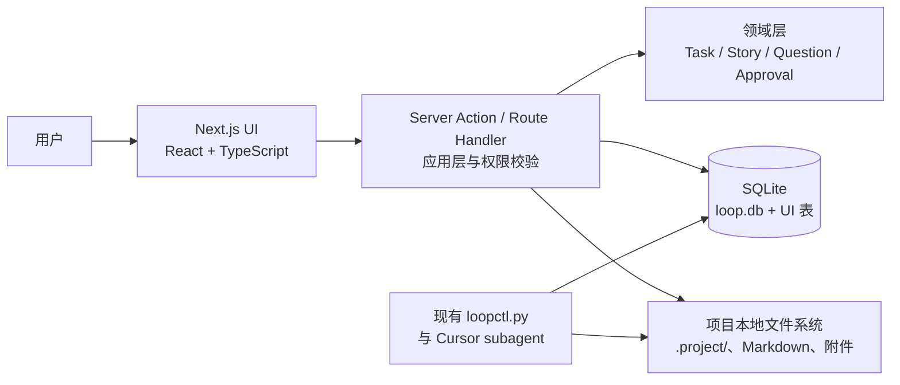

# Loop Engineering UI：V1 技术方案

## 1. 目标与边界

V1 的目标是把现有 Cursor Loop 的任务、Story、人工确认和文档证据以 UI 展示和操作出来；不是重做现有流程，也不是引入新的自动化能力。运行形态为本地模块化单体。

V1 必须保留：

- 当前 `loopctl` 的状态机、角色权限、游标约束、代码槽、browser 限制、run lease、`blocked` / `block-release` / `task-rewind` 语义。
- 现有目录、Markdown 文件名和 subagent 协议。本地文件仍然保存在项目目录中，Cursor subagent 仍可按当前协议读写。
- SQLite 作为本地持久化方案。

V1 明确不做：

- 云端部署、多用户实时协作、远程文件存储。
- 新的异步任务平台、队列、Redis、独立 Worker、Run Center 的实时执行控制。
- 修改现有 Task / Story 流程或引入原型中的新阶段名。
- 替换 Cursor `/loop` 或直接在浏览器中执行 agent。

## 2. 总体架构



系统以同一项目目录为运行边界。Next.js UI、Server Action、SQLite 和本地文件系统在一个进程内协作；不存在远程服务依赖。

## 3. 技术选型

| 层次 | V1 选择 | 说明 |
|---|---|---|
| 应用框架 | Next.js + React + TypeScript | 单进程承载页面、Server Action、领域用例和本地数据访问。 |
| UI 组件 | lucide 图标 + 自定义组件 | 以新的产品界面为基础，不再依赖原型生成物。 |
| 服务端入口 | Next.js Server Action / Route Handler + Zod | 不部署独立 API；仍由服务端入口校验输入、调用领域用例。 |
| 领域代码 | 纯 TypeScript | 不依赖 React、Next、SQLite 或文件路径，便于测试。 |
| 数据库 | SQLite | V1 使用 `.project/_loop/loop-ui.db`；使用版本化 SQL migration 管理表和索引。 |
| SQLite 访问 | `better-sqlite3` | 以同步事务边界匹配本地单机模型，并可被 Next server runtime 正确加载。 |
| 数据库迁移 | Umzug + 版本化 SQL 文件 | 以 `schema_migrations` 记录已执行版本，提供类 Flyway 的顺序迁移。 |
| 文件访问 | Node `fs/promises` | 所有路径必须限制在当前项目根目录内，禁止 API 读取任意主机路径。 |
| 页面更新 | Server Action + 页面刷新 | V1 无后台异步任务，操作完成后重新读取本地状态。 |
| 测试 | Next 构建 + 领域/集成测试 | 以既有规则和文档协议作为回归基线。 |

V1 只保留一个应用目录：

```text
app/                    # Next 页面与 Server Actions
src/domain/             # 纯领域模型和规则（按需要补齐）
src/application/        # 用例与输入校验
src/infrastructure/     # SQLite、migrations、文件系统
migrations/             # 顺序 SQL migrations
scripts/                # 本地 migration 命令
.project/               # SQLite 数据库与本地工作文件
```

## 4. 数据与文件的边界

### 4.1 事实来源

| 信息 | 事实来源 | UI 使用方式 |
|---|---|---|
| Task 生命周期、游标、当前 agent、lease | SQLite `tasks` / `meta` | 直接读库；状态改变必须走领域用例。 |
| Story 列表、目录名、拆分说明 | `03_story_list.md`，并同步到 `stories` 表 | UI 用表查询，文件作为兼容性正文。 |
| requirements、plan、test result、dev response、review | 各工作目录 Markdown | 保存原始文件；数据库保存 artifact 元数据、版本快照和可查询投影。 |
| Questions 与用户答复 | `90_questions.md`、`90_analysis_questions.md`、`91_test_questions.md` | 解析为 `questions` 表，UI 编辑后回写原文件。 |
| 附件、截图、日志 | 本地工作目录 | 数据库只存相对路径、hash、大小、类型和关联关系。 |

### 4.2 写入规则

1. 任何改变 Task 状态、游标、审批或资源占用的操作，必须先进入领域用例，不能由前端直接更新 SQLite。
2. 对已有 CLI 语义，Server Action 调用等价的 application command；不再保留 `loopctl.py` 作为运行依赖。
3. UI 编辑 Markdown 派生信息时，API 先校验并原子替换文件，再在 SQLite 事务中写入 artifact 版本及结构化投影。
4. subagent 或人工在 UI 外修改文件后，API 在读取时按 hash 检测变化并重新解析；解析失败时保留原文件、标记同步错误，不丢弃内容。
5. 数据库不保存附件二进制；数据库只保存文件索引和证据关联。

这意味着 V1 不会产生两个互相竞争的“文档正文真相”：Markdown 保持 agent 兼容的原始载体，SQLite 提供 UI 所需的结构化查询、历史和关系。

## 5. V1 页面与现有能力的映射

| 页面 | 展示内容 | V1 可执行操作 |
|---|---|---|
| 工作台 | blocked、待 analysis 确认、待 review 批准、当前代码槽、活动 Task | 打开具体问题、进入 Task。 |
| Task 列表 | `tasks` 的状态、优先级、进度、当前 agent | 搜索、筛选、打开详情。 |
| Task 详情 | Task 概览、Story、上下文、活动、artifact | 查看文档、打开原始链接、进入 Story。 |
| Story 详情 | 当前 analysis/dev/test 进度、requirements、plan、测试证据、Finding | 查看证据、处理其对应 question；不伪造独立的新状态机。 |
| Question / Approval | 原始问题、推荐答案、用户答复、影响范围 | 填答、确认 analysis、批准/驳回 review，并调用既有 `block-release` 语义。 |
| 项目设置 | 项目根目录、命令、agent 配置只读摘要 | V1 只读或编辑安全的项目配置；密钥不在 V1 管理。 |

V1 不实现“运行中心”的控制按钮。可以只展示当前 run lease 和最近一次由 CLI 记录的动作；停止、强制释放、重试等高风险能力继续通过既有命令行明确执行。

## 6. 本地 API 边界

API 使用现有术语，不提供泛化的 `PATCH /tasks/:id`。

```text
GET  /api/tasks
GET  /api/tasks/:taskId
GET  /api/tasks/:taskId/stories
GET  /api/tasks/:taskId/artifacts
GET  /api/tasks/:taskId/questions
POST /api/tasks/:taskId/questions/:questionId/answer
POST /api/tasks/:taskId/block-release
POST /api/tasks/:taskId/rewind
GET  /api/loop/status
GET  /api/projects/current
```

后续只在 UI 真正覆盖了对应 CLI 动作时增加明确 command endpoint，例如 `task-context-init`、`task-cancel` 或 `task-ingest`。每个 endpoint 必须说明 actor、允许的前置状态和失败原因。

## 7. 迁移与实施顺序

1. 将现有 `loop.db` 作为 V1 数据库基线，不改写已有 `tasks` / `meta` 语义。
2. 新增 SQL migration：`stories`、`artifacts`、`artifact_revisions`、`questions`、`task_events`、`sync_state` 等 UI 支撑表。
3. 实现只读 API 和文件扫描/解析，先让原型接入真实数据。
4. 实现 Question、Approval、`block-release` 的 UI 操作，全部以现有 CLI 规则验收。
5. 再实现 Task 详情中的文档编辑与文件-数据库同步。
6. 保留 CLI 回归测试：相同输入下，CLI 与 API 必须得到相同的状态、游标和阻塞结果。

## 8. V1 验收标准

- 已有项目可以直接打开，不需要迁移到远程服务。
- UI 显示的 Task、Story、blocked 和审批状态与 `loopctl task-get` / `block-list` 一致。
- UI 中回答问题、确认审批、release 或 rewind 后，现有 Cursor subagent 可从原有 Markdown 文件和 SQLite 状态继续工作。
- 外部修改 Markdown 后，UI 能发现并展示同步状态；不能静默覆盖人工或 agent 的内容。
- 任一 API 操作都不能绕过现有的 actor 权限、游标、审批和代码槽约束。
