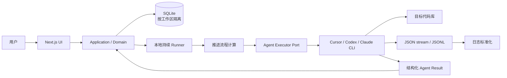

# Loop Engineering UI：V1 技术方案

## 1. 产品目标

V1 把现有 Loop Engineering 流程产品化为一个本地模块化单体：用户录入“需求”，系统拆成适合一个开发实现 Agent 完成的“交付单元”，再持续完成方案分析、开发实现、验证和整体验收。

V1 聚焦现有流程 UI 化、业务事实入库和执行过程可观察，不扩展为远程协作平台。

保留的能力：

- SQLite 本地持久化和多代码库数据隔离。
- Cursor、Codex、Claude 三种可插拔 Agent 执行器。
- 本地代码工作区、Git checkpoint、自动交付提交。
- 待确认、恢复、回退、取消、代码槽和浏览器资源约束。
- CLI 流式日志解析和用户友好的运行面板。

明确不做：

- 云部署、多用户协作、远程文件存储。
- Redis、消息队列、独立 Worker 或分布式租约。
- 兼容旧 `.project`、Inbox 和流程 Markdown 数据。
- 由 Agent 决定整体推进流程。

## 2. 总体架构



Next.js 页面、Server Action、领域用例、SQLite、Runner 和执行器适配器位于同一仓库、同一应用边界。业务事实只进入 SQLite；目标代码库只保存产品代码和正常 Git 历史。

## 3. 技术选型

| 层次 | 选择 | 说明 |
|---|---|---|
| 应用框架 | Next.js + React + TypeScript | 页面、服务端用例和本地数据访问组成一个大单体。 |
| 输入校验 | Zod | UI command、设置和 Agent Result 共用明确 Schema。 |
| 领域代码 | 纯 TypeScript | 不依赖 React、Next 或 SQLite driver。 |
| 数据库 | SQLite + `better-sqlite3` | 本地事务简单，适合单机持续 Loop。 |
| 数据库迁移 | Umzug + 顺序 SQL | `schema_migrations` 记录版本，提供类 Flyway 的迁移行为。 |
| Agent 执行 | Agent Executor Port | Cursor、Codex、Claude Adapter 将各自流格式标准化。 |
| 实时日志 | SQLite `run_logs` + SSE | Runner 写入，运行面板增量读取。 |
| Git | 本地命令适配器 | checkpoint、交付单元提交和安全文件检查由 Runner 控制。 |

仓库结构：

```text
app/                    Next.js 页面、Route Handler 与 Server Actions
src/domain/             领域规则、协议和统一术语映射
src/application/        用例、查询、推进流程和日志解释
src/infrastructure/     SQLite、迁移、执行器、Runner、Git
migrations/             项目数据库顺序迁移
app-migrations/         应用配置数据库顺序迁移
scripts/loop/           Runner 与人工维护 CLI
data/                   本地运行数据，按工作区短 hash 分目录
prototype/              历史资料，不参与运行
```

## 4. 数据边界

### 4.1 多代码库隔离

用户只设置工作区根目录：

- `data/loopwork.db` 保存当前工作区根目录。
- `data/<repo-root-short-hash>/loop-ui.db` 保存该工作区的需求和运行数据。
- 切换根目录后，应用自动选择对应数据库。
- 短 hash、数据库路径和应用数据目录不出现在普通设置界面。

### 4.2 事实来源

| 信息 | 事实来源 |
|---|---|
| 需求状态、进度、当前 Agent | SQLite `tasks` |
| 交付单元 | SQLite `stories` |
| 确认事项与用户答复 | SQLite `questions` |
| 确认记录 | SQLite `approvals` |
| 交付文档 | SQLite `documents` |
| Loop 状态与运行日志 | SQLite `loop_meta` / `run_logs` |
| Agent 原始结构化结果 | SQLite `agent_results` |
| 代码变更 | 用户选择的目标代码库 |

`tasks`、`stories`、`story_index` 等是当前物理兼容名。产品界面、Agent Prompt 和新结果协议使用 Requirement / Delivery Unit（需求 / 交付单元）。V1 不为术语调整单独做破坏性数据库迁移。

## 5. 持续 Loop

Runner 的控制循环：

```text
读取数据库 → 计算下一步 → 逐个执行 Agent → 应用结构化结果 → 再次计算
```

- 有可执行 Agent：全部逐个执行完成后，1 分钟后继续下一轮。
- 无可执行 Agent：不启动 CLI，输出 0 个 Agent，5 分钟后重试。
- 代码槽繁忙：步骤在应用内排队，释放后继续，不生成用户确认事项。
- 用户确认未完成：需求保持待确认，其他可运行需求仍可继续。

应用决定当前 Agent、推进阶段和交付单元。Agent 只负责当前目标，可以使用辅助 subagent 做上下文收集，但不能调度其他流程 Agent。

## 6. Agent 执行协议

每次 CLI 获得：

- `requirement`：需求描述、状态和进度。
- `currentDeliveryUnit` 与全部 `deliveryUnits`。
- 已有交付文档、确认事项、确认记录和近期事件。
- 当前 Agent、推进阶段、资源和明确目标。
- 最终 JSON Schema 与角色约束。

Agent 最终返回统一结构化 JSON，包含可选的：

- `summary`、`outcome`。
- `artifacts`：交付文档。
- `deliveryUnits`：仅交付规划 Agent 创建。
- `questions`：必须由用户确认的结构化事项。
- `rewind` / `rewindDeliveryUnit`：需要回退时的建议。

Application 负责校验结果、写入数据库和推进状态。Agent 不调用 `loopctl`，不写 `.project` 文档，不直接写 SQLite，也不主动写运行日志。

## 7. 执行器与日志

执行器命令：

```bash
cursor agent --print --output-format stream-json --force --workspace <workspace-root>
codex exec --json -C <workspace-root> <prompt>
claude --print --output-format stream-json <prompt>
```

选择 Codex 时显示模型和思考强度设置；选择 Cursor 或 Claude 时隐藏 Codex 专属参数。Runner 直接解析各 CLI 的 stdout、stderr、工具事件和子过程，统一写入 `run_logs`，运行面板按层级显示：

```text
Agent
├── 思考与输出
├── 工具调用
└── 辅助 subagent
    └── 工具调用
```

日志默认不自动抢夺用户滚动位置；用户可在友好视图与原始日志之间切换。诊断警告与真正执行错误分开展示。

## 8. Git 与代码槽

开发实现 Agent 只修改和验证代码。Runner 负责：

1. 检查敏感文件和工作区状态。
2. 对既有普通未提交改动创建 checkpoint commit。
3. 执行当前交付单元。
4. 校验改动和测试结果。
5. 创建包含 Requirement / Unit 标识的独立 commit。
6. 成功提交后才推进开发进度。

单代码槽用于避免两个写代码步骤同时修改同一工作区。它是本地串行队列，不是需要用户解除的租约或阻塞原因。

## 9. 页面能力

| 页面 | 核心内容与操作 |
|---|---|
| 工作台 | 需求概览、待确认、近期活动、Loop 状态。 |
| 需求列表 | 状态、优先级、进度、当前 Agent；右上角浮窗创建需求。 |
| 需求详情 | 顶部 Steps、交付单元、确认事项、文档、事件、推进流程和维护操作。 |
| 运行面板 | 开始/停止 Loop，查看占满工作区的流式分层日志。 |
| 项目设置 | 工作区根目录、执行器；Codex 被选中时显示模型和思考强度。 |

顶部 Steps 固定为：

```text
需求整理 → 交付拆分 → 单元推进 → 整体验收 → 完成
```

## 10. 验收标准

- 工作区切换后读写独立数据库，目标代码库不产生 Loop 数据目录。
- 新建需求后能进入持续 Loop；没有工作时不启动 Agent。
- 交付规划以端到端业务闭环生成交付单元，不按技术层拆分。
- 方案分析、开发实现、验证按交付单元顺序推进，整体验收只执行一次。
- Agent 产生的确认事项、文档和结果全部写入 SQLite 并可在详情页查看。
- 开发实现完成后由 Runner 创建独立 Git commit；代码槽繁忙会自动排队。
- 运行面板能观察 Agent、工具调用、辅助 subagent、警告和错误。
- 任一 UI 命令都不能绕过状态、进度、确认和资源约束。
