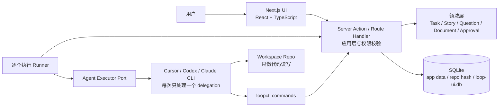

# Loop Engineering UI：V1 技术方案

## 1. 目标与边界

V1 的目标是把现有 Cursor Loop 的任务、Story、人工确认、运行日志和工作文档产品化为本地 UI。第一版不扩展流程能力，不引入远端服务；重点是把现有 loop 流程线上化、结构化、可观察。

V1 必须保留：

- 当前 `loopctl` 的状态机、角色权限、游标约束、代码槽、browser 限制、run lease、`blocked` / `block-release` / `task-rewind` 语义。
- SQLite 作为本地持久化方案。
- 可插拔 Agent Executor 作为执行入口，V1 支持 Cursor、Codex 与 Claude CLI。
- 本地 workspace 仍是代码修改发生的位置。

V1 明确不做：

- 云端部署、多用户实时协作、远程文件存储。
- Redis、独立 Worker、队列平台或新的异步任务系统。
- 修改已有 Task / Story / Agent / Pipeline 术语。
- 兼容旧 `.project` 数据。

## 2. 总体架构



系统是本地模块化单体：Next.js 页面、Server Action、领域用例、SQLite 连接和 Agent runner 都在同一应用仓库中。业务事实只落 SQLite；目标 repo 只作为代码工作区，不再生成 `.project` 工作文件。

## 3. 技术选型

| 层次 | V1 选择 | 说明 |
|---|---|---|
| 应用框架 | Next.js + React + TypeScript | 单进程承载页面、Server Action、领域用例和本地数据访问。 |
| UI 组件 | lucide 图标 + 自定义 CSS | 直接实现产品界面，不依赖 prototype 代码。 |
| 服务端入口 | Next.js Server Action / Route Handler + Zod | 表单和命令统一进入 application command。 |
| 领域代码 | 纯 TypeScript | 不依赖 React、Next 或 SQLite driver。 |
| 数据库 | SQLite | 应用级 `data/loopwork.db` 保存当前工作区；每个 workspace root 使用独立业务数据库：`data/<repo-root-short-hash>/loop-ui.db`。 |
| SQLite 访问 | `better-sqlite3` | 本地同步事务模型简单可控。 |
| 数据库迁移 | Umzug / 顺序 SQL migration | 应用级和项目级数据库都通过 `schema_migrations` 记录已执行 migration，提供类 Flyway 的顺序变更。 |
| Agent 执行 | Agent Executor Port + Cursor/Codex/Claude Adapter | App 启动逐个执行 runner；runner 对每个 delegation 单独启动一次所选 CLI，并把不同 JSON 流标准化为用户友好日志。 |
| 执行器设置 | SQLite `project_settings` | 每个 workspace 独立选择执行器，默认 Cursor；CLI 认证仍使用各工具本机账号。 |
| Agent 上下文 | `loopctl` 命令 | Agent 通过 `task-context`、`document-*`、`question-add` 获取和写入结构化上下文。 |

代码仓库结构：

```text
app/                    # Next 页面与 Server Actions
src/domain/             # 状态机、权限和领域规则
src/application/        # 用例、查询、命令、运行日志
src/infrastructure/     # SQLite、migration、Agent Executor Adapter 与 runner
migrations/             # 顺序 SQL migrations
app-migrations/         # 应用级配置数据库 migrations
scripts/loop/           # loopctl wrapper、runner 脚本
data/                   # 应用本地运行数据，按 repo 根路径短 hash 分目录
prototype/              # 历史资料与 prototype，不参与运行
```

## 4. 数据边界

### 4.1 事实来源

| 信息 | 事实来源 | 说明 |
|---|---|---|
| Task 生命周期、游标、当前 agent、lease | SQLite `tasks` / `loop_meta` | 所有状态改变必须走 application command。 |
| Story 列表 | SQLite `stories` | `story-add` 创建，UI 直接展示。 |
| 分析、复现、测试、review、上下文文档 | SQLite `documents` | Agent 使用 `document-upsert` 写入，UI 可直接查看正文。 |
| Questions 与用户答复 | SQLite `questions` | Agent 使用 `question-add --json` 创建结构化问题；用户在 UI 回答。 |
| Approval | SQLite `approvals` | analysis/review 的人工门禁记录。 |
| 运行日志 | SQLite `run_logs` | runner 逐行写入，运行面板通过 SSE 按 `log_id` 增量读取。 |
| 代码变更 | Workspace repo | dev-agent 仍在用户选择的 repo 中修改代码。 |
| 当前 workspace root | SQLite `data/loopwork.db` | 应用级配置；设置页切换后立即选择对应项目数据库。 |

### 4.2 Agent 执行边界

App/runner 是唯一调度者。Runner 通过内部 `createLoopDispatch` 用例得到本轮 delegation 后，读取当前项目的执行器设置，并按顺序逐条启动所选 CLI：

```text
delegation-1 -> executor.run(prompt for backlog-agent)
delegation-2 -> executor.run(prompt for analyst-agent)
delegation-3 -> executor.run(prompt for dev-agent)
```

每次 CLI 只收到当前 delegation 的 `task_id`、`agent`、`pipeline`、`story_index` 和目标描述。Agent 不具备全量派发、创建或释放 Run Lease 的 CLI 命令。

当前 agent 可以在本 delegation 内部使用辅助 subagent 做上下文收集或局部分析，但辅助 subagent 不能处理其他 delegation，不能推进 Task 状态；最终写库和状态更新仍由当前 agent 负责。

Runner 会校验关键 delegation 的完成契约。analyst 首次完成 Story 分析后必须进入人工确认：若已写入 analysis 文档但未创建确认问题，Runner 自动补建 Question/Approval 并阻塞 Task；若没有写入分析文档，则结束当前 Run，避免一分钟后重复执行。人工解除阻塞后的 resume delegation 会在确认生效后推进 `analysis_index`。

dev-agent 的完成顺序固定为：实现与测试、写入 dev_note、仅暂存当前 Story 相关文件、创建包含 Task/Story 标识的 Git commit，最后推进 `dev_index`。如果工作区既有改动与当前 Story 重叠而无法安全隔离，dev-agent 必须阻塞并请求人工处理，不能以未提交代码推进流程。

### 4.3 写入规则

1. UI、runner、agent 都不能直接改 SQLite；必须通过 application command 或 `loopctl`。
2. Agent 不再写 `.project`、`90_questions.md`、`06_review.md` 或工作文档 Markdown。
3. Agent 需要上下文时调用 `task-context` / `document-list` / `document-get`。
4. Agent 产生业务文档时调用 `document-upsert`。
5. Agent 需要人工确认时调用 `question-add --json`。
6. Runner 和 Agent 的运行日志写入 `run_logs` 表；运行面板不读取 run log 文件。
   Agent 不调用日志命令；Runner 直接解析 CLI stream，Application 自动记录领域事件。
7. 当前 workspace root 存在应用级 SQLite；业务数据库按 workspace root 短 hash 隔离。短 hash、数据库路径和 app data 目录对普通用户不可见。

## 5. Agent 命令边界

核心命令：

```text
task-context
story-add
document-upsert
document-list
document-get
question-add
task-update
task-rewind
block-release
run-status
```

示例：

```bash
python scripts/loop/loopctl.py task-context --task-id TASK-id

python scripts/loop/loopctl.py document-upsert --json '{
  "taskId": "TASK-id",
  "actor": "analyst-agent",
  "kind": "analysis",
  "storyIndex": 1,
  "title": "Story-1 Analysis",
  "format": "markdown",
  "content": "分析正文"
}'

python scripts/loop/loopctl.py question-add --json '{
  "taskId": "TASK-id",
  "actor": "analyst-agent",
  "kind": "analysis",
  "storyIndex": 1,
  "blockedReason": "等待用户确认业务规则",
  "blockTask": true,
  "questions": [
    {
      "title": "问题标题",
      "question": "需要用户回答的具体问题",
      "why": "为什么必须确认",
      "recommendation": "建议答案，可为空"
    }
  ]
}'
```

## 6. 页面与能力映射

| 页面 | 展示内容 | 可执行操作 |
|---|---|---|
| 工作台 | blocked、近期事件、运行状态 | 打开 Task、进入运行面板。 |
| Task 列表 | 状态、优先级、进度、当前 agent | 创建 Task、打开详情。 |
| Task 详情 | Task 概览、Story、Questions、Documents、Approvals、事件 | 新增 Story、回答问题、解除阻塞、状态流转、rewind、cancel。 |
| 运行面板 | 当前 run lease、Cursor agent 结构化日志 | 开始运行、结束运行、观察 pipeline 进展。 |
| 项目设置 | 当前 workspace root、Agent 执行器 | 输入并切换工作区根目录；选择 Cursor、Codex 或 Claude。存在活跃 loop 时拒绝切换。 |

## 7. 迁移与实施顺序

1. 使用 `data/loopwork.db` 保存当前 workspace root，使用 `data/<repo-root-short-hash>/loop-ui.db` 作为每个 workspace 的独立业务数据库。
2. 使用 SQL migration 管理表结构。
3. 保留旧 schema 中必要兼容列为空值，但新逻辑不再读写旧工作文件。
4. 将 Questions 线上化到 `questions` 表。
5. 将业务文档线上化到 `documents` 表，并扩展 agent 命令替代读写文件。
6. 将运行日志线上化到 `run_logs` 表。
7. 通过 Agent Executor Port 隔离 CLI 差异，使每次 CLI 只执行单个 delegation；内部辅助 subagent 只作为当前 agent 的上下文工具，不参与 pipeline 调度。

## 8. V1 验收标准

- 切换 workspace root 后，使用独立 `data/<repo-hash>/loop-ui.db`。
- 新建 Task 后可以进入持续 loop，并由外部 runner 逐个执行 pipeline agent。
- Agent 的问题写入 `questions` 表，Task 详情页可展示和回答。
- Agent 的分析、复现、测试、review 文档写入 `documents` 表，Task 详情页可查看正文。
- 运行面板从 `run_logs` 表显示所选执行器的用户友好日志，能观察 agent、tool call、子过程和错误。
- 任一 UI command 都不能绕过 actor 权限、游标、审批和代码槽约束。
