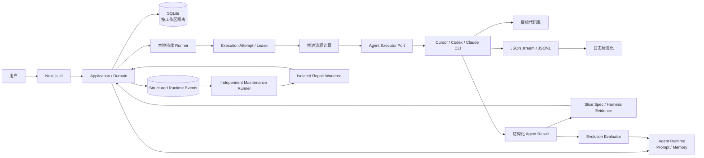

# Loop Engineering UI：V1 技术方案

## 1. 产品目标

V1 把现有 Loop Engineering 流程产品化为一个本地模块化单体：用户录入“需求”，系统拆成适合一个开发实现 Agent 完成的“交付单元”，再持续完成方案分析、开发实现、验证和整体验收。

V1 聚焦现有流程 UI 化、业务事实入库和执行过程可观察，不扩展为远程协作平台。

保留的能力：

- SQLite 本地持久化和多代码库数据隔离。
- Cursor、Codex、Claude 三种可插拔 Agent 执行器。
- 本地代码工作区、Git checkpoint、自动交付提交。
- 产品澄清、自动恢复、回退、取消、代码槽和浏览器资源约束。
- CLI 流式日志解析和用户友好的运行面板。

明确不做：

- 云部署、多用户协作、远程文件存储。
- Redis、消息队列、独立 Worker 或分布式租约。
- 兼容旧 `.project`、Inbox 和流程 Markdown 数据。
- 由 Agent 决定整体推进流程。

## 2. 总体架构



Next.js 页面、Server Action、领域用例、SQLite、Runner 和执行器适配器位于同一仓库、同一应用边界。业务事实只进入 SQLite；目标代码库只保存产品代码和正常 Git 历史。

## 3. 技术选型

| 层次 | 选择 | 说明 |
|---|---|---|
| 应用框架 | Next.js + React + TypeScript | 页面、服务端用例和本地数据访问组成一个大单体。 |
| 输入校验 | Zod | UI command、设置和 Agent Result 共用明确 Schema。 |
| 领域代码 | 纯 TypeScript | 不依赖 React、Next 或 SQLite driver。 |
| 数据库 | SQLite + `better-sqlite3` | 本地事务简单，适合单机持续 Loop。 |
| 数据库迁移 | Umzug + 顺序 SQL | `schema_migrations` 记录版本，提供类 Flyway 的迁移行为。 |
| Agent 执行 | Agent Executor Port | Cursor、Codex、Claude Adapter 将各自流格式标准化。 |
| 实时日志 | SQLite `run_logs` + SSE | Runner 写入，运行面板增量读取。 |
| Git | 本地命令适配器 | checkpoint、交付单元提交和安全文件检查由 Runner 控制。 |

仓库结构：

```text
app/                    Next.js 页面、Route Handler 与 Server Actions
src/domain/             领域规则、协议和统一术语映射
src/application/        用例、查询、推进流程和日志解释
src/infrastructure/     SQLite、迁移、执行器、Runner、Git
migrations/             项目数据库顺序迁移
app-migrations/         应用配置数据库顺序迁移
scripts/loop/           Runner 与人工维护 CLI
data/                   本地运行数据，按工作区短 hash 分目录
prototype/              历史资料，不参与运行
```

## 4. 数据边界

### 4.1 多代码库隔离

用户只设置工作区根目录：

- `data/loopwork.db` 保存当前工作区根目录。
- `data/<repo-root-short-hash>/loop-ui.db` 保存该工作区的需求和运行数据。
- 切换根目录后，应用自动选择对应数据库。
- 短 hash、数据库路径和应用数据目录不出现在普通设置界面。

### 4.2 事实来源

| 信息 | 事实来源 |
|---|---|
| 需求状态、进度、当前 Agent | SQLite `tasks` |
| 交付单元 | SQLite `stories` |
| 产品歧义、决策选项与用户答复 | SQLite `questions` |
| 版本化最小单元契约 | SQLite `story_specs` |
| Harness 验证与证据 | SQLite `verification_runs` / `verification_evidence` |
| Agent 执行尝试与副作用收据 | SQLite `execution_attempts` / `execution_receipts` |
| Agent Prompt / Memory 版本 | SQLite `agent_profiles` / `agent_prompt_versions` / `agent_memory_versions` |
| 当前实际 Agent 文件 | `data/<repo-hash>/agent-runtime/agents/<agent>/PROMPT.md` / `MEMORY.md` |
| 演化观察与评估 | SQLite `agent_observations` / `agent_evolution_runs` 与 Runtime daily memory |
| 机器可分析运行事件 | SQLite `runtime_events` |
| 软件维护任务与候选 | SQLite `software_maintenance_jobs` + 独立 Git branch/worktree |
| 结卡报告阅读记录 | SQLite `closure_acknowledgements` |
| 交付文档 | SQLite `documents` |
| Loop 状态与运行日志 | SQLite `loop_meta` / `run_logs` |
| Agent 原始结构化结果 | SQLite `agent_results` |
| 代码变更 | 用户选择的目标代码库 |

`tasks`、`stories`、`story_index` 等是当前物理兼容名。产品界面、Agent Prompt 和新结果协议使用 Requirement / Delivery Unit（需求 / 交付单元）。V1 不为术语调整单独做破坏性数据库迁移。

## 5. 持续 Loop

Runner 的控制循环：

```text
读取数据库 → 恢复未完成 attempt → 计算下一步 → 持久化输入 → 执行一个 Agent → Harness 验证 → 应用结果 → 再次计算
```

- 有可执行 Agent：全部逐个执行完成后，1 分钟后继续下一轮。
- 无可执行 Agent：不启动 CLI，输出 0 个 Agent，5 分钟后重试。
- 代码槽繁忙：步骤在应用内排队，释放后继续，不生成用户确认事项。
- 产品澄清未完成：`run_state=waiting_for_answers`，Agile 状态不被改成 blocked；其他需求继续运行。
- 执行异常：最多自动尝试三次，耗尽后进入 `run_state=system_blocked`。

应用决定当前 Agent、推进阶段和交付单元。Agent 只负责当前目标，可以使用辅助 subagent 做上下文收集，但不能调度其他流程 Agent。

## 6. Agent 执行协议

每次 CLI 获得：

- `requirement`：需求描述、状态和进度。
- `currentDeliveryUnit` 与全部 `deliveryUnits`。
- 已有交付文档、当前 Slice Spec、产品澄清及答复、验证证据和 execution attempt 摘要。
- 当前 Agent、推进阶段、资源和明确目标。
- 最终 JSON Schema 与角色约束。

Agent 最终返回统一结构化 JSON，包含可选的：

- `summary`、`outcome`。
- `artifacts`：交付文档。
- `deliveryUnits`：仅交付规划 Agent 创建。
- `spec`：当前交付单元的目标、范围、行为、决策、歧义、验收 Oracle、验证计划与 Change Budget。
- `questions`：仅 Analyst 可返回、必须由用户决定的结构化产品歧义。
- `rewind` / `rewindDeliveryUnit`：需要回退时的建议。

Review Agent 是例外的只报告角色：只能返回完整 artifact 和 `verdict=report_ready`，不能提问、阻塞或回退。

Application 负责校验结果、写入数据库和推进状态。Agent 不调用 `loopctl`，不写 `.project` 文档，不直接写 SQLite，也不主动写运行日志。

## 7. Agent Runtime 与演化

应用启动 Loop 前初始化 `data/<repo-hash>/agent-runtime`。它位于应用数据目录、被 Git 忽略且按目标 repo 隔离；种子 Prompt 只在 Agent Profile 首次创建时使用，此后的事实由版本表和本地 Runtime 文件共同物化。每次执行前检测本地文件哈希，外部编辑会形成 `source=local` 的新版本。

Runner 按 `Core Contract → Role Prompt → Durable Memory → recent daily memory → task context → Output Contract` 组装最终输入，并把 Prompt/Memory 的版本和哈希写入 execution attempt。Core Contract 和 Output Contract 不开放编辑，避免自定义 Prompt 改写权限、状态机或结构化协议。

Evolution Evaluator 是主执行后的 best-effort 旁路：它运行在独立 evaluator 目录，只输出受 Zod 校验的 observation JSON。观察首先进入 daily memory 与去重 occurrence 表；只有 `occurrence >= 3`、`distinct requirements >= 2`、`confidence >= 0.75` 且通过安全规则时才提升。Memory 直接形成新 revision；Prompt 形成 candidate，并只由带匹配 `evolution_candidate_id` 的真实 execution attempt 消耗三次 Canary。失败立即回滚，成功三次才激活。Evaluator 失败不改变主执行结果。

数据库文档以 Markdown 预览呈现，并允许文件级或选区级评论。评论保存文档 revision、引用原文和渲染文本偏移；文档更新只增加 revision，不改写历史锚点。Runner 把当前交付单元的评论放进 Agent task context；Evolution Evaluator 另外读取该 Agent 全局尚未分析的评论，并通过 `evidenceCommentIds` 显式关联 observation。成功评估后评论才转为 analyzed，评估失败继续保留为 pending。评论只是高价值证据，仍受跨需求阈值、Prompt candidate 和 Canary 约束。

## 8. 软件自维护与结构化日志

`run_logs` 继续服务 UI 实时流，`runtime_events` 采用 OpenTelemetry 风格字段保存机器证据：event timestamp、observed timestamp、trace/run、span/execution、event name、component、stage、severity number/text、attributes 和 exception。所有正文、异常 message 与 stack 在入库前执行长度限制和 secret redaction。

Agent Runner 在 execution 开始时设置进程级 correlation context；之后同一进程写出的 Agent、工具、Harness、恢复和演化日志自动关联 execution。Runner 的顶层 `try/catch/finally` 在 finally 中只写 durable maintenance outbox，不同步调用模型。Dispatch Waiter 的致命错误也走同一 outbox。

Maintenance Runner 是独立 detached OS process，以 SQLite lease 串行 claim job。它基于触发时的应用 commit 创建 Git worktree，调用 Software Maintenance Agent 分析结构化证据，并独立校验：

1. 结果 Schema、`classification=loop_bug`、`confidence >= 0.8`。
2. 声明变更与 Git status 完全一致。
3. 不超过 8 个文件 / 500 行，且没有进入 secret、migration、data 或自修复保护边界。
4. `npm test` 与 `npm run build` 全部通过。
5. 自动落地时应用仓库仍为相同 base commit、工作区 clean，且没有活跃开发写入步骤。

满足前四项但暂时没有安全落地窗口时保存 branch/commit 并标记 `verified`；基线已经变化时标记 `stale`。所有失败只影响维护任务，不改变 Requirement 状态或主 Loop 生命周期。

V1 明确区分 Git isolation 与 OS sandbox：worktree 不限制进程访问绝对路径。Runner 因此在 Agent 前后比较主仓库内容快照，Agent 执行期间不挂载共享 `node_modules`，并保护 package/lockfile、TypeScript/Next 配置和既有测试数量。后续通过 `SandboxPort` 接入 Docker 或 Cloudflare Sandbox SDK 后，Agent CLI 与 test/build 可以进一步在无网络、最小挂载的容器中执行；在该 Port 实现前，UI 和文档不得把 worktree 表述成硬安全沙箱。

## 9. 执行器与日志

执行器命令：

```bash
cursor-agent --print --output-format stream-json --force <prompt> # 进程 cwd 为工作区根目录
codex exec --json -C <workspace-root> <prompt>
claude --print --output-format stream-json <prompt>
```

选择 Codex 时显示模型和思考强度设置；选择 Cursor 或 Claude 时隐藏 Codex 专属参数。Runner 直接解析各 CLI 的 stdout、stderr、工具事件和子过程，统一写入 `run_logs`，运行面板按层级显示：

```text
Agent
├── 思考与输出
├── 工具调用
└── 辅助 subagent
    └── 工具调用
```

日志默认不自动抢夺用户滚动位置；用户可在友好视图与原始日志之间切换。诊断警告与真正执行错误分开展示。

## 10. Git 与代码槽

开发实现 Agent 只修改和验证代码。Runner 负责：

1. 检查敏感文件和工作区状态。
2. 对既有普通未提交改动创建 checkpoint commit。
3. 执行当前交付单元。
4. 按已解决 Slice Spec 的 verification plan 运行 Harness，保存命令、退出码和输出证据。
5. 创建包含 Requirement / Unit 标识的独立 commit，并保存幂等收据。
6. Harness 失败时自动回退开发；通过后才推进开发进度。

单代码槽用于避免两个写代码步骤同时修改同一工作区。它是本地串行队列，不是需要用户解除的租约或阻塞原因。

## 11. 页面能力

| 页面 | 核心内容与操作 |
|---|---|
| 工作台 | 需求概览、待产品澄清、待读结卡、近期活动、Loop 状态。 |
| 需求列表 | 状态、优先级、进度、当前 Agent；右上角浮窗创建需求。 |
| 需求详情 | 顶部 Steps、交付单元、Slice Spec、产品澄清、Harness 证据、execution attempts、结卡报告和事件。 |
| 运行面板 | 开始/停止 Loop，查看占满工作区的流式分层日志。 |
| 项目设置 | 工作区根目录、执行器；Codex 被选中时显示模型和思考强度。 |
| Agent 配置 | 各角色 Prompt / Memory 编辑、Effective Prompt 预览、版本回滚、daily memory、观察与自动演化状态。 |
| 软件演化 | 结构化事件数量、维护队列、根因、修复候选、Harness、自动落地与拒绝原因。 |

顶部 Steps 固定为：

```text
需求整理 → 交付拆分 → 单元推进 → 生成结卡报告 → 阅读结卡 → 完成
```

## 12. 验收标准

- 工作区切换后读写独立数据库，目标代码库不产生 Loop 数据目录。
- 新建需求后能进入持续 Loop；没有工作时不启动 Agent。
- 交付规划以端到端业务闭环生成交付单元，不按技术层拆分。
- 方案分析、开发实现、验证按交付单元顺序推进，整体验收只执行一次。
- Analyst 产生的歧义、版本化规格、回答、文档和结果全部写入 SQLite 并可在详情页查看。
- 回答只形成决策事实；必须由 Analyst 生成无歧义的新规格后才能进入开发。
- Harness 的每条证据都关联验收标准、规格版本和代码 Commit。
- Agent 进程在结构化输出后中断时能从原 attempt 恢复，不重复调用 Agent。
- 每个 attempt 可追溯实际 Prompt/Memory 哈希；目标 repo Git 不影响 Runtime Workspace。
- 单次观察不能自动改长期 Prompt；满足跨需求阈值后仍必须通过三次 Canary，失败自动回滚。
- finally 不同步运行维护 Agent；主 Runner 即使维护入队失败也能正常结束或继续派发。
- runtime event 必须关联 run/execution 并在落库前脱敏 secret；原始异常不得泄露到维护 Prompt。
- 软件修复只在独立 worktree 发生，保护边界、变更预算、test/build 或 clean-baseline 任一失败都不得自动落地主仓库。
- Review 生成报告后释放代码槽并进入 `ready_to_close`；阅读动作不产生 approve/reject。
- 开发实现完成后由 Runner 创建独立 Git commit；代码槽繁忙会自动排队。
- 运行面板能观察 Agent、工具调用、辅助 subagent、警告和错误。
- 任一 UI 命令都不能绕过状态、进度、确认和资源约束。
