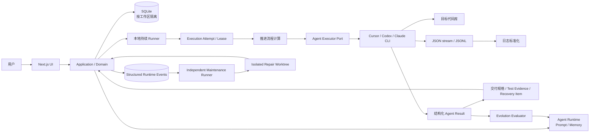

# Loop Engineering UI：V1 技术方案

## 1. 产品目标

V1 把现有 Loop Engineering 流程产品化为一个本地模块化单体：用户录入“需求”，系统拆成适合一个开发实现 Agent 完成的“交付单元”，再持续完成交付分析、开发实现、验证和整体验收。

V1 聚焦现有流程 UI 化、业务事实入库和执行过程可观察，不扩展为远程协作平台。

保留的能力：

- SQLite 本地持久化和多代码库数据隔离。
- Cursor、Codex、Claude 三种可插拔 Agent 执行器。
- 本地主干代码工作区、Agent 自主且可选的 Git 提交。
- 设计澄清、自动恢复、回退、取消、代码槽和浏览器资源约束。
- CLI 流式日志解析和用户友好的运行面板。

明确不做：

- 云部署、多用户协作、远程文件存储。
- Redis、消息队列、独立 Worker 或分布式租约。
- 兼容旧 `.project`、Inbox 和流程 Markdown 数据。
- 由 Agent 决定整体推进流程。

## 2. 总体架构


```mermaid
flowchart LR
  User["用户"] --> UI["Next.js UI"]
  UI --> App["Application / Domain"]
  App --> DB[("SQLite\n按工作区隔离")]
  App --> Profiles["Agent Runtime\nPrompt / Memory"]
  App --> Runner["本地持续 Runner"]
  Runner --> Attempt["Execution Attempt / Lease"]
  Attempt --> Flow["推进流程计算"]
  Flow --> Executor["Agent Executor Port"]
  Executor --> CLI["Cursor / Codex / Claude CLI"]
  CLI --> Repo["目标代码库"]
  CLI --> Stream["JSON stream / JSONL"]
  Stream --> Logs["日志标准化"]
  CLI --> Result["结构化 Agent Result"]
  Result --> Evidence["交付规格 / Test Evidence / Recovery Item"]
  Evidence --> App
  Result --> Evolution["Evolution Evaluator"]
  Evolution --> Profiles
  App --> Events[("Structured Runtime Events")]
  Events --> Maintenance["Independent Maintenance Runner"]
  Maintenance --> Repair["Isolated Repair Worktree"]
  Repair --> App
```

Next.js 页面、Server Action、领域用例、SQLite、Runner 和执行器适配器位于同一仓库、同一应用边界。业务事实只进入 SQLite；目标代码库只保存产品代码和正常 Git 历史。

## 3. 技术选型

| 层次 | 选择 | 说明 |
|---|---|---|
| 应用框架 | Next.js + React + TypeScript | 页面、服务端用例和本地数据访问组成一个大单体。 |
| 输入校验 | Zod | UI command、设置和 Agent Result 共用明确 Schema。 |
| 领域代码 | 纯 TypeScript | 不依赖 React、Next 或 SQLite driver。 |
| 数据库 | SQLite + `better-sqlite3` | 本地事务简单，适合单机持续 Loop。 |
| 数据库迁移 | Umzug + 顺序 SQL | `schema_migrations` 记录版本，提供类 Flyway 的迁移行为。 |
| Agent 执行 | Agent Executor Port | Cursor、Codex、Claude Adapter 将各自流格式标准化。 |
| 实时日志 | SQLite `run_logs` + SSE | Runner 写入，运行面板增量读取。 |
| Git | 本地命令适配器 | Agent 可按仓库规则提交本轮相关代码；Runner 只记录起止 HEAD。 |

仓库结构：

```text
app/                    Next.js 页面、Route Handler 与 Server Actions
src/domain/             领域规则、协议和统一术语映射
src/application/        用例、查询、推进流程和日志解释
src/infrastructure/     SQLite、迁移、执行器、Runner、Git
migrations/             项目数据库顺序迁移
app-migrations/         应用配置数据库顺序迁移
scripts/loop/           Runner 与人工维护 CLI
data/                   本地运行数据，按工作区短 hash 分目录
prototype/              历史资料，不参与运行
```

## 4. 数据边界

### 4.1 多代码库隔离

用户只设置工作区根目录：

- `data/loopwork.db` 保存当前工作区根目录。
- `data/<repo-root-short-hash>/loop-ui.db` 保存该工作区的需求和运行数据。
- 切换根目录后，应用自动选择对应数据库。
- 短 hash、数据库路径和应用数据目录不出现在普通设置界面。

### 4.2 事实来源

| 信息 | 事实来源 |
|---|---|
| 需求状态、进度、当前 Agent | SQLite `tasks` |
| 交付单元 | SQLite `stories` |
| 设计歧义、决策选项与用户答复 | SQLite `questions` |
| 版本化最小单元契约 | SQLite `story_specs` |
| Test 失败与恢复证据 | SQLite `documents` / `recovery_items` |
| Agent 执行尝试与副作用收据 | SQLite `execution_attempts` / `execution_receipts` |
| Agent 长文本命令临时文件 | 工作区 `.tmp/agent-<execution-id>`；通过 `LOOP_AGENT_TMP_DIR` 注入并在 execution 结束时独立清理 |
| 项目 Agent Prompt、临时 Prompt candidate 与 Memory revision 历史 | SQLite `agent_profiles` / `agent_prompts` / `agent_prompt_candidates` / `agent_memory_versions` |
| 当前实际 Agent 文件 | `data/<repo-hash>/agent-runtime/agents/<agent>/PROMPT.md` / `MEMORY.md` |
| 演化观察与评估 | SQLite `agent_observations` / `agent_evolution_runs` 与 Runtime daily memory |
| 机器可分析运行事件 | SQLite `runtime_events` |
| 软件维护任务与候选 | SQLite `software_maintenance_jobs` + 独立 Git branch/worktree |
| 结卡报告阅读记录 | SQLite `closure_acknowledgements` |
| 交付文档 | SQLite `documents` |
| Loop 状态与运行日志 | SQLite `loop_meta` / `run_logs` |
| Agent 原始结构化结果 | SQLite `agent_results` |
| 代码变更 | 用户选择的目标代码库 |

`tasks`、`stories`、`story_index` 等是当前物理兼容名。产品界面、Agent Prompt 和新结果协议使用 Requirement / Delivery Unit（需求 / 交付单元）。V1 不为术语调整单独做破坏性数据库迁移。

## 5. 持续 Loop

Runner 的控制循环：

```text
读取数据库 → 恢复未完成 attempt → 计算各任务 Lane → 持久化输入 → 执行 Agent → 任一 Lane 完成后立即重新计算
```

- 交付拆分前与 Review 阶段：每个任务只运行一个 Control Agent。
- 需求级产品澄清未完成：暂停该任务的 Control 流程；回答提交后只恢复需求梳理 Agent，完成需求边界后才允许交付拆分。
- 单元推进阶段：每个任务最多同时运行一个 Analysis Agent 和一个 Delivery Agent；Analysis 串行向前，Delivery 串行执行 Dev/Test。
- 全局容量：最多 4 个 Analysis；代码工作区与浏览器的独占容量由 Resource Claim 保证，同优先级 Analysis 按等待最久者优先。
- 任一 Lane 完成后立即继续调度，不等待其他 Agent 形成批次屏障。
- 无可执行 Agent：不启动 CLI，输出 0 个 Agent，5 分钟后重试。
- 代码槽繁忙：步骤在应用内排队，释放后继续，不生成用户确认事项。
- 交付级关键决策未完成：只暂停交付分析通道；开发验证通道继续消费已有已收敛规格。
- 运行信息未补充：只暂停发起请求的 Lane；提交后交回原 Agent 和交付单元。Dev/Test 等待时释放代码槽，恢复前重新申请。
- 执行异常：最多自动尝试三次，耗尽后只阻塞失败 Lane。
- 系统阻塞解除：只对声明了 `resume` 协议的角色恢复原草稿；交付规划、反馈处理和 Review 等无 `resume` 协议的角色，由调度器重新选择原 pipeline 与反馈工作组等业务作用域，不能统一改派为 `resume`。

应用决定当前 Agent、推进阶段和交付单元。Agent 只负责当前目标，可以使用辅助 subagent 做上下文收集，但不能调度其他流程 Agent。

## 6. Agent 执行协议

每次 CLI 获得：

- 冻结的 `Working Context Pack`：当前 Agent、阶段、交付单元、明确目标、权威需求、当前交付规格、用户决定、Active Obligations 和当前角色获准读取的最近执行摘要。
- 紧凑的 `Context Index`：文档、规格、决定、运行信息、反馈、恢复项和 execution evidence 的 ref、scope、revision、status、authority 与摘要，不默认放入全部正文。
- execution-bound 的只读 `agent-context` 命令：Agent 可按 ref 读取、搜索、列出资料及查看证据和历史；命令只读取本次 execution 开始时持久化的 Context Snapshot。
- 仓库、Git 和测试环境的实时 Ground Truth；它们由 Agent 使用原生命令行和文件工具检查，不由数据库快照替代。
- 当前角色的渐进式命令协议与确定性校验约束；Agent 不接收通用结果 JSON Schema。

Review Agent 通过 `FACT RECONCILIATION → CLOSURE ASSESSMENT` 先完成逐项事实对账和需求级组合评估；没有缺口时进入 `REPORT → FINALIZE`，存在缺口时进入 `FORWARD DELIVERY UNITS → FINALIZE`。`report_ready` 必须包含完整报告且不存在结卡缺口；`closure_gap` 同时包含结构化缺口和由 Review Agent 形成的完整前向交付单元，不生成无效报告、不创建人工问题，也不选择回退阶段。Application 按覆盖关系幂等追加这些单元并直接派发交付分析，不再经过 Story Splitter；一个单元可以覆盖必须共同闭合的多个相关缺口。Feedback Agent 一次读取冻结的评论批次，将评论按共同验收目标分为直接回复、历史说明、报告修订、Bug、行为修订、范围新增、技术调整或长期建议。Application 不接受 `targetStage`、`targetAgent` 或评论驱动的 rewind；Bug 先由问题复现 Agent 建立事实，所有需要工程修改的反馈工作随后统一进入交付规划，由交付规划 Agent 形成具备完整业务契约和来源关联的一个或多个追加交付单元，再经过交付分析、开发、验证和 Feedback 独立验证。Feedback Agent 不直接写入只有标题的占位单元。既有文档与交付规格保持为历史证据，只在最终结卡报告中汇总最终事实。反馈批次使用需求内递增的 `batch_number`，工作组使用批次内递增的 `group_order`，保证数据库、Agent 上下文和页面展示的执行顺序一致，不依赖时间戳或随机 UUID 排序。

需求梳理 Agent、交付规划 Agent、问题复现 Agent、交付分析 Agent、开发实现 Agent、验证 Agent、反馈处理 Agent 与结卡报告 Agent 已迁移为 execution 绑定的渐进命令协议。需求梳理 Agent 必须先调用 `loop-agent requirement-context status` 恢复持久草稿，再逐项维护业务意图、actual/expected/target 语义陈述、变化摘要、业务影响、验收语义、分类、约束、范围和问题。语义陈述保存来源与证据状态；业务影响区分 change、preserve、needs_decision 和 technical。来源、证据状态、稳定 key、修订状态和 decision key 只服务于 Agent 草稿恢复、校验和追溯，最终《业务变化上下文》只投影当前有效的业务语义，不把这些控制元数据写入正文。错误结论不能无痕删除，必须使用 dismiss 或 supersede 并保留修订历史。交付规划 Agent 必须先调用 `loop-agent delivery-plan status`，再逐项维护拆分依据、覆盖说明、排序、有稳定身份的交付单元、规划输入关联和自然依赖；候选单元同样使用 dismiss 或 supersede 保留历史。问题复现 Agent 必须先调用 `loop-agent reproduction status`，再逐项维护预期、实际、环境、稳定性、影响范围、复现步骤、证据、根因假设和人工对齐问题；交付分析 Agent 必须先调用 `loop-agent delivery-analysis status`，再渐进维护分析摘要、实际影响及处理方式、关键业务或技术决策、冻结交付契约、保护约束和验证关注点；开发实现 Agent 必须先调用 `loop-agent implementation status`，再只提交逐项验收证据、关键检查选择、风险、运行信息和恢复事项声明，Git 与命令事实由 Application 自动取证，不向 Test 提交交接；验证 Agent 必须先调用 `loop-agent verification status`，按 `PLAN → EXECUTE → EVIDENCE REVIEW → FINALIZE` 调用链工作：先用 `verification plan upsert` 建立带稳定身份的前端或 API 黑盒场景并以 `verification plan complete` 冻结 Expected，再逐项 `verification result record`，复核证据与责任分类后执行版本绑定校验，最后由 `verification complete` 根据计划结果提交结论；反馈处理 Agent 必须先调用 `loop-agent feedback status`，在 Triage 模式逐项维护评论分组、关联评论、影响单元、验收条件和最少必要澄清，在 Verify 模式逐项维护验证理由和独立证据；结卡报告 Agent 必须先调用 `loop-agent review status`，再用 `review reconciliation upsert` 把 Application 列出的每个必需 subject 映射到最终可观察结果和真实 Context evidence，无法闭合时用 `review gap upsert` 保存缺口边界，事实闭合后用 `review report section-upsert` 渐进组织报告。每个条目使用跨轮次稳定 key；恢复时覆盖原 key，不能靠换名堆叠同义内容。只有角色声明的终止命令会由 Application 生成内部 Agent Result 并推进状态，普通最终回复不参与控制面。长文本可通过 `--<字段>-file` 读取 UTF-8 文件，避免 Windows 命令行长度限制。

交付规划草稿按 `需求 + pipeline + delegation` 隔离。相同委派的失败重试会恢复未完成草稿；普通拆分和评论范围新增触发的追加拆分互不污染。草稿建立时冻结本轮规划输入，单元通过 source key 承接变化、保持约束、技术后果和验收语义，并通过 unit key 声明自然依赖。Application 校验所有输入均被有效单元覆盖、依赖无环且与推荐顺序一致，但不替 Agent 判断业务拆分优劣。`delivery-plan complete` 成功后，Application 从数据库草稿确定性生成交付计划文档，并在一个事务中把完整交付单元契约、来源快照和依赖写入需求聚合；后续交付分析 Agent Context 直接读取这些边界。

问题复现草稿按复现工作身份隔离：普通 Bug 使用稳定的需求级工作键；评论触发的复现使用稳定 `feedbackGroupId`，因此请求人工对齐后产生的新 execution 会继续同一份草稿。`reproduction request-alignment` 保存未复现证据和结构化问题但不规划下游路由；人工回答后新版本草稿必须先读取 status，再更新同 key 证据。只有 `reproduction complete` 通过完整性校验后，Application 才生成复现文档并允许进入交付拆分。

交付分析草稿按 `需求 + 交付单元` 隔离，普通分析和回答后的 `resume` 共用稳定工作键。新草稿冻结完整交付单元契约、上游来源与依赖；Do It Twice 只作为 Agent 的思考方法，Application 不要求保存完整推演。Agent 渐进保存分析摘要、实际影响、关键决策和交付契约。用户问题的 `decision_key` 是跨轮次身份：恢复版本复制上一版草稿和已回答事实，Agent 必须在原 key 上以 `user` 权限关闭并更新关联影响，不能通过重命名规避回答。`delivery-analysis request-clarification` 只为超出权限且会产生实质不同后果的最少未决决策生成问题；`delivery-analysis complete` 只校验所有影响已有处理方式、关键决策有权限与证据、回答被正确消费且交付契约完整。已解决技术决策不强制候选项，不存在关键决策时允许直接完成。

开发实现草稿按 `需求 + 交付单元` 隔离，普通开发和运行信息补充后的 `resume` 共用稳定工作键。Application 始终注入冻结交付单元验收 `unit-acceptance`，并在其后追加交付分析给出的验证关注点；Agent 每次执行都以当前仓库为准重新检查功能完整性，并逐条说明实现证据。CLI 的 provider-neutral tool event 按 execution 增量写入 `execution_receipts`；Agent 完成真实检查后重新读取 `status`，显式选择明确成功的 Shell/Bash receipt 并说明它为何支持交付结论，不再手填 command、passed 或 exit code。所选检查只绑定 execution、receipt 与原始命令哈希；同一命令出现更新结果后必须选择最新结果。运行信息使用稳定 request key，回答后恢复到原草稿。`implementation complete` 不比较 execution Commit 与当前 HEAD，不推断哪些文件属于本轮，也不因换分支、改写历史、其他 Commit 或未提交文件而拒绝完成；Git 状态最多作为 Agent 调查当前仓库的观察信息。完成门槛只由冻结契约的实现证据、Agent 选择的真实成功检查、运行信息与恢复事项构成。现有实现已经满足契约时，允许以充分走查和验证证据零改动完成。

验证草稿按 `需求 + 交付单元` 隔离，普通验证和运行信息补充后的 `resume` 共用稳定工作键。第一阶段，Agent 用稳定 plan key 声明场景渠道、测试准备、从真实入口开始的测试步骤、预期观察以及覆盖的交付验收、验证关注点或恢复事项；每项 `unit-acceptance` 至少由一个 `frontend` 场景覆盖，`api` 场景可以补充业务边界、错误反馈、数据语义或形成独立反例，但必须关联冻结契约中的业务期望。计划冻结后不得无痕改写；第二阶段逐项追加通过、失败或阻塞结果和 Agent 自己取得的观察。Test 的 Context Snapshot 排除 Dev 文档、Dev execution 摘要、自检、变更说明、Commit message 与恢复声明；它只继承自己的草稿和原始失败事实。`verification complete` 在全部活动场景都有结果后，根据失败分类和运行状态确定性生成通过、实现回流、规格回流或阻塞结论；前端地址、浏览器、账号、设备或测试数据等必要资源不可获得时允许环境阻塞。`verification request-input` 只产生运行信息请求，不推进交付单元。Application 信任 Test Agent 的专业观察和证据分类，不额外要求执行回执或仓库沙箱。

反馈草稿按冻结批次或单条待验证评论隔离。Triage 使用 `反馈批次 ID` 作为稳定工作身份，每条冻结评论必须且只能关联一个稳定 group key；工程类分组必须逐项记录验收条件，澄清恢复必须沿用原 decision key。`feedback triage-complete` 只在完整覆盖批次且没有未回答问题时提交，`feedback request-clarification` 只保存最少必要问题。Verify 使用 `评论 ID` 作为稳定工作身份，Agent 逐项记录独立证据后调用 `feedback resolve` 或 `feedback reopen`；Application 仍负责创建向前追加工作、新反馈批次或报告修订，不接受 goto、目标 Agent 或历史文档改写。

最终事实对账草稿按需求的下一报告修订版本或反馈报告工作组隔离。Application 在草稿创建时冻结必需 subject：原始业务意图、TO-BE、有效影响与需求级验收、每个交付单元的最新契约，以及已完成的前向反馈验收。Review Agent 只能引用 `status` 列出的 subject 和当前 Context Snapshot 中真实存在的 evidence ref；subject 与 evidence 同时保存版本指纹，不能在同一引用内容变化后静默沿用旧结论。普通结卡的每条已交付结论至少需要一条 `verdict=passed` 的独立 Test execution，Test 文档与 Spec 只能作为补充，其中 Spec 只能证明 Expected，不能单独证明 Actual。Review Agent 完成逐项事实对账后必须记录跨单元组合、历史修订和证据边界的需求级评估。没有活动缺口时才能撰写报告；存在 `missing_evidence`、`fact_conflict` 或 `unresolved_obligation` 时必须跳过报告，并为所有活动缺口形成具备参与者、业务触发、可观察结果、验收语义和自然依赖的完整前向交付单元。`review validate` 绑定当前草稿版本后，`review complete` 生成 `report_ready` 或 `closure_gap`。Application 仅在 execution 中冻结的交付前沿仍然有效时幂等追加单元，保留旧游标并直接重新走 Analysis、Dev、Test 与 Review。Review 不创建问题或运行信息请求。反馈触发的报告表达更正从当前结构化报告继承章节并绑定精确报告版本，只允许生成候选新报告，并继续交给 Feedback Agent 独立验证。报告发布将报告文档、Task、Feedback 工作组和 Agent Result 作为一个 SQLite 事务提交；排队重放恢复原 execution delegation，旧结果不能借当前 Task 状态伪装成新一轮结果。

Application 负责校验最小结果协议、写入数据库和推进状态。交付分析命令只校验稳定 key、影响处理、决策权限与回答消费、用户问题配对和交付契约完整性；影响是否识别充分、技术结论是否正确等专业语义由交付分析 Agent、用户决策和后续 Test 流程保证。Agent 只能调用受 execution 凭证约束的角色命令及只读上下文命令，不能写 `.project` 文档、直接写 SQLite 或主动写运行日志。

## 7. Agent Runtime 与演化

应用启动 Loop 前初始化 `data/<repo-hash>/agent-runtime`。它位于应用数据目录、被 Git 忽略且按目标 repo 隔离。系统代码只提供版本化 Prompt Template：某个项目第一次初始化 Agent 时，把当时模板复制为该项目数据库中的完整 Current Prompt；此后用户直接编辑这一份 Prompt，应用升级不会覆盖。新项目使用最新模板，旧项目新增此前不存在的 Agent 时只初始化该 Agent。Agent 配置页提供显式“重置为最新系统模板”动作：它只替换当前项目、当前 Agent 的 Prompt，保留 Memory，并清除尚未完成的 Prompt Canary；系统不会在用户未确认时自动覆盖。Core Contract、实际工具和状态机权限位于可编辑 Prompt 之外，不能通过 Prompt 扩大。自动演化基于当前 Prompt revision 产生一份完整 candidate；用户保存 Prompt 会立即丢弃 candidate，只有原 Prompt 未变化且三次 Canary 全部成功时 candidate 才能替换当前 Prompt。配置域不保留 Prompt 历史或恢复入口。本地 `PROMPT.md` 是项目 Current Prompt 的单向物化结果，文件修改不会反向导入。Memory 独立保留 revision 历史。

Runner 按 `Core Contract → Agent Tool Contract → Project Current Prompt → Durable Memory → recent daily memory → Working Context Pack → Context Index / Required Refs` 组装最终输入，并把实际发送给模型的完整 Prompt snapshot、execution input hash、项目 Prompt revision、初始模板 version、Prompt hash、Memory revision/hash 和完整 Context Snapshot 写入 execution attempt。配置域后续更新 Prompt 或丢弃 candidate 都不能改写这份 execution 审计，也不能把审计快照恢复为当前配置。Agent Tool Contract 在角色说明之前列出 execution 绑定的草稿命令、全部只读 `agent-context` 命令、实时仓库调查工具的用途及选择顺序；`loop-agent help` 复用同一只读工具清单，并提供当前角色的命令语义与主题帮助。启动 Prompt 只内联当前工作的高信号事实；完整资料保存在快照中，通过 `LOOP_EXECUTION_ID` 绑定的只读命令按需展开。运行期间产生的新评论或状态变化不改变本次快照，由下一次 execution 获取。Core Contract、工具权限、最小结果协议和提交通道不开放编辑，避免自定义 Prompt 改写权限或状态机。

所有 Agent 都使用 Application 管理的数据库草稿和领域命令，每次新进程都必须重新查看 status；失败命令可自行修正重试，成功终止命令与结果收据持久化保存，因此 Runner 在终止命令后崩溃也不会重跑模型。流程 Agent 的凭证绑定 execution；Prompt 演化和软件维护 Agent 的凭证绑定内部工作 ID 与本次进程会话，分别使用 `evolution` 和 `maintenance` 命名空间。任何 Agent 的普通最终回复或手写 JSON 都不推进流程。

Prompt 演化草稿逐项保存本轮摘要和最多五条稳定 observation key，Application 在 `evolution complete` 时校验 fingerprint、类别、建议、目标、置信度、复用标记和引用评论 UUID，再生成 Evolution Result。软件维护草稿逐项保存结果、分类、稳定 incident fingerprint、根因、置信度、变更文件和针对性测试；`fixed` 必须声明实际变更文件并至少记录一条通过的测试，之后仍由独立 Maintenance Harness 校验真实 diff、保护路径、完整测试与生产构建。

Evolution Evaluator 是主执行后的 best-effort 旁路：它在同类型 Agent 的一次结果成功应用后运行，而不是在评论保存时运行。开放评论按任务形成 Triage 批次，再由 Application 应用有效分组并创建直接回复、问题复现、追加交付单元、报告修订或长期学习工作；Evaluator 读取评论、批次、处理声明和验证结果作为演化证据。业务评论的 `status=open` 会一直保留到必要流程完成并通过独立验证，和 `evolution_status=analyzed` 相互独立。成功恢复时，已使用的运行信息问答也会作为 evidence 输入，但不得把具体用户数据、具体卡号、地址、账号或凭据写入 Memory；明确的仓库级模板和通用占位符可以提炼。观察首先进入 daily memory 与去重 occurrence 表；只有 `occurrence >= 3`、`distinct requirements >= 2`、`confidence >= 0.75` 且通过安全规则时才提升。Memory 直接形成新 revision 并保留 revision 历史；Prompt 演化只形成一个完整 Current Prompt candidate，并只由带匹配 `evolution_candidate_id` 的真实 execution attempt 消耗三次 Canary。同一 candidate 同时只允许一个 execution，Application 以持久化的 execution status/result 作为幂等、可重放的 Canary 收据；即使进程在 execution 结束后崩溃，下次初始化也会重新计算。三次全部成功且 candidate 基于的 Current Prompt revision 未变化时，Application 用 candidate 原子替换当前 Prompt 并删除 candidate；任一次失败或用户并发编辑都直接丢弃 candidate，当前 Prompt 保持不变。Evaluator 失败不改变主执行结果。

数据库文档以 Markdown 预览呈现，并允许文件级或选区级评论。评论保存文档 revision、引用原文和渲染文本偏移；文档更新只增加 revision，不改写历史锚点。Runner 把当前活动评论作为 Obligation 内联，并把任务资料以 ref 写入 Context Index；Agent 只在需要时读取正文。Evolution Evaluator 另外读取该 Agent 全局尚未分析的评论，并通过 `evidenceCommentIds` 显式关联 observation。成功评估后评论才转为 analyzed，评估失败继续保留为 pending。评论只是高价值证据，仍受跨需求阈值、单一 Prompt candidate 和 Canary 约束。

## 8. 软件自维护与结构化日志

`run_logs` 继续服务 UI 实时流，`runtime_events` 采用 OpenTelemetry 风格字段保存机器证据：event timestamp、observed timestamp、trace/run、span/execution、event name、component、stage、severity number/text、attributes 和 exception。所有正文、异常 message 与 stack 在入库前执行长度限制和 secret redaction。

Agent Runner 在 execution 开始时设置进程级 correlation context；之后同一进程写出的 Agent、工具、Harness、恢复和演化日志自动关联 execution。Runner 的顶层 `try/catch/finally` 在 finally 中只写 durable maintenance outbox，不同步调用模型。Dispatch Waiter 的致命错误也走同一 outbox。

Maintenance Runner 是独立 detached OS process，以 SQLite lease 串行 claim job。它基于触发时的应用 commit 创建 Git worktree，调用 Software Maintenance Agent 分析结构化证据，并独立校验：

1. 结果 Schema、`classification=loop_bug`、`confidence >= 0.8`。
2. 声明变更与 Git status 完全一致。
3. 不超过 8 个文件 / 500 行，且没有进入 secret、migration、data 或自修复保护边界。
4. `npm test` 与 `npm run build` 全部通过。
5. 自动落地时应用仓库仍为相同 base commit、工作区 clean，且没有活跃开发写入步骤。

满足前四项但暂时没有安全落地窗口时保存 branch/commit 并标记 `verified`；基线已经变化时标记 `stale`。所有失败只影响维护任务，不改变 Requirement 状态或主 Loop 生命周期。

V1 明确区分 Git isolation 与 OS sandbox：worktree 不限制进程访问绝对路径。Runner 因此在 Agent 前后比较主仓库内容快照，Agent 执行期间不挂载共享 `node_modules`，并保护 package/lockfile、TypeScript/Next 配置和既有测试数量。后续通过 `SandboxPort` 接入 Docker 或 Cloudflare Sandbox SDK 后，Agent CLI 与 test/build 可以进一步在无网络、最小挂载的容器中执行；在该 Port 实现前，UI 和文档不得把 worktree 表述成硬安全沙箱。

## 9. 执行器与日志

执行器命令：

```bash
cursor-agent --print --output-format stream-json --force <prompt> # 进程 cwd 为工作区根目录
codex exec --json -C <workspace-root> <prompt>
claude --print --output-format stream-json [--model <model>] <prompt>
```

每个流程 Agent 独立选择执行器和模型参数：选择 Codex 时显示模型和思考强度设置；选择 Claude 时显示可选模型输入，支持 CLI 别名或完整模型 ID，留空跟随 Claude 默认值；选择 Cursor 时隐藏模型参数。Runner 在每次派发时按 Agent 解析 Runtime，同一轮中的不同 Lane 可以使用不同 CLI。上下文对话和软件自维护等没有独立 Profile 的系统辅助 Agent 使用项目级系统 Runtime。Runner 直接解析各 CLI 的 stdout、stderr、工具事件和子过程，统一写入 `run_logs`，运行面板按层级显示：

```text
Agent
├── 思考与输出
├── 工具调用
└── 辅助 subagent
    └── 工具调用
```

日志默认不自动抢夺用户滚动位置；用户可在友好视图与原始日志之间切换。诊断警告与真正执行错误分开展示。

## 10. Git 与代码槽

开发实现 Agent 走查、修改和验证代码，并自行决定是否按仓库规范提交本轮相关改动。Application 与 Runner 共同负责：

1. Dev execution 直接使用当前仓库；恢复执行也重新观察当前状态，不清理或 checkpoint 工作区，不冻结 Git Commit、分支、HEAD 或未提交文件。
2. 执行当前交付单元。
3. 若 Agent 创建了 commit，按目标仓库规范保留 Git 历史；Application 不据此判断文件归属或交付成败。
4. Dev 完成后直接推进到独立 Test Agent；这是为了先形成稳定的待测仓库状态，不是把 Dev Result 传给 Test。交付分析只给出必须观察的业务变动范围、保护约束和验证关注点，不预先规定 Test Agent 的执行步骤。
5. Test Agent 根据冻结交付契约、仓库与环境事实选择真实验证方法，不读取 Dev 自述、自检、开发记录或 Commit message，保存自己的证据并把失败明确分类为实现问题、规格问题或当前验证受阻。实现与规格问题由 Application 回流；受阻场景由 Application 创建验证协助，用户补充条件或代为执行后恢复同一测试计划，最终结论仍由 Test Agent 独立形成。

Git hook 或提交命令失败属于开发实现 Agent 的工具执行结果。Agent 不得绕过仓库规则；若失败只缺少无法推导的非敏感元数据，则通过 `runtimeInputs` 请求补充并从 Dev 阶段恢复，否则按普通执行失败处理。Runner 不提供 Git 专项恢复状态。

单代码槽用于避免两个需要稳定工作区的 Dev/Test 步骤并发修改或验证同一工作区。它是 `resource_claims` 中的 `code:workspace` 资源，占用者是任务、交付单元与 execution，不由 Agile 状态、Agent 或游标组合反推。它是本地串行队列，不是需要用户解除的业务阻塞。

独占浏览器是同一表中的 `browser:exclusive` execution 级资源。Delegation 通过 `resources[]` 显式声明所需资源；Dev 与 Test 同时申请代码工作区和浏览器，Backlog 与 Repro 只申请浏览器，Idea Context 不申请浏览器。任一资源不可用时整笔申请回滚并自动排队。浏览器在 Agent 进程退出、失败、取消或 Runner 崩溃恢复时按 execution 幂等释放，调度器不再通过 Agent 名称或活跃 execution 推断占用。

## 11. 页面能力

| 页面 | 核心内容与操作 |
|---|---|
| 工作台 | 需求概览、待设计澄清、待补充运行信息、待验证协助、待读结卡、近期活动、Loop 状态。 |
| 需求列表 | 状态、优先级、进度、当前 Agent；右上角浮窗创建需求。 |
| 需求详情 | 顶部 Steps、交付单元、交付规格、关键决策、运行信息与验证协助、Test 文档、execution attempts、结卡报告和事件；右侧上下文 Chat 每轮重新读取当前事实。不改变业务语义、范围、可观察结果或验收标准的局部 UI、排版和措辞调整，可在 Runner 空闲且文件归属清楚的安全窗口内直接修改、验证并只提交自己的代码；其他修改在同一 turn 可提交任意多个稳定 key 变更请求，进入 Feedback 闭环并按实际边界向前追加任意多个交付单元。 |
| 运行面板 | 开始/停止 Loop，查看占满工作区的流式分层日志。 |
| 项目设置 | 工作区根目录、执行器；Codex 显示模型和思考强度，Claude 显示可选模型。 |
| Agent 配置 | 各角色按项目独立的完整 Prompt 编辑、Memory 编辑、Effective Prompt 预览、临时 Prompt Canary 状态、Memory revision 历史、daily memory、观察与自动演化状态；不展示 Prompt 历史或恢复入口。 |
| 软件演化 | 结构化事件数量、维护队列、根因、修复候选、Harness、自动落地与拒绝原因。 |

顶部 Steps 固定为：

```text
需求整理 → 交付拆分 → 单元推进 → 生成结卡报告 → 阅读结卡 → 完成
```

## 12. 验收标准

- 工作区切换后读写独立数据库，目标代码库不产生 Loop 数据目录。
- 新建需求后能进入持续 Loop；没有工作时不启动 Agent。
- 交付规划以端到端业务闭环生成交付单元，不按技术层拆分；每个单元完整保留业务边界、上游覆盖和自然依赖，并由后续交付分析 Agent 直接继承。
- 交付分析、开发实现、验证按交付单元顺序推进，整体验收只执行一次。
- 交付分析 Agent 的摘要、实际影响、业务与技术决策、冻结交付契约、回答、文档和结果全部写入 SQLite 并可在详情页查看；Do It Twice 的完整思考过程不要求落表。
- 回答只形成决策事实；必须由交付分析 Agent 在原 decision key 上消费回答并生成已收敛的新规格后才能进入开发。
- Test Agent 的验证文档关联当前交付单元和规格，失败证据持久化为 Recovery Item 并注入后续 Analysis、Dev 与 Test execution。
- Agent 进程在结构化输出后中断时能从原 attempt 恢复，不重复调用 Agent。
- 每个 attempt 持久化实际发送给模型的完整 Prompt snapshot、execution input hash、项目 Prompt revision、初始模板 version、Prompt hash 和 Memory revision/hash；配置域后续变化不改写审计，目标 repo Git 不影响 Runtime Workspace。
- 每个项目的每个 Agent 始终只有一条完整 Current Prompt 和至多一个临时 candidate；系统模板仅在首次初始化时复制，应用升级不覆盖项目 Prompt，配置域不保存 Prompt 历史，UI 不提供恢复入口。
- 单次观察不能自动改当前 Prompt；满足跨需求阈值后仍必须通过三次 Canary，成功且原 revision 未变化时 candidate 替换当前 Prompt，失败或用户编辑则丢弃 candidate。
- finally 不同步运行维护 Agent；主 Runner 即使维护入队失败也能正常结束或继续派发。
- runtime event 必须关联 run/execution 并在落库前脱敏 secret；原始异常不得泄露到维护 Prompt。
- 软件修复只在独立 worktree 发生，保护边界、变更预算、test/build 或 clean-baseline 任一失败都不得自动落地主仓库。
- Review 生成报告后进入 `ready_to_close`；代码槽已在最后一个 Test 通过时释放，阅读动作不产生 approve/reject。
- 当前报告有未验证反馈或活动反馈批次时，关闭动作被服务端拒绝。系统对同一需求一次只执行一个冻结反馈批次；直接回复类反馈就地闭环，工程类反馈追加交付单元，报告类反馈生成新版本。反馈在新增工作通过 Test 和 Feedback 独立验证前保持开放，验证未通过会创建新批次而不会回退旧单元。
- 开发实现有代码变化时由 Dev Agent 按仓库规范创建独立 Git commit；Application 不使用 Git 历史建立完成门禁，也不推断本轮文件归属，代码槽繁忙会自动排队。
- 运行面板能观察 Agent、工具调用、辅助 subagent、警告和错误。
- 任一 UI 命令都不能绕过状态、进度、确认和资源约束。
